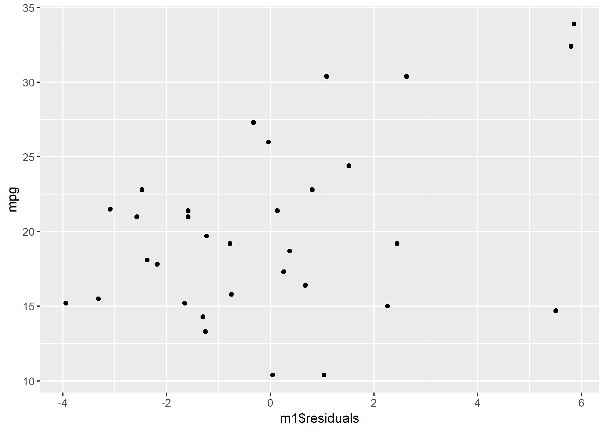

```{r setup, include=FALSE}
knitr::opts_chunk$set(echo = TRUE)
```

## Neste seminar

I neste seminar, skal vi se nærmere på regresjonsdiagnostikk for OLS og logistisk regresjon i første time. Andre time kommer til å gå med til flernivå. Det R-tekniske i første time blir ganske greit, i stedet kommer vi til å fokusere mye på substansielle tolkninger.
For at du skal henge med på dette, er det derfor fint å bruke denne anledningen til å repetere seg oversikt over en del viktige konsepter for regresjonsdiagnostikk. Under viser jeg de mest vriene R-tekniske temaene til 1. time. I tillegg oppfordrer jeg til å repetere forutsetninger for OLS og logistisk regresjon, samt repetere hva begreper fra regresjonsdiagnostikk som *innflytelse*, *leverage* og *outliers* betyr.

I andre del av denne introduksjonen viser jeg syntaksen for flernivåmodeller.

## Sentrale begreper i regresjonsdiagnostikk

I tillegg til å lese dette korte avsnittet, anbefaler jeg at du tar en titt på forutsetninger for OLS og for logistisk regresjon dersom du ikke husker disse, og forstår hva brudd på dem innebærer. Under forklarer jeg grunnleggende begreper som regresjonsdiagnostikk bygger på, og viser hvordan informasjonen kan hentes ut.

### Forventet verdi vs. faktisk verdi - residualer

Ut fra regresjonskoeffisientene fra en regresjonsmodell, kan vi beregne den forventede verdien til hver enkelt observasjon på den avhengige variabelen. vi kan sammenligne denne verdien med den observerte verdien på avhengig variabel for observasjonene våre, for å få et inntrykk av hvor godt modellen passer til data, eller se på differansen mellom forventet og faktisk verdi for en observasjon, dvs. residualen til en observasjon. Residualer, forventet verdi og faktisk verdi brukes også i ulike typer regresjonsdiagnostikk. Under viser jeg hvordan du enkelt kan hente ut residualer ved å lagre `summary(lm_model)` som et objekt. For å hente ut forventet verdi kan du bruke `predict()` (se nedenfor). Regresjonen har *miles per gallon* som avh. var, og *horse power* og *weight* som uavhengige variabler.

```{r}
m1 <- lm(mpg ~ wt + hp, data = mtcars)
m1s <- summary(m1)
names(m1s) # residualer for alle observasjoner gis automatisk i model summary-objekter.
m1s$residuals # residualer for alle observasjonene
```

Med `cbind()`, kan du legge residualene til det opprinnelige datasettet, og deretter plotte faktiske verdier på avhengig variabel mot residualene:

```{r, eval = F}
mtcars2 <- (cbind(mtcars, m1s$residuals))
names(mtcars2)
library(ggplot2)
ggplot(mtcars2, aes(x = m1$residuals, y = mpg)) + geom_point()
```
```{r, include=F}
mtcars2 <- (cbind(mtcars, m1s$residuals))
names(mtcars2)
library(ggplot2)
ggplot(mtcars2, aes(x = m1$residuals, y = mpg)) + geom_point()
```
```{r, include=F}
ggsave("../pics/int4plot1.png")
dev.off()
```
```{r echo = FALSE}

```

Man kan gjøre tilsvarende sammenligning for logistisk regresjon, men da tar man gjerne utgangspunkt i at utfallet enten er `1` eller `0` i logistisk regresjon, og sammenligner om modellen predikerer `0` eller `1` med om observasjonene faktisk har den predikerte verdien. Andelen observasjoner som korrekt predikeres som `1`, delt på alle observasjoner som faktisk har verdien 1 (dvs. observasjoner som korrekt predikeres som `1` summert med andelen som feilaktig predikeres som `0`) kalles sensivitet. Andelen observasjoner som korrekt predikeres som `0`, delt på alle observasjoner som faktisk har verdien `0` (dvs. observasjoner som korrekt klassifiseres som `0` summert med observasjoner som feilaktig klassifiseres som `1`), kalles spesifisitet. Legg merke til at i en ROC-kurve, plottes *1 - spesifisitet*. Dette kan tolkes som andelen observasjoner som galt predikeres til verdien 1 (som faktisk har verdien 0), delt på det totale antallet observasjoner som faktisk har verdien 0.

Man kunne tenkt seg at for å få best mulig klassifisering, er det fornuftigste er å klassifisere alle observasjoner med predikert sannsynlighet for `1` høyere enn `0.5` som `1`, og de resterende observasjonene som `0`, men andre terskelverdier er også mulige. En ROC-kurve kan fremstille hvor korrekt en logistisk regresjon klassifiserer observasjoner for alle slike terskelverdier. Siden en ROC-kurve er ganske greit å lage med R, viser jeg hvordan dette gjøres under, ved hjelp av funksjoner fra pakkene `plotROC` og `ggplot2` [mer her](https://cran.r-project.org/web/packages/plotROC/vignettes/examples.html).


```{r, eval = F}
#install.packages("plotROC")
library(plotROC)

# Kjører regresjonsmodell
m2 <- glm(am ~ vs + hp, data = mtcars, family = binomial())
summary(m2)
m2res <- predict(m2, type = "response") # henter ut predikerte sannsynligheter for observasjonene i datasettet vi brukte til å estimere modellen.

mtcars2 <- cbind(mtcars, m2res)
# Basic ROC:
basicplot <- ggplot(mtcars2, aes(d = am, m = m2res)) + geom_roc(labelround = 2) 
# Pyntet ROC med AUC.
basicplot + 
    style_roc(ylab = "Sensivity (True positive fraction)") +
  theme(axis.text = element_text(colour = "blue")) +
  annotate("text", x = .75, y = .25, 
           label = paste("AUC =", round(calc_auc(basicplot)$AUC, 2))) +
  scale_x_continuous("1 - Specificity", breaks = seq(0, 1, by = .1))
  

```
```{r, include = F}
#install.packages("plotROC")
library(plotROC)

# Kjører regresjonsmodell
m2 <- glm(am ~ vs + hp, data = mtcars, family = binomial())
summary(m2)
m2res <- predict(m2, type = "response") # henter ut predikerte sannsynligheter for observasjonene i datasettet vi brukte til å estimere modellen.

mtcars2 <- cbind(mtcars, m2res)
# Basic ROC:
basicplot <- ggplot(mtcars2, aes(d = am, m = m2res)) + geom_roc(labelround = 2) 
# Pyntet ROC med AUC.
basicplot + 
    style_roc(ylab = "Sensivity (True positive fraction)") +
  theme(axis.text = element_text(colour = "blue")) +
  annotate("text", x = .75, y = .25, 
           label = paste("AUC =", round(calc_auc(basicplot)$AUC, 2))) +
  scale_x_continuous("1 - Specificity", breaks = seq(0, 1, by = .1))
  

```
```{r, include=F}
ggsave("../pics/int4plot2.png")
dev.off()
```
```{r echo = FALSE}
knitr::include_graphics("../pics/int4plot2.png")
```

Grunnen til at denne ROC-kurven ikke er glatt og kontinuerlig, er forøvrig at datasettet `mtcars` er så lite.


### Spesifikasjon av flernivåmodeller
Den statistiske motivasjonen bak flernivåanalyse er å ta hensyn til avhengighet mellom observasjoner i en hierarkisk struktur. 

*I R:* Som de andre regresjonsformene vi har sett på, ligner syntaksen for flernivåanalyse på syntaksen for ols. Den største forskjellen ligger i spesifisering av nivå for variabler. Vi skal bruke `lme4` pakken til å kjøre flernivå, installer den og last den inn med koden under.

```{r, eval=FALSE}
install.packages("lme4")
library(lme4)
```

```{r, include=FALSE}
library(lme4)
```

Under finner dere syntaksen for flernivå med samme notasjon som på forelesning, oversatt til `lmer`. Jeg bruker `group_var` for å betegne variabelen som forteller hvilken gruppe observasjoner tilhører (den hierarkiske strukturen). `x` refererer til variabler på nivå 1, mens `z` referer til variabler på nivå 2 (skiller mellom z og x for å gjøre det lettere og oversette til **R**).

**Lineær Regresjon:** 


`lm(y ~ x1 + x2, data = data)`

**Flernivå med kun random intercept:**  


`lmer(y ~ 1 + (1|group_var), data = data)`

**Flernivå med uavh. var på mikronivå, fixed effects, random intercept:** 


`lmer(y ~ (1|group_var) + x1, data = data)`

**Flernivå med uavh. var på mikronivå, random slopes:**  


`lmer(y ~ x1 + (x1|group_var), data=data)`

**Flernivå med uavh. var på mikronivå med random effects, og uavhengig variabel på makronivå:**


`lmer(y ~ x1 + (x1|group_var) + z2, data=data)`

**Flernivå med uavh. var på mikronivå med random effects, kryssnivåsamspill, og uavhengig variabel på makronivå:**  


`lmer(y ~ x1*z2  + x1 + (x1|group_var) + z2, data=data)`

Som dere kanskje husker, kan vi bruke modellen med kun random intercept til å beregne intra-class correlation. For å gjøre dette deler vi varians på nivå 2 på summen av varians på nivå en og nivå 2: $$var(u_j)/(var(u_j) + var(e_{ij}))$$

Dersom vi har brukt `lmer()` til å kjøre en flernivåmodell med kun random intercept, får vi outputen vi trenger til å regne ut ICC etter denne formelen med `summary()`. Vi kan også bruke `VarCorr(model, comp=`Variance`)`. Dere kan hente ut random slopes/intercepts med `ranef()`, mens faste effekter kan hentes ut med `coef()`.

Nå som dere har sett syntaksen, vil jeg at dere skal importere `ess.Rdata` datasettet [herfra](https://github.com/martigso/stv4020aR/raw/master/Gruppe%201/data/ess.RData), en omarbeidet versjon av European social survey. Når du har lastet inn datasettet, kan du spesifisere modeller av typene over. Regn også ut ICC. Bruk `trust_police` som avhengig variabel, og `country` som grupperingsvariabel på nivå 2. Variabler på nivå 1 som dere kan bruke er `age`, `gender` og `income_decile`. Variabler på nivå 2 som dere kan bruke, er `lvl2_legalsys` og `lvl2_politicians`. De to siste variablene laget jeg selv ved å aggregere. Disse to variablene viser tillit aggregert på landnivå til henholdsvis domstoler og politikere. 


