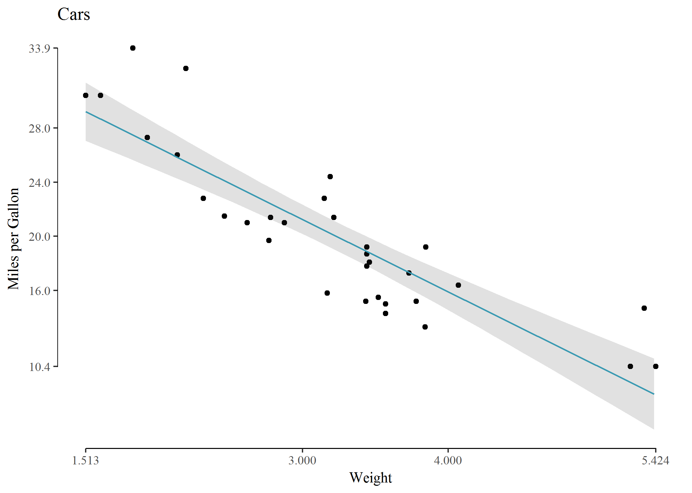
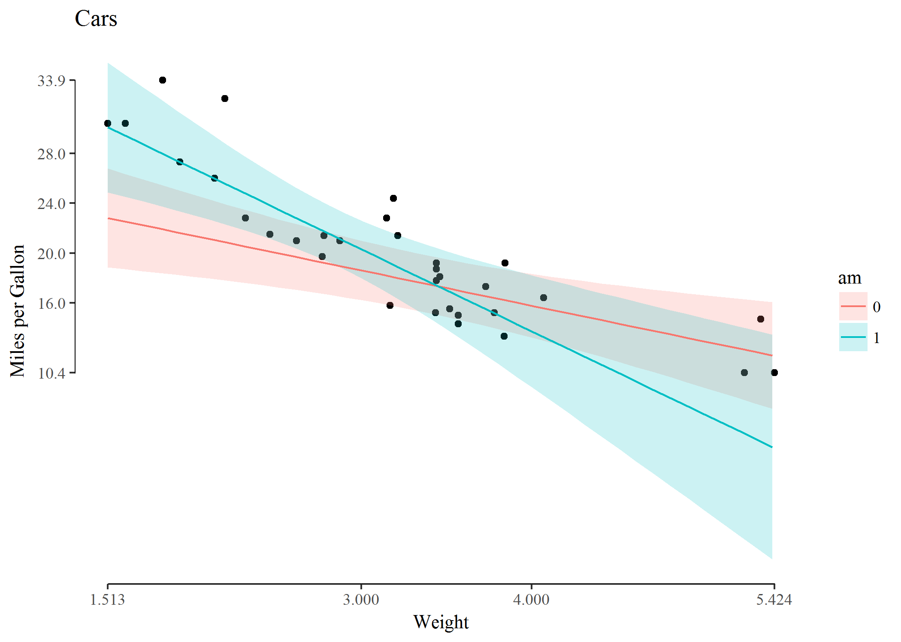

# Plotte regresjon med ggplot2
Erlend Langørgen  
25 august 2017  


## En generell tilnærming til å plotte regresjon

### Innhold:
1. [Introduksjon](#Introduksjon)
2. [Den generelle tilnærmingen, trinn for trinn](#Trinn)
3. [Lineær regresjon med en uavhengig variabel](#ols1)
4. [Multippel lineær regresjon](#ols2)
5. [Multippel lineær regresjon med samspill](#samspill)


### Introduksjon <a name="Introduksjon"></a>

Dette scriptet gir en kort innføring i hvordan du kan plotte regresjonslinjer, ved hjelp av `ggplot()` og `predict()`. De grunnleggende ideene for metoden, inkludert `predict()` kan overføres til andre former for regresjonsanalyse, og `plot()`. Jeg demonstrerer hvordan du kan plotte enkel ols, multivariat ols og multivariat ols med samspill. Dere kan lese om hvordan metoden kan overføres til logistisk regresjonsanalyse [på nett](https://stackoverflow.com/questions/26694931/how-to-plot-logit-and-probit-in-ggplot2), med litt googling burde dere finne tilsvarende metoder for andre regresjonsmodeller også. Jeg bruker pakkene **ggplot2**, **ggthemes** og **wesanderson** (de to siste til pynting av plot). For å holde koden så enkel som mulig, gjemmer jeg all kode som brukes for å pynte plottene du ser. Plottene du får ved å copy-paste koden du ser vil gi plot med samme innhold, men litt annet utseende enn plottene du ser. Dersom du vil se nærmere på hvordan jeg pynter plottene, gå inn på .Rmd filen og klikk på raw. 


### **Den generelle tilnærmingen, trinn for trinn:** <a name="Trinn"></a>

1. Kjør en regresjonsmodell, og lagre modellen som et objekt.
2. Lag et nytt datasett, med en variabel for hver uavhengig variabel i regresjonsmodellen. Variablene i datasettet du lager må ha samme navn som de uavhengige variablene i regresjonsmodellen. La verdiene til de uavhengige variablene du vil plotte effekten vil variere, hold verdiene til de andre uavhengige variablene konstant.
3. Bruk `predict()` og argumentet `newdata =` til å lage enda et nytt datasett. Denne funksjonen lar deg beregne forventede verdier på **avhengig variabel** samt standardfeil med utgangspunkt i modellen fra trinn 1, gitt verdiene på de **uavhengige variablene** i datasettet fra trinn 2. 
4. Lag et nytt datasett ved å kombinere datasettene fra trinn 2 og 3 med `cbind()`.
5. Kalkuler kofidensintervaller med din foretrukne formel for standardfeil ved hjelp av standardfeilene du beregnet i trinn 3<a href="#footnote-1">[1]</a>, og legg til datasettet ditt fra trinn 4.<a href="#footnote-2">[2]</a>. 
6. Plot effekten til uavhengig variabel ved hjelp av datasettet fra trinn 5.

<p id="footnote-1">[1] Du kan bruke **sandwich** pakken til å regne ut robuste standardfeil. Regn først ut robuste standardfeil, bytt deretter ut `plot_data$se` med dine nye standardfeil i utregning av konfidensintervall i trinn 5. Spørsmål og svar i denne linken viser hvordan du kan gå frem: (https://stackoverflow.com/questions/13259357/using-ggplot2-to-plot-predicted-values-with-robust-standard-errors) </p>

<p id="footnote-2">[2] Ved bootstrap må du kalkulere standardfeil i trinn 3, samtidig som du bruker `predict`: (http://rstudio-pubs-static.s3.amazonaws.com/24365_2803ab8299934e888a60e7b16113f619.html) </p>


### Lineær regresjon med en uavhengig variabel <a name="ols1"></a>
Her illustrerer jeg den generelle tilnærmingen for å plotte regresjon med datasettet *mtcars* og lineær regresjon med en uavhengig variabel.

```r
## Trinn 1: Kjører regresjonsmodell
m1 <- lm(mpg ~ wt, data = mtcars)
## Trinn 2: Lager datasett med den uavh. var wt
data_for_prediction <- data.frame(wt = seq(min(mtcars$wt), max(mtcars$wt), 0.1))
# Ved veldig få observasjoner i dette datasettet kan plottet bli kornete

## Trinn 3: Lager nytt datasett med predikerte verdier for avhengig variabel, og
## standardfeil:
predicted_data <- predict(m1, newdata = data_for_prediction, se = TRUE)

## Trinn 4: Kombinerer data fra trinn 2 og 3:
plot_data <- cbind(predicted_data, data_for_prediction)

## Trinn 5: Kalkulerer konfidensintervall med standardfeil fra trinn 3 og legger til
## plot_data fra trinn 4. Her lager jeg 95% CI med vanlige standardfeil
plot_data$low <- plot_data$fit - 1.96 * plot_data$se
plot_data$high <- plot_data$fit + 1.96 * plot_data$se

## Trinn 6: Plot av effekt med konfidensintervall, viser i to steg: Steg 6.1: lager
## scatterplot med de faktiske verdiene til variablene fra mtcars
p <- ggplot(mtcars, aes(x = wt, y = mpg)) + geom_point()
p
```


<!-- -->


```r
## Steg 6.2: Tegner inn regresjonslinje og konfidensintervaller fra det nye datasettet
## plot_data på toppen av scatterplottet:
p + geom_ribbon(data = plot_data, aes(y = fit, ymin = low, ymax = high)) + geom_line(data = plot_data, 
    aes(y = fit))
```


<!-- -->


Regresjon med en uavhengig variabel er et spesialtilfelle, der vi ikke trenger å bruke den generelle tilnærmingen for å plotte regresjon for å ha kontroll over output. Funksjonen `geom_smooth()` med argumentet `method="lm"` gir samme resultat. Her spesifiserer vi regresjonen direkte inn i plottet. Bortsett fra tykkelsen på linjen er resultatet helt likt.


```r
p <- ggplot(mtcars, aes(x = wt, y = mpg)) + geom_point() + ggtitle("Cars")
p + geom_smooth(method = "lm")
```


<!-- -->

Dersom vi prøver å legge inn flere variabler i plottet vårt får vi imidlertid bedre kontroll ved å bruke den generelle tilnærmingen.

### Multippel lineær regresjon <a name="ols2"></a>
Implementeringen av den generelle tilnærmingen endres kun i trinn 2 når vi går fra lineær regresjonsanalyse med en uavhengig variabel til lineær regresjonsanalyse med flere uavhengige variabler. I trinn 2 må vi nå gjøre to valg: 

1. Vi må bestemme oss for hvilken uavhengig variabel vi vil plotte effekten til
2. Vi må bestemme hvilken verdi alle de andre uavhengige variablene (kontrollvariablene) skal ha.

Jeg demonstrerer dette under:

```r
## Omkoder am og cyl til faktor
mtcars$am <-  as.factor(mtcars$am)
mtcars$cyl <- as.factor(mtcars$cyl)
## Trinn 1: Kjører regresjonsmodell
m2 <- lm(mpg ~ wt + am + cyl + qsec + hp, data=mtcars)
## Trinn 2: Lager datasett med den uavh. var wt og kontrollvariablene am (dummy), qsec og hp. Jeg er interessert i effekten av wt, og lar denne variabelen variere i datasettet jeg lager. Jeg velger medianverdien til qsec, gjennomsnittet til hp, og setter faktoren am til 1.
data_for_prediction <- data.frame(wt   = seq(min(mtcars$wt),
                                                 max(mtcars$wt), .1),
                                  qsec = median(mtcars$qsec),
                                  hp   = mean(mtcars$hp),
                                  cyl  = as.factor(6),
                                  am   = as.factor(1))


## Trinn 3: Lager nytt datasett med predikerte verdier for avhengig variabel, og standardfeil:
predicted_data <- predict(m2, newdata = data_for_prediction, 
                                        se=TRUE)

## Trinn 4: Kombinerer data fra trinn 2 og 3: 
plot_data <- cbind(predicted_data, data_for_prediction)

## Trinn 5: Kalkulerer konfidensintervall med standardfeil fra trinn 3 og legger til plot_data fra trinn 4. Her lager jeg 95% CI med vanlige standardfeil
plot_data$low  <- plot_data$fit - 1.96*plot_data$se
plot_data$high <- plot_data$fit + 1.96*plot_data$se

## Trinn 6: Plot
p <- ggplot(mtcars, aes(x = wt, y = mpg)) +
  geom_point() +
  geom_ribbon(data=plot_data, aes(y=fit, ymin=low, ymax=high)) +
  geom_line(data=plot_data, aes(y=fit))
p
```


<!-- -->

Vi kan nå begynne å legge inn forskjellige utvidelser av plottet over.
Som dere kanskje husker fra forelesning, kan man visualisere effekten av dummyvariabler som ulike skjæringspunkt med y-aksen. Plottet under er likt plottet over, bortsett fra at jeg nå også visualiserer effekten av dummy-variabelen am, som var holdt konstant til verdien 1 i sted. For å gjøre dette, lager jeg et datasett til plotting med alle plotte-verdier for wt 2 ganger, en gang for `am = 0`, og en gang for `am = 1`.


```r
## Omkoder am og cyl til faktor
mtcars$am <-  as.factor(mtcars$am)
mtcars$cyl <- as.factor(mtcars$cyl)
## Trinn 1: Kjører regresjonsmodell
m2 <- lm(mpg ~ wt + am + cyl + qsec + hp, data=mtcars)
## Trinn 2: Lager datasett med den uavh. var wt og kontrollvariablene am (dummy), qsec og hp. Jeg er interessert i effekten av wt, og lar denne variabelen variere i datasettet jeg lager. Jeg velger medianverdien til qsec og gjennomsnittet til hp. Jeg velger å også plotte effekten av dummy-variabelen am. For å få til dette må jeg inkludere verdiene jeg bruker til å plotte wt to ganger, en gang for am = 0, og en gang for am = 1.
data_for_prediction <- data.frame(wt   = rep(seq(min(mtcars$wt),
                                                 max(mtcars$wt), .1),2),
                                  qsec = median(mtcars$qsec),
                                  hp   = mean(mtcars$hp),
                                  cyl  = as.factor(6),
                                  am   = as.factor(c(rep(1, 40), rep(0, 40))))


## Trinn 3: Lager nytt datasett med predikerte verdier for avhengig variabel, og standardfeil:
predicted_data <- predict(m2, newdata = data_for_prediction, 
                                        se=TRUE)

## Trinn 4: Kombinerer data fra trinn 2 og 3: 
plot_data <- cbind(predicted_data, data_for_prediction)

## Trinn 5: Kalkulerer konfidensintervall med standardfeil fra trinn 3 og legger til plot_data fra trinn 4. Her lager jeg 95% CI med vanlige standardfeil
plot_data$low  <- plot_data$fit - 1.96*plot_data$se
plot_data$high <- plot_data$fit + 1.96*plot_data$se

## Trinn 6: Plot
p <- ggplot(mtcars, aes(x = wt, y = mpg)) +
  geom_point() +
  geom_ribbon(data=plot_data, aes(y=fit, ymin=low, ymax=high, fill=am)) +
  geom_line(data=plot_data, aes(y=fit, colour=am))
p
```


<!-- -->

Muligheten til å kontrollere verdiene til kontrollvariabler, lar oss sjekke effekten for ulike grupper i datasettet. I plottet under er basert på samme modell som forrige plot, men jeg har satt alle kontrollvariablene til sin minimumsverdi. Dette kan være nyttig, siden vi kanskje har teoretisk motivasjon for å være spesielt interessert i effekten for en gruppe med en bestemt kombinasjon verdier på kontrollvariablene. Jeg plotter forøvrig også effekten av am i dette plottet. Koden er dermed det samme som over, bortsett fra at trinn 2 nå ser slik ut:

```r
## Trinn 2: Lager datasett med den uavh. var wt og kontrollvariablene am (dummy), qsec og
## hp. Jeg er interessert i effekten av wt, og lar denne variabelen variere i datasettet jeg
## lager. Jeg velger minimumsverdiene til kontrollvariablene. Jeg plotter også effekten av
## am.
```

```r
data_for_prediction <- data.frame(wt   = rep(seq(min(mtcars$wt),
                                                 max(mtcars$wt), .1),2),
                                  qsec = min(mtcars$qsec),
                                  hp   = min(mtcars$hp),
                                  cyl  = as.factor(4),
                                  am   = as.factor(c(rep(1, 40), rep(0, 40))))
```

Ved å bytte ut denne delen av koden får vi følgende plot:


<!-- -->

### Introduksjon <a name="samspill"></a>
Neste steg er plotting av samspill. Jeg snikintroduserte den sentrale endringen vi må gjøre for å plotte samspill i forrige seksjon, ved å plotte `am`. Trikset er å lage et datasett i trinn 2, med alle kombinasjoner av verdier vi trenger for plotting. La oss nå lage en ny modell som inkluderer samspill mellom `am` og `wt`. Som dere kanskje husker fra forelesning, vil slikt samspill kunne føre til ulik helning på regresjonslinjen for `wt` for de to ulike verdiene av am. Under ser dere kode for hvordan jeg plotter denne modellen, her har jeg ikke fjernet pynt.


```r
## Trinn 1: kjører regresjon med samspill mellom am og wt.
m3 <- lm(mpg ~ wt * as.factor(am) + as.factor(cyl) + qsec + hp, data = mtcars)
## Trinn 2: Lager datasett med den uavh. var wt og kontrollvariablene am (dummy), qsec og
## hp. Jeg er interessert i effekten av wt, og lar denne variabelen variere i datasettet jeg
## lager. Jeg velger medianverdien til qsec, gjennomsnittet til hp, og setter faktoren am
## til 1.
data_for_prediction <- data.frame(wt = rep(seq(min(mtcars$wt), max(mtcars$wt), 0.1), 2), qsec = median(mtcars$qsec), 
    hp = mean(mtcars$hp), cyl = as.factor(6), am = as.factor(c(rep(1, 40), rep(0, 40))))


## Trinn 3: Lager nytt datasett med predikerte verdier for avhengig variabel, og
## standardfeil:
predicted_data <- predict(m3, newdata = data_for_prediction, se = TRUE)

## Trinn 4: Kombinerer data fra trinn 2 og 3:
plot_data <- cbind(predicted_data, data_for_prediction)

## Trinn 5: Kalkulerer konfidensintervall med standardfeil fra trinn 3 og legger til
## plot_data fra trinn 4. Her lager jeg 95% CI med vanlige standardfeil
plot_data$low <- plot_data$fit - 1.96 * plot_data$se
plot_data$high <- plot_data$fit + 1.96 * plot_data$se

## Trinn 6: Plot
p <- ggplot(mtcars, aes(x = wt, y = mpg)) + geom_rangeframe() + ggtitle("Cars") + theme_tufte() + 
    scale_x_continuous(breaks = extended_range_breaks()(mtcars$wt)) + scale_y_continuous(breaks = extended_range_breaks()(mtcars$mpg)) + 
    ylab("Miles per Gallon") + xlab("Weight") + geom_point() + geom_ribbon(data = plot_data, 
    aes(y = fit, ymin = low, ymax = high, fill = am), alpha = 0.2) + geom_line(data = plot_data, 
    aes(y = fit, colour = am))
p
```


<!-- -->

Plottet viser tydelig at regresjonslinjen for `wt` får ulik helning for ulike verdier av `wt` (men vi må fortsatt gjøre hypotesetesting for å vite om samspillet er statistisk signifikant).

Ved hjelp av funksjonen `facet_wrap()` kan vi faktisk også visualisere to samspillseffekter samtidig. I modell 4 under, utvider jeg modell3 ved å legge inn samspill mellom `wt` og `cyl` (som dummyvariabler) også. Med `facet_wrap()` får vi et plot for hver verdi av en variabel, her `cyl`. Tallene over hvert plot viser variabelverdien i  hvert plot, her antall sylindre. Jeg viser først scatterplot med `facet_wrap()`, før jeg legger på regresjonslinjer og konfidensintervall.


```r
## Trinn 1: kjører regresjon med samspill mellom am og wt.
m4 <- lm(mpg ~ wt * as.factor(am) + wt * as.factor(cyl) + qsec + hp, data = mtcars)
## Trinn 2: Lager datasett med den uavh. var wt og kontrollvariablene am (dummy), qsec og
## hp. Jeg er interessert i effekten av wt, og lar denne variabelen variere i datasettet jeg
## lager. Jeg velger medianverdien til qsec og gjennomsnittet til hp. Jeg lar verdiene til
## am og cyl variere.

data_for_prediction <- data.frame(wt = rep(seq(min(mtcars$wt), max(mtcars$wt), 0.1), 6), qsec = median(mtcars$qsec), 
    hp = mean(mtcars$hp), cyl = as.factor(rep(c(rep(4, 40), rep(6, 40), rep(8, 40)), 2)), am = as.factor(rep(c(rep(1, 
        40), rep(0, 40)), 3)))


## Trinn 3: Lager nytt datasett med predikerte verdier for avhengig variabel, og
## standardfeil:
predicted_data <- predict(m4, newdata = data_for_prediction, se = TRUE)

## Trinn 4: Kombinerer data fra trinn 2 og 3:
plot_data <- cbind(predicted_data, data_for_prediction)

## Trinn 5: Kalkulerer konfidensintervall med standardfeil fra trinn 3 og legger til
## plot_data fra trinn 4. Her lager jeg 95% CI med vanlige standardfeil

plot_data$low <- plot_data$fit - 1.96 * plot_data$se
plot_data$high <- plot_data$fit + 1.96 * plot_data$se

## Trinn 6: Viser først scatterplot, legger deretter på linjer.

p <- ggplot(mtcars, aes(x = wt, y = mpg)) + ggtitle("Cars") + theme_tufte() + ylab("Miles per Gallon") + 
    xlab("Weight") + geom_point() + facet_wrap(~as.factor(cyl))
p
```


<!-- -->


```r
## Plotter med regresjonslinje og konfidensintervall
p + geom_ribbon(data = plot_data, aes(y = fit, ymin = low, ymax = high, fill = am), alpha = 0.2) + 
    geom_line(data = plot_data, aes(y = fit, colour = am))
```


<!-- -->

I dette tilfellet er datasettet så lite at det ikke har mye for seg å modellere to samspill (konfidensintervallene er enorme, noe som betyr at det er enorm usikkerhet. Årsaken er lite data), men i andre tilfeller kan slik visualisering av data være nyttig. Legg forøvrig merke til at det ser ut som om det er en tydelig sammenheng mellom `wt` og `cyl` (se på plassering av verdier på x-aksen i de tre plottene). Ytterligere utvidelser er også mulig, man kunne for eksempel visualisert to samspill ved hjelp av tredimensjonale plot. 


### Bonus: visualisering av mange variabler i scatterplot
Jeg synes også noen ganger det er nyttig å visualisere enda flere variabler i et scatterplot. Med utgangspunkt i scatterplottene over, kan vi legge inn følgende alternativer i (aes) for å visualisere `hp`, `qsec` og `am` også:

```r
p <- ggplot(mtcars, aes(x = wt, y = mpg, col=hp, size=qsec,  shape=as.factor(am))) +
  ggtitle("Cars")  + 
  theme_tufte() + 
  ylab("Miles per Gallon") +
  xlab("Weight") + 
  geom_point() +
  facet_wrap(~as.factor(cyl))
p
```


<!-- -->

Her er alle variablene i regresjonen visualisert. I dette tilfellet synes jeg ikke visualiseringen fungerer spesielt godt, men vi ser at am = 1 ser ut til å være korrelert med lavt antall sylindre, høy verdi på `hp` og høy verdi på `qsec`. Det generelle poenget er imidlertid at man kan visualisere mange variabler samtidig med ggplot. Man kan også legge inn histogram eller andre typer plot, i tillegg til eller i stedet for scatterplot. Slike visualiseringer kan gjøre det lettere å forstå hva regresjonskoeffisientene sier, og hvordan uavhengig variabel er relatert til kontrollvariabler. Jeg anbefaler derfor visualisering som et virkemiddel for å forstå hvordan en modell fungerer.


