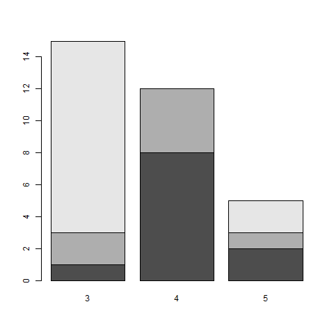

# Første R-Seminar
Erlend Langørgen  
28 august 2017  


# Velkommen!

<!-- -->


# Seminaropplegg

## Seminarene

| Dato              | Tid             | Aktivitet                         | Sted                |
|-------------------|-----------------|-----------------------------------|---------------------|
| ma. 28. aug.      | 08:15–10:00     | Seminar i databehandling R 1      | ES PC-stue 351      |
| ti. 29. sep.      | 09:15–11:00	    | Seminar i databehandling R 1      | **HH PC-rom 035**	  |
| to. 14. sep.      | 14:15–16:00   	| Seminar i databehandling R 1      | ES PC-stue 351      |
| to. 21. sep.      | 14:15–16:00	    | Seminar i databehandling R 1      | ES PC-stue 351	    |
| to. 28. sep.      | 14:15–16:00	    | Seminar i databehandling R 1      | ES PC-stue 351	    |
| to. 5. okt.       | 14:15–16:00	    | Seminar i databehandling R 1      | ES PC-stue 351	    |
| **to. 12. okt.**  | **14:15–16:00** | **Obligatorisk prøve**            | **ES PC-stue 351**	|

## Linker
- [Last ned R](http://cran.uib.no/)
- [Last ned Rstudio](https://www.rstudio.com/products/rstudio/download/#download)
- [Last ned R og Rstudio til PC på UiO](https://software.uio.no)
- [Gratis innføringsbok på nett](http://r4ds.had.co.nz/)
- [Stilguide for R](https://google.github.io/styleguide/Rguide.xml)
- [Bruke prosjekter i R](https://support.rstudio.com/hc/en-us/articles/200526207-Using-Projects)
- [Mappestruktureringsforslag](https://nicercode.github.io/blog/2013-04-05-projects/)
- [Guide til ggplot2](http://docs.ggplot2.org/current/)
- [Facebookgruppe for R](https://www.facebook.com/groups/427792970608618/)

## Undervisningsopplegg
* Jeg vil at dere skal skrive mest mulig kode i seminarene. Dere må skrive kode for å lære R. 
    + I de to første seminarene fokuserer vi på grunnleggende ferdigheter i R. Vi skal gå gjennom ferdighetene dere trenger, ut over statistisk analyse, for å kunne skrive hjemmeoppgave med R.
    + I andre halvdel av seminar 2 og i de påfølgende seminarene fokuserer vi på å løse oppgaver knyttet til statistikkpensum og R-prøven.
* Undervisningsmateriell blir lastet opp på [github](https://github.com/martigso/stv4020aR). Der kan dere også se det Martin laster opp. Jeg kommer i hvert fall til å laste opp:
    + R-script til seminarene, vil inneholde kommenterte løsninger på oppgavene i seminaret. 
    + Oversiktsdokumenter med forklaringer til seminarene. Disse vil inneholde mer inngående forklaringer av koden vi gjennomgår i seminarene, samt mer generelle forklaringer av hvordan R fungerer. Disse dokumentene vil ikke inneholde oppgavene fra seminaret. Jeg vil trolig legge inn en del ekstra som kan være nyttig til å skrive hjemmeoppgave.
    + Kanskje noen tilleggsdokumenter, kom gjerne med forespørsler.
* Inspirasjonskilder for stilen i undervisningsopplegget er i hovedsak diskusjon med tidligere/andre seminarledere og [R for Data Science](http://r4ds.had.co.nz/).   

## Dagens seminar: R basics - en myk start
Jeg håper alle har fått installert R og Rstudio. Dersom dere ikke har gjort dette, [Åpne Rstudio i kiosk](https://kiosk.uio.no). Dere kan installere Rstudio i pausen.   

Dagens seminar er organisert som en **code-along**, jeg vil at dere skal teste all koden vi går gjennom underveis, dere vil også få noen småoppgaver.

Dersom koden deres ikke virker i løpet av dagens seminar, start med å se etter **skrivefeil**. Sammenlign så koden din med naboens kode, se om hun/han/hen kan hjelpe deg. R er svært pirkete på skrivefeil, parenteser, komma og små/store bokstaver. Dersom koden fortsatt ikke virker, spør dere meg om hjelp. Ikke nøl med å spørre meg, jeg vil ikke at dere skal sitte og lete lenge etter løsningen på egenhånd i dagens seminar.    

Plan for i dag (så mye vi rekker):

1. [Åpne Rstudio](#Rstudio)
2. [R som kalkulator](#kalkulator)
3. [Objekter, vektorer og indeksering](#objekter)
4. [Kort om funksjoner og pakker](#funksjoner)
5. [Datasett](#datasett)
6. [Deskriptiv statistikk og visualisering](#deskriptiv)
7. [Lineær regresjonsanalyse (OLS)](#ols)

## Åpne Rstudio <a name="Rstudio"></a>
Rstudio er en IDE (integrated development environment) til R. Rstudio gjør R mer brukervennlig, og har en del tilleggsfunksjonalitet som er nyttig. Derfor bruker vi Rstudio. Rstudio består av 3 vinduer første gang dere åpner det. Til venstre ser dere console. Her vises kode som vi kjører. Oppe til høyre er environment, hvor objekter vi har opprettet vises. Nede til høyre vises filer i mappen vi jobber fra. Fra menyen over vinduet nede til høyre, ser vi at "plot", "packages" og "Help" også vises i dette vinduet. Mer om dette i løpet av dagens seminar.


<!-- -->


Det viktigste vinduet må vi imidlertid opprette selv. Klikk på arket med en grønn sirkel med et plusstegn like under `File` øverst til venstre, og velg `R Script`. Vi har nå opprettet et R-script. Vi skriver all kode i R-script, fordi r-script lar oss skrive, redigere, kommentere og lagre kode. I tillegg hjelper R-studio oss med å rette og organisere kode som skrives i R-script. R-script hjelper oss med å gjøre arbeidet vårt **reproduserbart**. For å kjøre koden på en linje i et r-script, naviger til linjen og trykk `ctrl + enter` (`Cmd` i stedet for `Ctrl` for dem som bruker mac). forsøk med 2+2.

## R som kalkulator <a name="kalkulator"></a>
### R kan brukes som en kalkulator:


```r
6 + 3
```

```
## [1] 9
```

```r
6 - 3
```

```
## [1] 3
```

```r
6 * 3
```

```
## [1] 18
```

```r
6/3
```

```
## [1] 2
```

```r
6^3
```

```
## [1] 216
```

### R kan brukes som en kalkulator 2:

```r
6/3 + 3
```

```
## [1] 5
```

```r
6/(3 + 3)  # Parentesregler fra skolen gjelder også i R.
```

```
## [1] 1
```

```r
log(3)
```

```
## [1] 1.098612
```

```r
exp(3)
```

```
## [1] 20.08554
```


### Logiske operatorer
R kan også brukes til å evaluere om logiske utsagn er sanne. Til dette bruker vi logiske operatorer, som `==` og `>`.

```r
6 + 3 == 9  # bruk ==, ikke = for å teste ekvivalens. Forsøk 3=2 selv.
```

```
## [1] TRUE
```

```r
6 + 3 == 9.2  # . er kommasymbol når vi skriver tall i r.
```

```
## [1] FALSE
```

```r
6 + 3 < 9.2  # mindre enn
```

```
## [1] TRUE
```

```r
6 + 3 <= 9.2  # mindre eller lik 
```

```
## [1] TRUE
```

```r
"SPSS" == "R"  # == kan også brukes til å teste utsagn som ikke handler om tall  
```

```
## [1] FALSE
```

```r
"R" == "R"
```

```
## [1] TRUE
```

### Vi kan også teste mer komplekse utsagn:

```r
6 + 3 == 9 | 6 + 3 == 9.2  # | står for 'eller' (alt + 7 på norsk mac)
```

```
## [1] TRUE
```

```r
6 + 3 == 9 & 6 + 3 == 9.2  # & står for 'og'
```

```
## [1] FALSE
```
Google "logical operators r" for å få en mer komplett oversikt, kan dere finne den logiske operatoren for "ikke lik"? 


## Objekter og vektorer <a name="objekter"></a>   
Objekter er grunnleggende byggesteiner i R. Vi kan lagre ulike typer verdier, som regresjonskoeffisienter, tekst og tall i objekter. Vi lager objekter ved hjelp av "<-" :

```r
x <- 3  # lager objektet x
y <- 6  # lager objektet y
z <- x + y  # man kan lage objekter fra andre objekter

# Vi kan også gi andre navn til objekter:
gull <- 3
bronse <- 6
medaljer <- gull + bronse
```
Når vi lager objekter, returnerer ikke R en verdi i Console slik vi får når vi bruker R som en kalkulator. Vi kan imidlertid får vite verdien til et objekt ved å skrive navnet til objektet og trykke `ctrl + enter`.

```r
z
```

```
## [1] 9
```

Vi kan også gi navn til objekter med ´=´. Jeg oppfordrer dere imidlertid instendig til å alltid bruke `<-` for å gi navn til objekter, **alle** følger denne konvensjonen.   

Dersom dere ser i øverste vindu til høyre (global environment), ser dere fire linjer under values: R, x, y og z. Når vi oppretter et nytt objekt vises det her.


### Vektorer:
Det er mulig å opprette mange forskjellige objekttyper i R. Et naturlig steg videre fra å opprette objekter som representerer et enkelt tall, er å opprette en vektor. I R kan en vektor defineres som en ordnet liste av verdier, dvs. at verdiene kommer i en bestemt rekkefølge. Det finnes flere måter å lage vektorer på:


```r
## Ved å bruke parenteser rundt denne koden oppretter jeg objektet samtidig som jeg printer
## innholdet i objektet i console.
(x <- 1:5)  # med : teller vi på heltall mellom de to tallene
```

```
## [1] 1 2 3 4 5
```

```r
(y <- c(1, 2, 4, 3, 5))  # med c() kan vi kombinere ulike tall i den rekkefølgen vi vil.
```

```
## [1] 1 2 4 3 5
```
Legg merke til at vi nå har overskrevet de tidligere verdiene til x og y, uten at R gir oss noen advarsel. Dette illustrerer viktigheten av å gi navn på en lur måte.  

Vi kan også bruke `c()` til å lage vektorer med forskjellige typer innhold, som tekst. 

```r
(z <- c(1, 2, "tre", "fire", 5))
```

```
## [1] "1"    "2"    "tre"  "fire" "5"
```

Vi kan utføre matematiske operasjoner på vektorer som bare består av tall. Her er noen eksempler:

```r
x * y
```

```
## [1]  1  4 12 12 25
```

```r
x + y
```

```
## [1]  2  4  7  7 10
```

```r
x * 2
```

```
## [1]  2  4  6  8 10
```
Dette fungerer naturlig nok ikke på vektorer som inneholder andre typer verdier enn tall. Forsøk `x*z` for å kontrollere. En vektor som bare består av en type verdier (f.eks, bare tall), kalles **atomic vector**. En vektor som består av forskjellige typer verdier (f.eks. både tall og tekst) kalles **list**.


### Ulike typer vektorer i R - grov inndeling:    

------------------------------------------------------------

atomic vector | List
------------- | -------------
numeric       | Blanding
integer       | 
character     | 
factor        | 
               
Her må jeg forklare nærmere om **atomic vector** og **list**. En hyppig årsak til at kode ikke fungerer, er at en vektor ikke er i det formatet vi forventet, dette fører ofte til uønskede resultater. Hvilket format tror dere x, y og z har? Vi kan sjekke med `class`. 

```r
class(x)
```

```
## [1] "integer"
```

```r
class(y)
```

```
## [1] "numeric"
```

```r
class(z)
```

```
## [1] "character"
```

```r
class(list(1:5))
```

```
## [1] "list"
```
Som dere ser, er x integer og y numerisk, mens z er character. Den siste vektoren jeg lager i koden over er helt lik x og y, men er en liste. Dette betyr ikke at det jeg sa i sted om  vektorer av typene *list* og *atomic.vector*  er galt. Dette  betyr at at alle verdiene i x er lest inn som en *integer*, alle verdiene i y er lest inn som *numeric*, alle verdiene i z er lest inn som *character*, mens den siste vektoren er lest inn som en liste. Dette kan være veldig forvirende, men som regel er dette lett å løse, med funksjoner som `as.character()`, `as.numeric()` og `as.factor()` (for de fleste praktiske formål trenger vi ikke skille mellom *integer* og *numeric*). Med `unlist()` kan vi gjøre *list* om til *atomic.vector*. 

```r
class(as.character(x))
```

```
## [1] "character"
```

```r
class(as.list(y))
```

```
## [1] "list"
```

```r
class(as.numeric(z))
```

```
## Warning: NAs introduced by coercion
```

```
## [1] "numeric"
```

```r
as.numeric(z)
```

```
## Warning: NAs introduced by coercion
```

```
## [1]  1  2 NA NA  5
```

```r
class(unlist(list(1:5)))
```

```
## [1] "integer"
```
En ting man bør passe seg for, er imidlertid å bruke `as.numeric()` på en faktor som inneholder tall, da skjer følgende:

```r
as.numeric(as.factor(c(2, 3, 4)))
```

```
## [1] 1 2 3
```

```r
as.numeric(as.character(as.factor(c(2, 3, 4))))  # Gå veien via character
```

```
## [1] 2 3 4
```

Det er mer å si om forskjellige typer vektorer og objekter enn jeg kommer inn på her, dette burde imidlertid være nok til å hjelpe dere med å komme i gang med å løse problemer som skyldes at et objekt er av en annen type enn du forventet. Dersom koden din oppfører seg merkelig er det alltid en god idé og sjekke hva slags type objekt du har nærmere. Funksjoner som `class()`, `str()`, `is.list()`, `is.atomic()` og `dim()` er nyttig til dette. Les også advarsler i konsoll som handler om objektene dine.  


### Indeksering
Indeksering lar oss spesifisere et eller flere elementer i et objekt. For vektorer, bruker vi `[]` til å indeksere oss frem til verdier fra et objekt som vi er interessert i. 

```r
y[4]  # Tallet i '[]', her 4, refererer til 4. element i objektet, ikke tallet 4.
```

```
## [1] 3
```

```r
z[3:4]  # Vi kan bruke : til å velge flere elementer
```

```
## [1] "tre"  "fire"
```

```r
y[c(1, 2, 3, 4)]  # Vi kan også bruke c() til å velge flere elementer
```

```
## [1] 1 2 4 3
```
Indekseringen av z og y over returnerte nye vektorer. Vi kan dermed bruke indeksering til å opprette nye vektorer. Ved hjelp av `c()` kan vi lage en ny versjon av y, der vi endrer på rekkefølgen i vektoren:

```r
x == y  # Vi kan bruke == til å sammenligne verdiene i to vektorer som er like lange
```

```
## [1]  TRUE  TRUE FALSE FALSE  TRUE
```

```r
y <- y[c(1, 2, 4, 3, 5)]
x == y  # Vi ser at y nå er endret, slik at alle verdiene i x og y er like
```

```
## [1] TRUE TRUE TRUE TRUE TRUE
```


## Kort om  funksjoner <a name="funksjoner"></a>
En annen grunnleggende byggestein i R er funksjoner. En funksjon tar i mot verdi(er), gjerne lagret i form av et R-objekt, utfører operasjoner basert på input, og produserer nye verdier. En typisk R-funksjon har følgende *syntaks*:

```r
aFunction(x = "R-objekt", arg = "alternativ for funksjonens oppførsel")
## Merk: dette er ikke en faktisk funksjon i R. Funksjoner kan også ha andre syntakser.
```
Vi har allerede brukt noen enkle R funksjoner, `c()` og `log()` er eksempler.
Dersom vi vil lære mer om en funksjon, kan vi spørre R om hjelp med `?`. Kjør `?c` og `?log`  

Dersom vi er på jakt etter en funksjon til et spesielt formål, kan vi bruke `??` (eller google).
Si at vi har lyst til å lage en sekvens av tall, som med `:`, men bare inkludere partall. La oss se om vi kan finne en funksjon til å gjøre dette med følgende kode: `??sequence`

Vi ser at `seq` kan gjøre jobben:

```r
seq(from = 2, to = 20, by = 2)
```

```
##  [1]  2  4  6  8 10 12 14 16 18 20
```

```r
seq(from = 20, to = 2, by = -2)
```

```
##  [1] 20 18 16 14 12 10  8  6  4  2
```
Dersom en funksjon produserer output av en type som fungerer som input i en annen funksjon, kan vi plassere funksjoner inne i andre funksjoner:

```r
c(seq(20, 2, -2), rep(1, 2), seq(2, 20, 2))
```

```
##  [1] 20 18 16 14 12 10  8  6  4  2  1  1  2  4  6  8 10 12 14 16 18 20
```
Som dere ser trenger vi ikke skrive argumentene, kjør `?rep` for å finne ut hva funksjonen i midten gjør. Fortsett å bruke `?` til å lære om nye funksjoner som introduseres resten av seminaret. Øv på å lese syntaks fra hjelpefilene, sammen med googling vil evnen til å lese syntaks sette dere i stand til å finne løsninger på alle slags problemer, med litt trening går dette stort sett ganske raskt. 

Vi skal lære mer om funksjoner neste gang.

## Datasett <a name="datasett"></a>
I R finnes det mange forskjellige typer objekter. I dette seminaret fokuserer vi heretter på datasett, som utgjør klassen "data.frame". Siden det stort sett er datasett som brukes til statistisk analyse, er det denne objekt-klassen vi skal jobbe mest med i seminarene. 

Dere kan tenke på datasett som et sett av samordnede vektorer. Vi kan lage vårt eget datasett av en samling vektorer på følgende måte:

```r
(test_data <- data.frame(x = c(rep(1, 5), rep(0, 5)), y = seq(2, 20, 2), z = rnorm(10), w = "tekst", 
    q = c(1, 2)))
```

```
##    x  y          z     w q
## 1  1  2 -2.0055457 tekst 1
## 2  1  4  0.4079542 tekst 2
## 3  1  6 -0.9547722 tekst 1
## 4  1  8 -0.8067421 tekst 2
## 5  1 10  0.7354837 tekst 1
## 6  0 12 -1.0560398 tekst 2
## 7  0 14 -0.6332924 tekst 1
## 8  0 16 -0.6119554 tekst 2
## 9  0 18 -0.1280464 tekst 1
## 10 0 20  1.0084484 tekst 2
```
Legg merke til at de tre første vektorene har en lengde på 10, mens de to siste har en lengde på henholdsvis 1 og 2. R fyller inn verdier basert på strukturen til disse variablene slik at de kan slåes sammen med de lengre variablene. Som regel fungerer R slik at du må spesifisere nøyaktig det du vil ha for å få output, men noen ganger tolker R den gale koden din i beste mening, og gir deg output du egentlig ikke ønsker. Hva skjer dersom vi forsøker å inkludere variabelen `s = c(1,2,3)`?

I stedet for å starte med å lære dere alt som kan føre til at dere får andre resultater enn dere ønsker, vil jeg imidlertid heller lære dere å sjekke om koden deres fungerer, samt å finne frem til årsak og løsning.   


Kjør følgende kode for å laste inn deres første 'ordentlige' datasett i R:

```r
my_data <- mtcars
```
Merk at mtcars er et eksempeldatasett som er lagret i R, derfor lastes det ikke inn på samme måte som andre datasett. Her er noen nyttige funksjoner for å lære mer om datasett:

```r
class(my_data)  # Er dette faktisk en data.frame, eller et annet type objekt?
```

```
## [1] "data.frame"
```

```r
colnames(my_data)  # denne funksjonen forteller deg kolonnenavn i datasettet.
```

```
##  [1] "mpg"  "cyl"  "disp" "hp"   "drat" "wt"   "qsec" "vs"   "am"   "gear"
## [11] "carb"
```

```r
head(my_data, 5)  # denne funksjonen viser deg de første observasjonene i datasettet.
```

```
##                    mpg cyl disp  hp drat    wt  qsec vs am gear carb
## Mazda RX4         21.0   6  160 110 3.90 2.620 16.46  0  1    4    4
## Mazda RX4 Wag     21.0   6  160 110 3.90 2.875 17.02  0  1    4    4
## Datsun 710        22.8   4  108  93 3.85 2.320 18.61  1  1    4    1
## Hornet 4 Drive    21.4   6  258 110 3.08 3.215 19.44  1  0    3    1
## Hornet Sportabout 18.7   8  360 175 3.15 3.440 17.02  0  0    3    2
```

```r
tail(my_data, 5)  # denne funksjonen viser deg de siste observasjonene i datasettet.
```

```
##                 mpg cyl  disp  hp drat    wt qsec vs am gear carb
## Lotus Europa   30.4   4  95.1 113 3.77 1.513 16.9  1  1    5    2
## Ford Pantera L 15.8   8 351.0 264 4.22 3.170 14.5  0  1    5    4
## Ferrari Dino   19.7   6 145.0 175 3.62 2.770 15.5  0  1    5    6
## Maserati Bora  15.0   8 301.0 335 3.54 3.570 14.6  0  1    5    8
## Volvo 142E     21.4   4 121.0 109 4.11 2.780 18.6  1  1    4    2
```

```r
str(my_data)  # denne funksjonen beskriver strukturen til et objekt.
```

```
## 'data.frame':	32 obs. of  11 variables:
##  $ mpg : num  21 21 22.8 21.4 18.7 18.1 14.3 24.4 22.8 19.2 ...
##  $ cyl : num  6 6 4 6 8 6 8 4 4 6 ...
##  $ disp: num  160 160 108 258 360 ...
##  $ hp  : num  110 110 93 110 175 105 245 62 95 123 ...
##  $ drat: num  3.9 3.9 3.85 3.08 3.15 2.76 3.21 3.69 3.92 3.92 ...
##  $ wt  : num  2.62 2.88 2.32 3.21 3.44 ...
##  $ qsec: num  16.5 17 18.6 19.4 17 ...
##  $ vs  : num  0 0 1 1 0 1 0 1 1 1 ...
##  $ am  : num  1 1 1 0 0 0 0 0 0 0 ...
##  $ gear: num  4 4 4 3 3 3 3 4 4 4 ...
##  $ carb: num  4 4 1 1 2 1 4 2 2 4 ...
```
Dere kan også åpne datasettet ved å trykke på `View` i toppmenyen, skriv evt. `View(my_data)`, men ikke lagre denne kommandoen i scriptet ditt som en hovedregel.

### Indeksering i datasett
Prinsippene for indeksering av datasett, og objekter i R generelt er like som for vektorer. I datasett har vi imidlertid en dimensjon mer enn i en vektor, så for å velge en spesifikk verdi fra et datasett, må vi indeksere i to trinn. I datasett bruker vi `$` for å velge en variabel/vektor. 

```r
my_data$mpg
```

```
##  [1] 21.0 21.0 22.8 21.4 18.7 18.1 14.3 24.4 22.8 19.2 17.8 16.4 17.3 15.2
## [15] 10.4 10.4 14.7 32.4 30.4 33.9 21.5 15.5 15.2 13.3 19.2 27.3 26.0 30.4
## [29] 15.8 19.7 15.0 21.4
```
Dersom vi ønsker å opprette en ny variabel i datasettet vårt, må vi indeksere på samme måte:

```r
my_data$carnames <- rownames(mtcars)  # bare for demonstrasjon
str(my_data)
```

```
## 'data.frame':	32 obs. of  12 variables:
##  $ mpg     : num  21 21 22.8 21.4 18.7 18.1 14.3 24.4 22.8 19.2 ...
##  $ cyl     : num  6 6 4 6 8 6 8 4 4 6 ...
##  $ disp    : num  160 160 108 258 360 ...
##  $ hp      : num  110 110 93 110 175 105 245 62 95 123 ...
##  $ drat    : num  3.9 3.9 3.85 3.08 3.15 2.76 3.21 3.69 3.92 3.92 ...
##  $ wt      : num  2.62 2.88 2.32 3.21 3.44 ...
##  $ qsec    : num  16.5 17 18.6 19.4 17 ...
##  $ vs      : num  0 0 1 1 0 1 0 1 1 1 ...
##  $ am      : num  1 1 1 0 0 0 0 0 0 0 ...
##  $ gear    : num  4 4 4 3 3 3 3 4 4 4 ...
##  $ carb    : num  4 4 1 1 2 1 4 2 2 4 ...
##  $ carnames: chr  "Mazda RX4" "Mazda RX4 Wag" "Datsun 710" "Hornet 4 Drive" ...
```
Legg merke til at det står `chr` etter den nye variabelen, mens det står `num` etter de andre, `str` forteller oss også hva slags type variabler vi har i datasettet vårt.

Hvordan tror dere at vi kan velge den 15 verdien til variabelen `mpg`? Outputen dere skal få finner dere under.

```
## [1] 10.4
```

Vi kan også velge variabler med klammeparentes, `[]`. Husk på at datasett har to dimensjoner, den første dimensjonen er definert som `rows` mens den andre er definert som `columns`. For å velge et element fra columns, den andre dimensjonen, skriver vi `[ , x]`, der x referer til et eller flere element.
For å velge et element fra rows, den første dimensjonen, skriver vi `[x, ]`, der x referer til et eller flere element

```r
dim(my_data)  # my_data har 32 rows (observasjoner) og 11 columns (variabler).
```

```
## [1] 32 12
```

```r
my_data[, 1]
```

```
##  [1] 21.0 21.0 22.8 21.4 18.7 18.1 14.3 24.4 22.8 19.2 17.8 16.4 17.3 15.2
## [15] 10.4 10.4 14.7 32.4 30.4 33.9 21.5 15.5 15.2 13.3 19.2 27.3 26.0 30.4
## [29] 15.8 19.7 15.0 21.4
```

```r
my_data[1, ]
```

```
##           mpg cyl disp  hp drat   wt  qsec vs am gear carb  carnames
## Mazda RX4  21   6  160 110  3.9 2.62 16.46  0  1    4    4 Mazda RX4
```

```r
my_data[, 1][15]
```

```
## [1] 10.4
```

```r
head(my_data[, c(1, 3, 8)])  # kode for å få raskt inntrykk av variabler vi er interessert i
```

```
##                    mpg disp vs
## Mazda RX4         21.0  160  0
## Mazda RX4 Wag     21.0  160  0
## Datsun 710        22.8  108  1
## Hornet 4 Drive    21.4  258  1
## Hornet Sportabout 18.7  360  0
## Valiant           18.1  225  1
```
Denne typen indeksering er nyttig dersom vi raskt vil velge mange variabler/observasjoner, men den gjør koden vår mindre forståelig. Derfor bruker vi `$` til å velge variabler/navngitte elementer i et objekt.

Dersom dere vil vite hvordan dere skal indeksere et R-objekt, kan dere bruke `str`

```r
(a <- list(a1 = list(1, 2), a2 = c(3, 4)))
```

```
## $a1
## $a1[[1]]
## [1] 1
## 
## $a1[[2]]
## [1] 2
## 
## 
## $a2
## [1] 3 4
```

```r
str(a)
```

```
## List of 2
##  $ a1:List of 2
##   ..$ : num 1
##   ..$ : num 2
##  $ a2: num [1:2] 3 4
```
`str` gir dere en oppskrift på hvordan dere kan gå frem for å velge ulike elementer av R-objekt, se på `$` i koden over, og følgende indeksering:

```r
a$a1[1]
```

```
## [[1]]
## [1] 1
```

```r
a[[1]][2]
```

```
## [[1]]
## [1] 2
```
Nå som vi har sett hvordan datasettet vårt er bygd opp, og lært hvordan vi kan velge variabler fra datasettet kan vi begynne med statistisk analyse. 

## Deskriptiv statistikk og visualisering <a name="deskriptiv"></a>
Vi starter med deskriptiv statistikk for å lære mer om datatsettet vårt.
`summary` er en svært nyttig funksjon som fungerer på mange forskjellige typer objekter:

```r
summary(my_data$mpg)
```

```
##    Min. 1st Qu.  Median    Mean 3rd Qu.    Max. 
##   10.40   15.42   19.20   20.09   22.80   33.90
```

```r
summary(my_data)
```

```
##       mpg             cyl             disp             hp       
##  Min.   :10.40   Min.   :4.000   Min.   : 71.1   Min.   : 52.0  
##  1st Qu.:15.43   1st Qu.:4.000   1st Qu.:120.8   1st Qu.: 96.5  
##  Median :19.20   Median :6.000   Median :196.3   Median :123.0  
##  Mean   :20.09   Mean   :6.188   Mean   :230.7   Mean   :146.7  
##  3rd Qu.:22.80   3rd Qu.:8.000   3rd Qu.:326.0   3rd Qu.:180.0  
##  Max.   :33.90   Max.   :8.000   Max.   :472.0   Max.   :335.0  
##       drat             wt             qsec             vs        
##  Min.   :2.760   Min.   :1.513   Min.   :14.50   Min.   :0.0000  
##  1st Qu.:3.080   1st Qu.:2.581   1st Qu.:16.89   1st Qu.:0.0000  
##  Median :3.695   Median :3.325   Median :17.71   Median :0.0000  
##  Mean   :3.597   Mean   :3.217   Mean   :17.85   Mean   :0.4375  
##  3rd Qu.:3.920   3rd Qu.:3.610   3rd Qu.:18.90   3rd Qu.:1.0000  
##  Max.   :4.930   Max.   :5.424   Max.   :22.90   Max.   :1.0000  
##        am              gear            carb         carnames        
##  Min.   :0.0000   Min.   :3.000   Min.   :1.000   Length:32         
##  1st Qu.:0.0000   1st Qu.:3.000   1st Qu.:2.000   Class :character  
##  Median :0.0000   Median :4.000   Median :2.000   Mode  :character  
##  Mean   :0.4062   Mean   :3.688   Mean   :2.812                     
##  3rd Qu.:1.0000   3rd Qu.:4.000   3rd Qu.:4.000                     
##  Max.   :1.0000   Max.   :5.000   Max.   :8.000
```
Som dere ser får vi ulike former for deskriptiv statistikk, som minimumsverdi, median og gjennomsnitt. Når vi kjører summary på hele datasettet, får vi denne statistikken for alle variablene på en gang. Dersom vi bare vil ha gjennomsnitt eller median, kan vi kjøre:

```r
mean(my_data$mpg)
```

```
## [1] 20.09062
```

```r
median(my_data$mpg)
```

```
## [1] 19.2
```


Dersom vi har en variabel med et begrenset antall verdier, er `table()` svært nyttig:

```r
table(my_data$cyl)
```

```
## 
##  4  6  8 
## 11  7 14
```
Den øverste linjen viser verdiene til *cyl*, under ser vi fordelingen av biler på de ulike verdiene. Vi kan også bruke `table()` til å få et inntrykk av sammenhengen mellom to variabler:

```r
table(my_data$cyl, my_data$gear)
```

```
##    
##      3  4  5
##   4  1  8  2
##   6  2  4  1
##   8 12  0  2
```

Dersom vi heller vil ha en grafisk fremstilling av tabellen kan vi bruke `barplot`:

```r
barplot(table(my_data$cyl, my_data$gear))
```

<!-- -->

Dersom vi ser på sammenhengen mellom variabler som har svært mange verdier er `table()` ikke like nyttig. I stedet kan Vi f.eks. bruke `cor()` for å få korrelasjoen:

```r
## korrelasjon mellom miles per galon og vekt:
cor(my_data$mpg, my_data$wt)
```

```
## [1] -0.8676594
```
Vi kan også bruke `cor` til å lage en korrelasjonsmatrise for et sett av variabler (numeric) fra datasettet vårt:

```r
cor(mtcars[, c(1:3, 6, 9)])
```

```
##             mpg        cyl       disp         wt         am
## mpg   1.0000000 -0.8521620 -0.8475514 -0.8676594  0.5998324
## cyl  -0.8521620  1.0000000  0.9020329  0.7824958 -0.5226070
## disp -0.8475514  0.9020329  1.0000000  0.8879799 -0.5912270
## wt   -0.8676594  0.7824958  0.8879799  1.0000000 -0.6924953
## am    0.5998324 -0.5226070 -0.5912270 -0.6924953  1.0000000
```


Dersom vi vil ha et mer detaljert bilde av sammenhengen mellom to kontinuerlige variabler kan vi lage et enkelt scatterplot med `plot()`:

```r
plot(my_data$mpg, my_data$wt)
```

<!-- -->

Fra plottet ser det ut som om sammenhengen mellom mpg og vekt er noenlunde lineær, som innebærer at korrelasjonskoeffisienten er et greit mål på sammenhengen mellom variablene.

For å visualisere fordelingen til en variabel (både kontinuerlig og kategorisk) kan vi bruke `hist`, som lager et histogram, forsøk selv med *cyl*

```r
hist(my_data$mpg, breaks = 10)
```

<!-- -->

Nå som vi har lært litt om sammenhenger i datasettet, kan vi komme opp med en hypotese, og se om den holder i en lineær regresjonsanalyse. Jeg foreslår følgende hypotese: 

> Økt fart fører til økt bensinforbruk.

## Lineær regresjon (OLS) <a name="ols"></a>
Vi kan nå kjøre en regresjonsanalyse for å teste hypotesen, til dette bruker vi `lm()`, som har følgende syntaks:

```r
lm(avhengig.variabel ~ uavhengig.variabel1 + uavh.var2, data = mitt_datasett)
# på mac får du ~ med alt + k + space
```

La oss teste hypotesen, med variablene *mpg* (miles per gallon) og *qsec* (1/4 mile time)

```r
m1 <- lm(mpg ~ qsec, data = my_data)
summary(m1)
```

```
## 
## Call:
## lm(formula = mpg ~ qsec, data = my_data)
## 
## Residuals:
##     Min      1Q  Median      3Q     Max 
## -9.8760 -3.4539 -0.7203  2.2774 11.6491 
## 
## Coefficients:
##             Estimate Std. Error t value Pr(>|t|)  
## (Intercept)  -5.1140    10.0295  -0.510   0.6139  
## qsec          1.4121     0.5592   2.525   0.0171 *
## ---
## Signif. codes:  0 '***' 0.001 '**' 0.01 '*' 0.05 '.' 0.1 ' ' 1
## 
## Residual standard error: 5.564 on 30 degrees of freedom
## Multiple R-squared:  0.1753,	Adjusted R-squared:  0.1478 
## F-statistic: 6.377 on 1 and 30 DF,  p-value: 0.01708
```

Det ser ut som om det er en viss støtte for hypotesen, * betyr signifikans på 0.05 nivå, men hva skjer dersom vi legger inn noen kontrollvariabler?

```r
summary(m2 <- lm(mpg ~ qsec + cyl + wt + gear, data = my_data))
```

```
## 
## Call:
## lm(formula = mpg ~ qsec + cyl + wt + gear, data = my_data)
## 
## Residuals:
##     Min      1Q  Median      3Q     Max 
## -4.3958 -1.4244 -0.3801  1.2006  5.5538 
## 
## Coefficients:
##             Estimate Std. Error t value Pr(>|t|)    
## (Intercept)  26.6068    15.1757   1.753 0.090907 .  
## qsec          0.5728     0.5276   1.086 0.287222    
## cyl          -0.8269     0.7695  -1.075 0.292040    
## wt           -3.8787     0.9329  -4.158 0.000291 ***
## gear          0.2319     1.0422   0.223 0.825576    
## ---
## Signif. codes:  0 '***' 0.001 '**' 0.01 '*' 0.05 '.' 0.1 ' ' 1
## 
## Residual standard error: 2.584 on 27 degrees of freedom
## Multiple R-squared:  0.8399,	Adjusted R-squared:  0.8162 
## F-statistic: 35.41 on 4 and 27 DF,  p-value: 2.241e-10
```
Her ser dere at sammenhengen forsvinner. Kan dere komme opp med en forklaring på dette?


## Takk for i dag!

<!-- -->

**Deg når du forstår at du faktisk bestemte deg for å lære deg R i stedet for SPSS?**  


R kan være frustrerende å lære, særlig i starten. Jeg vil at dere skal unngå å føle dere som på bildet over. Jeg oppfordrer dere til samarbeid, hjelp hverandre. Spør en venn, internett eller meg dersom du sitter fast! Jeg oppfordrer dere også til å jobbe gjennom, og forsøke å forstå kode fra seminarene dersom du ikke helt fikk med deg noe. Dersom jeg får spørsmål om ting fra seminaret, kommer jeg til å laste opp spørsmål og svar med deres samtykke, det er sikkert andre som lurer på det samme som deg.

