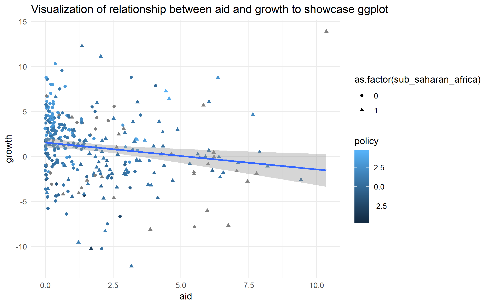

# Første R-Seminar
Erlend Langørgen  
28 august 2017  


# Velkommen!


# Seminaropplegg

## Seminarene

De fleste seminarene vil bestå av 3 moduler:

1. Før seminaret - en kort tutorial jeg vil at dere skal gjøre før seminaret, slik at det blir mulig å jobbe mer selvstendig og få mer individuell oppfølging i selve seminaret.
2. Selve seminaret - Vil så langt det er mulig bestå av korte plenumsseksjoner etterfulgt av selvstendig oppgaveløsing.
3. Oppgaver til etter seminaret - Lar dere teste om dere klarer å anvende ferdigheter fra seminaret selvstendig. Disse oppgavene velger dere selv om dere ønsker å prioritere.

## Om å lære R:

For å få bli gode i R som statsvitere, kan vi trene følgende ferdigheter:

1. Forståelse av grunnleggende konvensjoner i R, og evnen til finne og forstå koden dere trenger for å kunne gjøre som dere vil i R.
2. Forståelse av samfunnsvitenskapelig teori og metode
3. Forståelse av statistikk
4. Forståelse av programmering

Det kan være vanskelig å lære seg R i begynnelsen, særlig hvis man lærer R uten særlig forkunnskaper i noen av ferdighetene over. Den første ferdigheten trente vi i innføringen til R, og innebærer forståelse av ting som *objekter*, *funksjoner*, *indeksering*, *working directory* og *hjelpefiler*. Det å få på plass denne basisen er den tyngste delen av å lære R for mange. Jeg forventer ikke at alle som er nye til R har en dyp forståelse av de grunnleggende tingene i R etter den korte innføringen dere fikk for to uker siden. 

Gode ferdigheter i punkt 2.-4. setter deg i stand til å lage klare planer for hva som skal gjøres, og hva slags resultater du kan regne med å få, før du har skrevet en linje med kode. I en slik situasjon er det relativt lett å forstå problemer med kode. En vanskeligere, og mer frustrerende situasjon oppstår dersom du ikke forstår den statistiske modellen du jobber med, eller har klare begreper om hva du vil gjøre. Da blir det vanskelig å vite om koden din er rett selv om koden kjører. Seminarene er lagt opp slik at R seminarer for statistiske modeller holdes etter forelesningen for modellen. Jeg vil derfor oppfordre dere på det sterkeste til å forsøke å være ajour med pensum til de statistiske modellene vi skal jobbe med i seminarene.

Seminarene i STV4020A kommer til å vektlegge anvendt statistisk analyse, med hovedvekt på ferdighet 1 og 3. For å lykkes med hjemmeoppgaven må dere imidlertid også ha en bred beherskelse av samfunnsvitenskapelig metode. Jeg kommer derfor også til å vise hvordan vi kan flette R sammen med bred metodeforståelse til en viss grad. Programmering ut over det som gjennomgås i seminarene kan dere lære gjennom oppgaver merket med **programmering** blant oppgavene som legges ut etter seminarene.  Dere trenger imidlertid ikke lære mer R enn det som gjennomgås i seminarene til R-prøven. 


## Andre læringsressurser og nyttige R-lenker

- [Gratis innføringsbok på nett](http://r4ds.had.co.nz/)
- [Quick-R - et bra sted å søke etter ting, lett å forstå for nybegynnere](https://www.statmethods.net/)
- [Interaktiv R-intro fra datacamp](https://www.datacamp.com/courses/free-introduction-to-r)
- [Interaktiv tidyverse-intro fra datacamp](https://www.datacamp.com/courses/introduction-to-the-tidyverse)
- [Stackoverflow - har svar på det R-problemet du sliter med](https://stackoverflow.com/questions/tagged/r)
- [R-bloggers - har gode, kortfattede tutorials](https://www.r-bloggers.com/)
- [Guide til ggplot2](http://docs.ggplot2.org/current/)
- [Facebookgruppe for R for statsvitere](https://www.facebook.com/groups/427792970608618/)
- [Stilguide for R](https://google.github.io/styleguide/Rguide.xml)
- [Bruke prosjekter i R](https://support.rstudio.com/hc/en-us/articles/200526207-Using-Projects)
- [Mappestruktureringsforslag](https://nicercode.github.io/blog/2013-04-05-projects/)


Du kan også finne videoer, flere gratis bøker m.m. hvis du googler/søker på stackoverflow.
Dersom dere ønsker å gjøre/lære mye databehandling med R, vil jeg anbefale at dere bruker tid på å jobbe gjennom *R for data science*. Det viktigste er nok imidlertid å lære seg å lese og forstå hjelpefiler i R og stackoverflow. For å bli god i R er det lurt å huske noen grunnbegreper, men ut over det bruker man hjelpefiler i R/stackoverflow som ordbøker hele tiden. 


## Undervisningsopplegg

Jeg vil at dere skal skrive mest mulig selvstendig kode i seminarene. Dette er den beste måten å trene dere til å løse hjemmeoppgaven, og den beste måten å sørge for at det ikke blir ubehagelige overraskelser på prøven. Det gir også meg muligheten til å gå rundt å gi individuell oppfølging til dere. For at dette skal fungere effektivt, må dere gjøre noe forberedelser. Derfor foreslår jeg følgende:

1. **Før seminaret:** Alle bruker opp til en halvtime på tutorials før seminarene - dette vil gjøre at jeg slipper å prate så mye i seminaret.
2. **I seminaret:**
- Jeg lager oppgavesett, et script og et kort oversiktsdokument over dagens emner til hvert seminar
- Når vi jobber med oppgaver, hjelp/spør hverandre om dere står fast og jeg hjelper noen andre. 
- Spør/si i fra dersom noe er uklart, så skal jeg oppdatere undervisningsopplegget.
3. **Etter seminaret:** Jeg legger ut noen oppgaver, og kommenterer hva slags ferdigheter oppgavene gir trening i. Dere velger selv hvor mye tid dere vil bruke på slike oppgaver. Dere har et travelt semester, og det er mange metoder å fordype seg i. Jeg forventer ikke at alle prioriterer å fordype seg i R.

* Undervisningsmateriell blir lenket til på Canvas. Selve opplegget blir lastet opp på [github](https://github.com/martigso/stv4020aR). Der kan dere også se det Martin laster opp. For øyeblikket ligger fjorårets opplegg ute, jeg kommer til å oppdatere alle seminaren i løpet av semester, da jeg har endret seminarstrukturen en god del. 

## Dagens seminar: En første dataanalyse med R.

I dagens seminar skal jeg gjennomgå følgende:

1. [Kort om funksjoner og hjelpefiler](#funksjoner)
2. [Importere ulike datatyper i R.](#Importere)
3. [Utforsking av data og deskriptiv statistikk.](#deskriptiv)
4. [Plotte-funksjonen `ggplot`.](#ggplot)
5. [Lineær regresjonsanalyse (OLS)](#ols)


Dere vil få oppgaver som trener dere i disse ferdighetene, samt i grunnleggende forståelse av R som språk. Dersom dere sliter med å forstå indeksering, funksjoner, objekter e.l., kan dere kikke [her](https://github.com/martigso/stv4020aR/blob/master/Gruppe%201/scripts/Introduksjon.md), eller spørre meg.
Vi kommer til å fortsette med å trene på basics også i neste seminar.


## Kort om  funksjoner <a name="funksjoner"></a>

En grunnleggende byggestein i R er funksjoner. En funksjon tar i mot verdi(er), gjerne lagret i form av et R-objekt, utfører operasjoner basert på input, og produserer nye verdier. En typisk R-funksjon har følgende *syntaks*:

```r
aFunction(x = "R-objekt", arg = "alternativ for funksjonens oppførsel")
## Merk: dette er ikke en faktisk funksjon i R. Funksjoner kan også ha andre syntakser.
```
Funksjoner som `c()`, `log()`, `summary()`, `str()` og `read.csv()` er eksempler på funksjoner.
Dersom vi vil lære mer om en funksjon, kan vi spørre R om hjelp med `?`. Kjør `?c()` og `?log()`  

Dersom vi er på jakt etter en funksjon til et spesielt formål, kan vi bruke `??` (eller google).
Si at vi har lyst til å lage en sekvens av tall, som med `:` (som teller på heltall), men bare inkludere partall. La oss se om vi kan finne en funksjon til å gjøre dette med følgende kode: `??sequence`

Søket med `??` viser at `seq` kan gjøre jobben:

```r
seq(from = 2, to = 20, by = 2)
```

```
##  [1]  2  4  6  8 10 12 14 16 18 20
```

```r
seq(from = 20, to = 2, by = -2)
```

```
##  [1] 20 18 16 14 12 10  8  6  4  2
```
Dersom en funksjon produserer output av en type som fungerer som input i en annen funksjon, kan vi plassere funksjoner inne i andre funksjoner:

```r
c(seq(20, 2, -2), rep(1, 2), seq(2, 20, 2))
```

```
##  [1] 20 18 16 14 12 10  8  6  4  2  1  1  2  4  6  8 10 12 14 16 18 20
```
Som dere ser trenger vi ikke skrive argumentene, kjør `?rep` for å finne ut hva funksjonen i midten gjør. Fortsett å bruke `?` til å lære om nye funksjoner som introduseres resten av seminaret. Øv på å lese syntaks fra hjelpefilene, sammen med googling vil evnen til å lese syntaks sette dere i stand til å finne løsninger på alle slags problemer, med litt trening går dette stort sett ganske raskt.  

Mange funksjoner er i eksterne pakker (det finnes over 10 000!) som må lastes ned fra nettet med `install.packages("pakkenavn")` og gjøres tilgjengelig i R-sesjonen din før du kan bruke dem med `library(pakkenavn)`.

I dagens seminar skal dere innom pakkene `ggplot2`, `haven`, `moments` og kanskje `dplyr`.
Under viser jeg koden for å installere `moments`. Skriv koden for å installere og laste inn de to andre pakkene selv i scriptet ditt!

```r
# install.packages('moments') # dersom pakken allerede er installert trenger du ikke kjøre
# denne, klikk på packages i viduet nede til høyre for å sjekke, eller se om neste linje
# med kode kjører uten problemer.
library(moments)
```

### Noen omkodingsfunksjoner:

Omkoding er ofte nødnvedig i dataanalyse. Dere skal få et godt råd: ikke gjør en omkoding som overskriver variabler som allerede finnes, opprett alltid nye variabler, ellers kan det bli veldig kjedelig å gjøre feil.

Den funksjonen jeg bruker mest til omkoding, er `ifelse()`. Syntaksen til denne funksjonen kan forklares som følger:


```r
data$nyvar <- ifelse(test = my_data$my.variabel == "some logical condition", yes = "what to return if 'some condition' is TRUE", 
    no = "what to return if 'some condition' is FALSE")
```

Andre nyttige funksjoner til omkoding er matematiske transformasjoner som `log()`, `exp()` og `sqrt()`, og funksjoner for å "lagge" og "leade" variabler som `lag()` og `lead()` fra pakken `dplyr`. Det finnes et stort antall funksjoner som kan brukes til omkoding.


## Importere ulike datatyper i R <a name="importere"></a>

Dersom dere skal gjøre statistisk analyse, er som regel den første seksjonen import og forberedelse av data. En styrke ved R, er at det er mulig å importere alskens mulige filer, både fra en **mappe på pcen** din og fra en **url** på internett. Jeg går gjennom import av filer fra excel, stata, spss og R, men vit at det finnes mange andre muligheter. Vi skal bruke et datasett som ble brukt i artikkelen "Aid, policies, and growth." skrevet av Burnside og Dollar i år 2000). Vi kommer til å bruke dette datasettet gjennom hele seminaret.

I introen til seminar 1 som jeg lenket til på canvas fikk dere i oppgave å laste inn datasett fra en url på nett. Nå skal vi se på import av data fra en mappe på pcen. R vil til enhver tid forvente at filnavn du refererer til befinner seg i **working directory**, som er en mappe på pcen din. For å sjekke hva nåværende **working directory** er, og hvilke filer som finnes seg i den mappen, kan du skrive følgende kode (jeg har gjemt egen output):


```r
getwd()  # lister opp ditt
list.files()
```

For å endre **working directory**, bruker dere følgende kode: 


```r
setwd("C:/Users/Navn/R/der/du/vil/jobbe/fra")  # For windows
setwd("~/R/der/du/vil/jobbe/fra")  # For mac/linux
```

Et annet alternativ er å starte et nytt prosjekt i **R**, ved å trykke på *File* og deretter *New Project* i menyen øverst til venstre i Rstudio. Da får du muligheten til å lage en ny mappe på pcen din som blir satt til **working directory**. Senere kan du sette denne mappen til working directory med *Open project* fra menyen (jeg anbefaler å bruke prosjekter, særlig til hjemmeoppgaven).

**Oppgave:** Lag en ny mappe til R-seminarene, og sett den til **working directory**. Bruk enten `setwd()` eller prosjekter. Last deretter ned filene du finner bak disse lenkene, og lagre dem i ditt working directory:

1. https://github.com/martigso/stv4020aR/raw/master/Gruppe%202/data/aidgrowth/aidgrowth.RData 
2. https://github.com/martigso/stv4020aR/raw/master/Gruppe%202/data/aidgrowth/aidgrowth.dta
3. https://github.com/martigso/stv4020aR/raw/master/Gruppe%202/data/aidgrowth/aidgrowth.sav

Sjekk til slutt at filene er i **working directory** med `list.files()`.

Vi er nå klare til å laste inn data som et objekt i R. Funksjoner for å laste inn ulike datatyper har stort sett ganske lik syntaks (noen variasjoner og ulike tilleggalternativ)

```r
datasett <- read_filtype("filnavn.filtype")
read.csv("filnavn.csv")  # for .csv, sjekk også read.table
load("")
# Fra haven-pakken
read_spss("filnavn.sav")  # for .sav-filer fra spss
read_stata("filnavn.dta")  # for .dta-filer fra stata
```


**Oppgave** Last inn en av de tre filene "aidgrowth.RData", "aidgrowth.sav" eller "aidgrowth.dta" som et objekt med navnet `aid`.


* Legg merke til: eksterne filer, som uinstallerte pakker og datasett som ikke er lastet inn som objekter, må alltid skrives i `" "` når vi refererer til dem. Informasjon som er lagret internt, som nedlastede pakker og opprettede objekter, refererer vi ikke til med `" "`

## Utforsking av data og deskriptiv statistikk <a name="deskriptiv"></a>

Det første vi vil gjøre etter at vi har åpnet et datasett i R, er som regel å sjekke hva det inneholder og hvordan det er strukturert. Funksjonene under er nyttige til dette formålet. I tillegg til disse funksjonene, er en kodebok helt uunværlig for å forstå hva som foregår i et datasett. Korte variabelbeskrivelser til datasettet `aid` finner dere [her](https://github.com/martigso/stv4020aR/tree/master/Gruppe%202/data/aidgrowth). Operasjonaliseringen er mer uutførlig beskrevet i artikkelen til Burnside og Dollar (2000).


```r
class(aid)  # Er dette faktisk en data.frame, eller et annet type objekt?
```

```
## [1] "data.frame"
```

```r
colnames(aid)  # denne funksjonen forteller deg kolonnenavn i datasettet.
```

```
##  [1] "X"                      "country"               
##  [3] "period"                 "gdp_growth"            
##  [5] "aid"                    "policy"                
##  [7] "gdp_pr_capita"          "ethnic_frac"           
##  [9] "assasinations"          "sub_saharan_africa"    
## [11] "fast_growing_east_asia" "institutional_quality" 
## [13] "m2_gdp_lagged"
```

```r
names(aid)  # denne funksjonen forteller deg kolonnenavn i datasettet, men fungerer også på andre objekttyper.
```

```
##  [1] "X"                      "country"               
##  [3] "period"                 "gdp_growth"            
##  [5] "aid"                    "policy"                
##  [7] "gdp_pr_capita"          "ethnic_frac"           
##  [9] "assasinations"          "sub_saharan_africa"    
## [11] "fast_growing_east_asia" "institutional_quality" 
## [13] "m2_gdp_lagged"
```

```r
head(aid, 5)  # denne funksjonen viser deg de første observasjonene i datasettet.
```

```
##    X country period gdp_growth       aid     policy gdp_pr_capita
## 1 34     ARG      2   1.700300 0.0182389  0.6565560          5637
## 2 35     ARG      3   1.077615 0.0171555 -0.5792648          6168
## 3 36     ARG      4  -1.115285 0.0239942 -0.1356454          5849
## 4 37     ARG      5  -2.551385 0.0299630 -1.3482960          5487
## 5 38     ARG      6  -1.099306 0.0157275 -1.0904191          5624
##   ethnic_frac assasinations sub_saharan_africa fast_growing_east_asia
## 1        0.31          2.75                  0                      0
## 2        0.31          9.75                  0                      0
## 3        0.31          1.00                  0                      0
## 4        0.31          0.00                  0                      0
## 5        0.31          0.25                  0                      0
##   institutional_quality m2_gdp_lagged
## 1               4.28125      24.82476
## 2               4.28125      28.79304
## 3               4.28125      30.23452
## 4               4.28125      29.73977
## 5               4.28125      20.33055
```

```r
tail(aid, 5)  # denne funksjonen viser deg de siste observasjonene i datasettet.
```

```
##        X country period gdp_growth       aid    policy gdp_pr_capita
## 327 1355     ZWE      3 -3.5808799 0.0879854 0.8161532          1364
## 328 1356     ZWE      4  2.9041770 1.0499049 0.4893152          1168
## 329 1357     ZWE      5 -0.6336143 1.9634120 0.4975752          1332
## 330 1358     ZWE      6  0.5389957 2.0841630 0.5161451          1178
## 331 1359     ZWE      7 -2.0151441 2.9587979 0.4785629          1182
##     ethnic_frac assasinations sub_saharan_africa fast_growing_east_asia
## 327        0.54            NA                  1                      0
## 328        0.54          1.00                  1                      0
## 329        0.54          0.75                  1                      0
## 330        0.54          0.00                  1                      0
## 331        0.54          0.00                  1                      0
##     institutional_quality m2_gdp_lagged
## 327                4.4375            NA
## 328                4.4375            NA
## 329                4.4375      33.40377
## 330                4.4375      29.76109
## 331                4.4375      30.27968
```

```r
str(aid)  # denne funksjonen beskriver strukturen til et objekt. Alt du trenger.
```

```
## 'data.frame':	331 obs. of  13 variables:
##  $ X                     : int  34 35 36 37 38 39 154 155 156 157 ...
##  $ country               : Factor w/ 56 levels "ARG","BOL","BRA",..: 1 1 1 1 1 1 2 2 2 2 ...
##  $ period                : int  2 3 4 5 6 7 2 3 4 5 ...
##  $ gdp_growth            : num  1.7 1.08 -1.12 -2.55 -1.1 ...
##  $ aid                   : num  0.0182 0.0172 0.024 0.03 0.0157 ...
##  $ policy                : num  0.657 -0.579 -0.136 -1.348 -1.09 ...
##  $ gdp_pr_capita         : int  5637 6168 5849 5487 5624 4706 1661 1838 2015 1864 ...
##  $ ethnic_frac           : num  0.31 0.31 0.31 0.31 0.31 0.31 0.68 0.68 0.68 0.68 ...
##  $ assasinations         : num  2.75 9.75 1 0 0.25 0 0.75 0 0.25 0 ...
##  $ sub_saharan_africa    : int  0 0 0 0 0 0 0 0 0 0 ...
##  $ fast_growing_east_asia: int  0 0 0 0 0 0 0 0 0 0 ...
##  $ institutional_quality : num  4.28 4.28 4.28 4.28 4.28 ...
##  $ m2_gdp_lagged         : num  24.8 28.8 30.2 29.7 20.3 ...
```
Dere kan også åpne datasettet i et egete vindu ved å dobbeltklikke på det, skriv evt. `View(aid)`, men ikke lagre denne kommandoen i scriptet ditt som en hovedregel.

Etter at vi har forstått strukturen til datasettet kan vi begynne på en statistisk analyse. Før du kjører en regresjonsmodell, kan det ofte være nyttig å danne seg en forståelse av hvordan sentrale variabler vi er interessert i er fordelt. I dette seminaret skal vi undersøke hypotesen til Burnside og Dollar om at bistand har en positiv, akslererende effekt på vekst i land med "god økonomisk politikk":

>We investigate a new hy pothesis about aid: that it does affect growth,  but that its impact is conditional on  the same  policies that affect growth. Poor countries with  sound economic policies benefit directly from
 the policies, and in this environment aid accelerates growth. In highly distorted economies, however, aid is    dissipated in unproductive government expenditure.

Denne hypotesen er fin å jobbe med, siden den lar oss se nærmere både på samspill ("conditional impact") og andregradsledd ("accelerates growth"). Variablene vi er interessert i, heter `gdp_growth`, `aid` og `policy`. Før vi undersøker hypotesen vil vi imidlertid gjerne vite hvordan variablene som inngår i hypotesen er fordelt, ellers blir det vanskelig å tolke effektene av variablene substansielt. Vi skal bruke noen funksjoner fra `moments` pakken i tillegg til funksjoner som ikke trenger å lastes inn via pakker.

Disse funksjonene fungerer gir unviariat statistikk for kontinuerlige variabler:


```r
min(aid$gdp_growth, na.rm = TRUE)  # minimumsverdi, na.rm = T spesifiserer at missing skal droppes i beregning.
```

```
## [1] -12.20386
```

```r
max(aid$gdp_growth, na.rm = TRUE)  # maksimumsverdi
```

```
## [1] 13.89921
```

```r
mean(aid$gdp_growth, na.rm = TRUE)  # gjennomsnitt
```

```
## [1] 1.039167
```

```r
median(aid$gdp_growth, na.rm = T)  # median
```

```
## [1] 1.186194
```

```r
sd(aid$gdp_growth, na.rm = T)  # standardavvik
```

```
## [1] 3.753341
```

```r
var(aid$gdp_growth, na.rm = T)  # varians
```

```
## [1] 14.08757
```

```r
# install.packages('moments')
library(moments)
skewness(aid$gdp_growth)  # skjevhet - fra moments
```

```
## [1] NA
```

```r
kurtosis(aid$gdp_growth)  # kurtose - fra moments
```

```
## [1] NA
```

```r
summary(aid$gdp_growth)  # forskjellig deskriptiv statistikk for en variabel
```

```
##    Min. 1st Qu.  Median    Mean 3rd Qu.    Max.    NA's 
## -12.204  -1.292   1.186   1.039   3.392  13.899       6
```

```r
summary(aid)  # deskriptiv statistikk for alle variabler i datasettet
```

```
##        X             country        period        gdp_growth     
##  Min.   :  34.0   ARG    :  6   Min.   :2.000   Min.   :-12.204  
##  1st Qu.: 382.5   BOL    :  6   1st Qu.:3.000   1st Qu.: -1.292  
##  Median : 746.0   BRA    :  6   Median :4.000   Median :  1.186  
##  Mean   : 727.0   BWA    :  6   Mean   :4.468   Mean   :  1.039  
##  3rd Qu.:1074.5   CHL    :  6   3rd Qu.:6.000   3rd Qu.:  3.392  
##  Max.   :1359.0   CIV    :  6   Max.   :7.000   Max.   : 13.899  
##                   (Other):295                   NA's   :6        
##       aid                policy        gdp_pr_capita      ethnic_frac    
##  Min.   :-0.007973   Min.   :-4.5035   Min.   :  296.0   Min.   :0.0000  
##  1st Qu.: 0.269372   1st Qu.: 0.5197   1st Qu.:  972.8   1st Qu.:0.1600  
##  Median : 0.998406   Median : 0.9357   Median : 1753.5   Median :0.5400  
##  Mean   : 1.757570   Mean   : 1.1605   Mean   : 2224.2   Mean   :0.4738  
##  3rd Qu.: 2.628056   3rd Qu.: 1.4042   3rd Qu.: 2872.2   3rd Qu.:0.7200  
##  Max.   :10.359500   Max.   : 4.5245   Max.   :11368.0   Max.   :0.9300  
##                      NA's   :45        NA's   :7                         
##  assasinations     sub_saharan_africa fast_growing_east_asia
##  Min.   : 0.0000   Min.   :0.0000     Min.   :0.00000       
##  1st Qu.: 0.0000   1st Qu.:0.0000     1st Qu.:0.00000       
##  Median : 0.0000   Median :0.0000     Median :0.00000       
##  Mean   : 0.3974   Mean   :0.3746     Mean   :0.09063       
##  3rd Qu.: 0.2500   3rd Qu.:1.0000     3rd Qu.:0.00000       
##  Max.   :11.5000   Max.   :1.0000     Max.   :1.00000       
##  NA's   :2                                                  
##  institutional_quality m2_gdp_lagged   
##  Min.   :2.271         Min.   : 7.235  
##  1st Qu.:3.695         1st Qu.:20.274  
##  Median :4.516         Median :24.948  
##  Mean   :4.607         Mean   :28.415  
##  3rd Qu.:5.471         3rd Qu.:33.356  
##  Max.   :7.000         Max.   :92.971  
##                        NA's   :12
```

For bivariat eller multivariat deskriptiv statistikk, ser vi gjerne på korrelasjon (pearsons R). Med funksjonen `cor()` kan vi få bivariat korrelasjon mellom to variabler, eller lage bivariate korrelasjoner mellom alle numeriske variabler i datasettet vårt:


```r
cor(aid$gdp_growth, aid$aid, use = "pairwise.complete.obs")  # argumentet use bestemmer missing-håndtering
```

```
## [1] -0.1587284
```

```r
str(aid)  # sjekker hvilke variabler som er numeriske
```

```
## 'data.frame':	331 obs. of  13 variables:
##  $ X                     : int  34 35 36 37 38 39 154 155 156 157 ...
##  $ country               : Factor w/ 56 levels "ARG","BOL","BRA",..: 1 1 1 1 1 1 2 2 2 2 ...
##  $ period                : int  2 3 4 5 6 7 2 3 4 5 ...
##  $ gdp_growth            : num  1.7 1.08 -1.12 -2.55 -1.1 ...
##  $ aid                   : num  0.0182 0.0172 0.024 0.03 0.0157 ...
##  $ policy                : num  0.657 -0.579 -0.136 -1.348 -1.09 ...
##  $ gdp_pr_capita         : int  5637 6168 5849 5487 5624 4706 1661 1838 2015 1864 ...
##  $ ethnic_frac           : num  0.31 0.31 0.31 0.31 0.31 0.31 0.68 0.68 0.68 0.68 ...
##  $ assasinations         : num  2.75 9.75 1 0 0.25 0 0.75 0 0.25 0 ...
##  $ sub_saharan_africa    : int  0 0 0 0 0 0 0 0 0 0 ...
##  $ fast_growing_east_asia: int  0 0 0 0 0 0 0 0 0 0 ...
##  $ institutional_quality : num  4.28 4.28 4.28 4.28 4.28 ...
##  $ m2_gdp_lagged         : num  24.8 28.8 30.2 29.7 20.3 ...
```

```r
head(aid[, 3:13])  # velger de substansielle numeriske variablene i datasettet
```

```
##   period gdp_growth       aid     policy gdp_pr_capita ethnic_frac
## 1      2   1.700300 0.0182389  0.6565560          5637        0.31
## 2      3   1.077615 0.0171555 -0.5792648          6168        0.31
## 3      4  -1.115285 0.0239942 -0.1356454          5849        0.31
## 4      5  -2.551385 0.0299630 -1.3482960          5487        0.31
## 5      6  -1.099306 0.0157275 -1.0904191          5624        0.31
## 6      7   4.258730 0.0007560  1.2945040          4706        0.31
##   assasinations sub_saharan_africa fast_growing_east_asia
## 1          2.75                  0                      0
## 2          9.75                  0                      0
## 3          1.00                  0                      0
## 4          0.00                  0                      0
## 5          0.25                  0                      0
## 6          0.00                  0                      0
##   institutional_quality m2_gdp_lagged
## 1               4.28125      24.82476
## 2               4.28125      28.79304
## 3               4.28125      30.23452
## 4               4.28125      29.73977
## 5               4.28125      20.33055
## 6               4.28125      21.72240
```

```r
cor(aid[, 3:13], use = "pairwise.complete.obs")  # korrelasjonsmatrise basert på numeriske variabler
```

```
##                               period  gdp_growth        aid      policy
## period                  1.0000000000 -0.27112913  0.1414084  0.14146969
## gdp_growth             -0.2711291305  1.00000000 -0.1587284  0.45346637
## aid                     0.1414084467 -0.15872840  1.0000000 -0.14758229
## policy                  0.1414696885  0.45346637 -0.1475823  1.00000000
## gdp_pr_capita           0.1215467714  0.04361142 -0.4892737  0.07114461
## ethnic_frac            -0.0006755442 -0.12464188  0.2857391 -0.05375693
## assasinations           0.0714324232 -0.06381011 -0.1537210 -0.01143047
## sub_saharan_africa     -0.0002440557 -0.24092665  0.6343521 -0.18138537
## fast_growing_east_asia  0.0058915431  0.29124012 -0.2310245  0.46324560
## institutional_quality   0.0099406333  0.25364737 -0.0867613  0.26236235
## m2_gdp_lagged           0.3399973121  0.04156672 -0.1109513  0.05582412
##                        gdp_pr_capita   ethnic_frac assasinations
## period                    0.12154677 -0.0006755442    0.07143242
## gdp_growth                0.04361142 -0.1246418822   -0.06381011
## aid                      -0.48927369  0.2857390547   -0.15372098
## policy                    0.07114461 -0.0537569312   -0.01143047
## gdp_pr_capita             1.00000000 -0.3635439612    0.10118860
## ethnic_frac              -0.36354396  1.0000000000   -0.08658713
## assasinations             0.10118860 -0.0865871279    1.00000000
## sub_saharan_africa       -0.48984383  0.5464936308   -0.22131292
## fast_growing_east_asia    0.04651834  0.1068686704   -0.02892082
## institutional_quality     0.33032535 -0.0180701236   -0.17814046
## m2_gdp_lagged             0.20212861 -0.1373697483   -0.01518115
##                        sub_saharan_africa fast_growing_east_asia
## period                      -0.0002440557            0.005891543
## gdp_growth                  -0.2409266493            0.291240117
## aid                          0.6343520628           -0.231024519
## policy                      -0.1813853663            0.463245602
## gdp_pr_capita               -0.4898438322            0.046518343
## ethnic_frac                  0.5464936308            0.106868670
## assasinations               -0.2213129159           -0.028920820
## sub_saharan_africa           1.0000000000           -0.244344771
## fast_growing_east_asia      -0.2443447709            1.000000000
## institutional_quality        0.0753295878            0.162581771
## m2_gdp_lagged               -0.3132726427            0.106094571
##                        institutional_quality m2_gdp_lagged
## period                           0.009940633    0.33999731
## gdp_growth                       0.253647370    0.04156672
## aid                             -0.086761301   -0.11095127
## policy                           0.262362352    0.05582412
## gdp_pr_capita                    0.330325354    0.20212861
## ethnic_frac                     -0.018070124   -0.13736975
## assasinations                   -0.178140455   -0.01518115
## sub_saharan_africa               0.075329588   -0.31327264
## fast_growing_east_asia           0.162581771    0.10609457
## institutional_quality            1.000000000    0.08670519
## m2_gdp_lagged                    0.086705188    1.00000000
```


En av variablene i datasettet vårt, `aid$country`, er ikke kontinuerlig. Ved å ta `str(aid)`, ser vi at denne variabelen er kodet som en faktor. Dette innebærer at den vil behandles som en nominalnivå-variabel i statistisk analyse. For kategoriske variabler, er tabeller nyttig:


```r
table(aid$country)  # frekvenstabell
```

```
## 
## ARG BOL BRA BWA CHL CIV CMR COL CRI DOM DZA ECU EGY ETH GAB GHA GMB GTM 
##   6   6   6   6   6   6   6   6   6   6   6   6   6   6   6   6   4   6 
## GUY HND HTI IDN IND JAM KEN KOR LKA MAR MDG MEX MLI MWI MYS NER NGA NIC 
##   5   6   6   6   6   6   6   6   6   6   6   6   6   6   6   6   6   4 
## PAK PER PHL PRY SEN SLE SLV SOM SYR TGO THA TTO TUN TUR TZA URY VEN ZAR 
##   6   6   6   6   6   6   6   6   6   6   6   6   6   6   6   6   6   6 
## ZMB ZWE 
##   6   6
```

```r
prop.table(table(aid$country))  # prosentfordeling basert på frekvenstabell
```

```
## 
##        ARG        BOL        BRA        BWA        CHL        CIV 
## 0.01812689 0.01812689 0.01812689 0.01812689 0.01812689 0.01812689 
##        CMR        COL        CRI        DOM        DZA        ECU 
## 0.01812689 0.01812689 0.01812689 0.01812689 0.01812689 0.01812689 
##        EGY        ETH        GAB        GHA        GMB        GTM 
## 0.01812689 0.01812689 0.01812689 0.01812689 0.01208459 0.01812689 
##        GUY        HND        HTI        IDN        IND        JAM 
## 0.01510574 0.01812689 0.01812689 0.01812689 0.01812689 0.01812689 
##        KEN        KOR        LKA        MAR        MDG        MEX 
## 0.01812689 0.01812689 0.01812689 0.01812689 0.01812689 0.01812689 
##        MLI        MWI        MYS        NER        NGA        NIC 
## 0.01812689 0.01812689 0.01812689 0.01812689 0.01812689 0.01208459 
##        PAK        PER        PHL        PRY        SEN        SLE 
## 0.01812689 0.01812689 0.01812689 0.01812689 0.01812689 0.01812689 
##        SLV        SOM        SYR        TGO        THA        TTO 
## 0.01812689 0.01812689 0.01812689 0.01812689 0.01812689 0.01812689 
##        TUN        TUR        TZA        URY        VEN        ZAR 
## 0.01812689 0.01812689 0.01812689 0.01812689 0.01812689 0.01812689 
##        ZMB        ZWE 
## 0.01812689 0.01812689
```

Vi kan også lage tabeller med flere variabler. Under viser jeg hvordan du lager en tabell fordelingen av observasjoner som har høyere vekst enn medianveksten i utvalget, ved hjelp av en logisk test:

```r
table(aid$gdp_growth > median(aid$gdp_growt, na.rm = T))
```

```
## 
## FALSE  TRUE 
##   163   162
```

```r
table(aid$gdp_growth > median(aid$gdp_growt, na.rm = T), aid$country)
```

```
##        
##         ARG BOL BRA BWA CHL CIV CMR COL CRI DOM DZA ECU EGY ETH GAB GHA
##   FALSE   4   3   2   0   3   4   3   1   2   2   2   3   2   2   4   5
##   TRUE    2   3   4   6   3   2   3   5   4   4   4   3   4   1   2   1
##        
##         GMB GTM GUY HND HTI IDN IND JAM KEN KOR LKA MAR MDG MEX MLI MWI
##   FALSE   3   4   4   4   4   0   2   3   3   0   0   2   6   3   4   4
##   TRUE    1   2   1   2   2   6   4   3   3   6   6   4   0   3   2   2
##        
##         MYS NER NGA NIC PAK PER PHL PRY SEN SLE SLV SOM SYR TGO THA TTO
##   FALSE   0   5   3   3   0   4   2   3   5   4   3   5   2   6   0   3
##   TRUE    6   1   3   1   6   2   4   3   1   2   3   1   4   0   6   3
##        
##         TUN TUR TZA URY VEN ZAR ZMB ZWE
##   FALSE   1   1   3   2   5   5   6   4
##   TRUE    5   5   0   4   1   1   0   2
```

De fleste land har vekst både over og under medianen. Dersom det ikke hadde vært tilfelle, ville kontrollvariabler for land kunne ha fjernet effekten av de fleste variabler - vi ville ikke hatt veldig godt datagrunnlag for å si så mye om effekten av bistand i samspill med policy (jeg sier ikke at dataene er gode generelt,...).


## Plotte-funksjonen `ggplot` <a name="ggplot"></a>


Hadley Wickham fra R studio skriver mange veldig gode tilleggspakker til R (i tillegg til gratis innføringsbøker på nett), blant annet pakken `ggplot2` (det kan være forvirrende at pakken heter `ggplot2`, mens funksjonen heter `ggplot()`). Jeg foretrekker å lage plot med `ggplot()` funksjonen fra ggplot2 over `plot()` fra *base* R. Grunnen til dette er først og fremst fordi jeg liker syntaksen bedre, og at jeg har brukt `ggplot()` mest, det er ingenting galt med `plot()`. Dersom jeg  bare vil ha et svært enkelt scatterplot bruker jeg ofte `plot()`. Med det sagt, her er de nødvendige elementene man må spesifisere i syntaksen til `ggplot()`:


```r
ggplot(data = my_data) +  
  geom_point(aes(x = x-axis_var_name, y = y-axis_var_name, col=my.var3)))  
```

Vi starter med å fortelle ggplot hvilket datasett vi bruker. Deretter bruker vi en `geom_...()`-funksjon, her `geom_point()` (det er en lang rekke alternativer), for å fortelle hvordan vi vil plotte data. Her har vi valgt å plotte data som punkter, dvs. lage et scatterplot. Vi må også spesifisere hvilke variabler fra datasettet vi vil plotte, etter `aes()` for aesthetics. Vi må minst velge å plotte en akse, som regel vil vi plotte minst to akser. Vi kan også velge å legge til argumentet `col` for å visualisere enda en variabel. Dette argumentet gir ulike farger til observasjonen avhengig av verdien de har på variabelen vi spesifiserte. Det finnes også alternative måter å visualisere mer enn to variabler, som f.eks. `size = my.var3`, eller `shape = my.var3`.   

Vi legger til nye argumer til plottet vårt med `+`. Etter at vi har spesifisert datasett, geom og aesthetics må vi ikke legge til flere argumenter, men det er mulig å legge til flere elementer (som en regresjonslinje) eller finjustere plottet i det uendelige (f.eks. angi fargekoder for alle farger i plottet manuelt). Man får imidlertid som regel et godt resultat med et par linjer kode. Vi skal se raskt på 3 `geom()`

1. `geom_histogram` - histogram (et godt alternativ kan være å bruke `geom_bar()`)
2. `geom_boxplot()` - box-whiskers plot
3. `geom_point()`   - scatterplot


```r
library(ggplot2)
ggplot(aid) + geom_histogram(aes(x = gdp_growth), bins = 50)  # lager histogram
```


```r
ggplot(aid) + geom_boxplot(aes(x = as.factor(sub_saharan_africa), y = aid))
```


Her er et overlesset eksempel på et scatterplot (poenget er å illustrere muligheter, ikke å lage et pent plot):


```r
library(ggplot2)
ggplot(aid) +
  geom_point(aes(x=aid, y=gdp_growth, col=policy, shape=as.factor(sub_saharan_africa))) +
  geom_smooth(aes(x=aid, y=gdp_growth), method="lm") +  # merk: geom_smooth gir bivariat regresjon
  ggtitle("Visualization of relationship between aid and growth to showcase ggplot") +
  xlab("aid") +
  ylab("growth") +
  theme_minimal()
```




**Oppgave:** Forsøk å legge til `facet_wrap(~sub_saharan_africa)`, hva gjør dette argumentet? Hvordan kan det være nyttig for å plotte samspill? Forsøk å fjerne ett og ett argument i plottet over for å se hva argumentene gjør.

Dersom du lager et plot du er fornøyd med, kan du lagre det med `ggsave()`, som lagrer ditt siste ggplot.

```r
ggsave("testplot.png", width = 8, height = 5)  # lagrer ditt siste ggplot i det formatet du vil på working directory
```
Mulighetene er endeløse, jeg har bare vist dere noen få muligheter her. Ved hjelp av [cheatsheet til ggplot2](https://www.rstudio.com/wp-content/uploads/2015/03/ggplot2-cheatsheet.pdf) og [annen dokumentasjon](http://zevross.com/blog/2014/08/04/beautiful-plotting-in-r-a-ggplot2-cheatsheet-3/) som dere kan google dere frem til, burde dere finne metoder for å lage akkurat det plottet dere ønsker.


## Lineær regresjon (OLS) <a name="ols"></a>
Vi kan nå kjøre en regresjonsanalyse for å teste hypotesen, til dette bruker vi `lm()`, som har følgende syntaks:

```r
lm(avhengig.variabel ~ uavhengig.variabel1 + uavh.var2, data = mitt_datasett)
# på mac får du ~ med alt + k + space
```

La oss først se på en bivariat regresjon mellom `aid` og `gdp_growth`:


```r
m1 <- lm(gdp_growth ~ aid, data = aid)  # gdp_growth avh. var, aid uavh. var
summary(m1)  # for å se resultatene
```

```
## 
## Call:
## lm(formula = gdp_growth ~ aid, data = aid)
## 
## Residuals:
##     Min      1Q  Median      3Q     Max 
## -12.813  -2.181   0.144   2.153  15.443 
## 
## Coefficients:
##             Estimate Std. Error t value Pr(>|t|)    
## (Intercept)   1.5570     0.2730   5.704 2.64e-08 ***
## aid          -0.2993     0.1036  -2.889  0.00412 ** 
## ---
## Signif. codes:  0 '***' 0.001 '**' 0.01 '*' 0.05 '.' 0.1 ' ' 1
## 
## Residual standard error: 3.711 on 323 degrees of freedom
##   (6 observations deleted due to missingness)
## Multiple R-squared:  0.02519,	Adjusted R-squared:  0.02218 
## F-statistic: 8.348 on 1 and 323 DF,  p-value: 0.004122
```

Legger inn flere kontrollvariabler med `+`. Med `as.factor()` sørger jeg for at `sub_saharan_africa` og `fast_growing_east_asia` behandles som dummyvariabler. Med `as.factor` inne i `lm()` blir det laget dummy-variabler for alle verdier på en variabel unntatt en refereanseverdi . 


```r
m2 <- lm(gdp_growth ~ aid + policy + assasinations + as.factor(sub_saharan_africa) + as.factor(fast_growing_east_asia), 
    data = aid)
summary(m2)
```

```
## 
## Call:
## lm(formula = gdp_growth ~ aid + policy + assasinations + as.factor(sub_saharan_africa) + 
##     as.factor(fast_growing_east_asia), data = aid)
## 
## Residuals:
##      Min       1Q   Median       3Q      Max 
## -12.1164  -1.6158  -0.0034   1.6213  12.8289 
## 
## Coefficients:
##                                    Estimate Std. Error t value Pr(>|t|)
## (Intercept)                          0.2366     0.3495   0.677   0.4990
## aid                                 -0.0286     0.1391  -0.206   0.8373
## policy                               1.1535     0.1786   6.459 4.73e-10
## assasinations                       -0.2971     0.1584  -1.876   0.0617
## as.factor(sub_saharan_africa)1      -1.0593     0.5414  -1.956   0.0514
## as.factor(fast_growing_east_asia)1   1.1148     0.7120   1.566   0.1186
##                                       
## (Intercept)                           
## aid                                   
## policy                             ***
## assasinations                      .  
## as.factor(sub_saharan_africa)1     .  
## as.factor(fast_growing_east_asia)1    
## ---
## Signif. codes:  0 '***' 0.001 '**' 0.01 '*' 0.05 '.' 0.1 ' ' 1
## 
## Residual standard error: 3.188 on 277 degrees of freedom
##   (48 observations deleted due to missingness)
## Multiple R-squared:  0.2419,	Adjusted R-squared:  0.2282 
## F-statistic: 17.68 on 5 and 277 DF,  p-value: 3.367e-15
```

Legger inn samspill mellom `aid` og `policy` med `*`. Merk at de individuelle regresjonskoeffisientene for variabler i samspill blir automatisk inkludert (det er bra). Nå gjør vi vår første test av hypotesen til Burnside og Dollar


```r
m3 <- lm(gdp_growth ~ aid * policy + assasinations + sub_saharan_africa + fast_growing_east_asia, 
    data = aid)
summary(m3)
```

```
## 
## Call:
## lm(formula = gdp_growth ~ aid * policy + assasinations + sub_saharan_africa + 
##     fast_growing_east_asia, data = aid)
## 
## Residuals:
##     Min      1Q  Median      3Q     Max 
## -12.059  -1.769   0.066   1.697  12.826 
## 
## Coefficients:
##                        Estimate Std. Error t value Pr(>|t|)    
## (Intercept)              0.4829     0.3897   1.239 0.216325    
## aid                     -0.1613     0.1674  -0.963 0.336194    
## policy                   0.9133     0.2458   3.716 0.000245 ***
## assasinations           -0.3102     0.1584  -1.959 0.051138 .  
## sub_saharan_africa      -1.1153     0.5419  -2.058 0.040509 *  
## fast_growing_east_asia   1.4580     0.7507   1.942 0.053146 .  
## aid:policy               0.1519     0.1070   1.419 0.156925    
## ---
## Signif. codes:  0 '***' 0.001 '**' 0.01 '*' 0.05 '.' 0.1 ' ' 1
## 
## Residual standard error: 3.182 on 276 degrees of freedom
##   (48 observations deleted due to missingness)
## Multiple R-squared:  0.2474,	Adjusted R-squared:  0.231 
## F-statistic: 15.12 on 6 and 276 DF,  p-value: 5.767e-15
```

**Oppgave:** Bruk R til å regne ut effekten av en enhets økning i bistand for maksimums- og minimumsverdien til `aid$policy`. 

For å legge inn andregradsledd, bruker vi `I(var^2)`. Vi kan nå se nærmere på om effekten av bistand er kurve-lineær ved å legge inn et andregradsledd: 


```r
m4 <- lm(gdp_growth ~ aid + I(aid^2) + policy + assasinations + sub_saharan_africa + fast_growing_east_asia, 
    data = aid)
summary(m4)
```

```
## 
## Call:
## lm(formula = gdp_growth ~ aid + I(aid^2) + policy + assasinations + 
##     sub_saharan_africa + fast_growing_east_asia, data = aid)
## 
## Residuals:
##      Min       1Q   Median       3Q      Max 
## -11.8420  -1.6016   0.0469   1.5826  12.8561 
## 
## Coefficients:
##                        Estimate Std. Error t value Pr(>|t|)    
## (Intercept)             0.49293    0.39016   1.263   0.2075    
## aid                    -0.46032    0.32549  -1.414   0.1584    
## I(aid^2)                0.06563    0.04475   1.467   0.1436    
## policy                  1.15453    0.17822   6.478 4.25e-10 ***
## assasinations          -0.30140    0.15810  -1.906   0.0576 .  
## sub_saharan_africa     -0.88172    0.55371  -1.592   0.1124    
## fast_growing_east_asia  0.97612    0.71682   1.362   0.1744    
## ---
## Signif. codes:  0 '***' 0.001 '**' 0.01 '*' 0.05 '.' 0.1 ' ' 1
## 
## Residual standard error: 3.181 on 276 degrees of freedom
##   (48 observations deleted due to missingness)
## Multiple R-squared:  0.2478,	Adjusted R-squared:  0.2314 
## F-statistic: 15.15 on 6 and 276 DF,  p-value: 5.406e-15
```

**Oppgave:** hva blir den forventede effekten av bistand for medianverdien til bistand, og for maksimumsverdien til bistand, i henhold til regresjonen over? 


## Takk for i dag!


