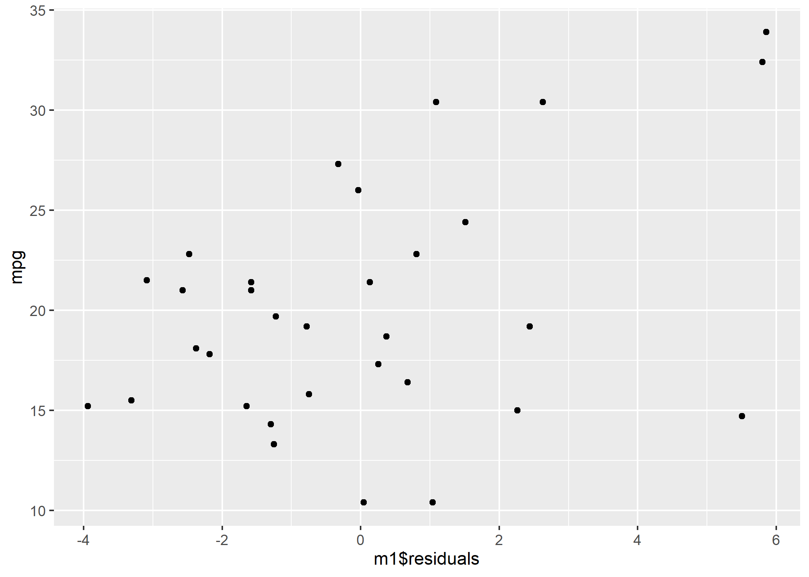
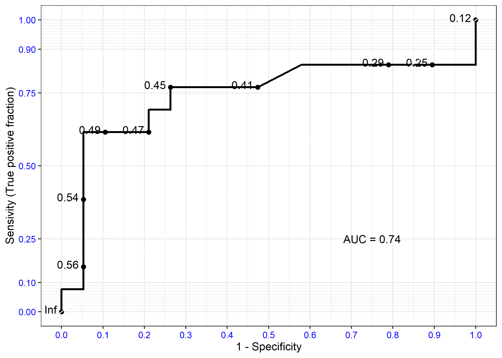

## Logistisk regresjon

I dette dokumentet får du en rask innføring i hvordan du kan gjøre logistisk regresjon med R. Jeg inkluderer en svært enkel forklaring av logistisk regresjon på starten av dokumentet - men ta utgangspunkt i pensum/forelesning dersom du skal bruke metoden/lese til eksamen.

**Teori:** Vi gjør basically det samme som med *OLS*, vi bruker en matematisk metode for å finne den linjen som beskriver sammenhengen vi spesifiserer mellom uavhengig og avhengig variabel best. På grunn av at den avhengige variabelen er dikotom, må den imidlertid transformeres for at regresjonen vår skal fungere. Dette er tankegangen bak logistisk regresjon, og beslektede metoder som *probit*. Det er også en vanlig begrunnelse for andre alternative regresjonsmodeller som *multinomisk logistisk regresjon*.

**Konsekvenser i praksis:**

* Den største praktiske forskjellen er at substansiell tolkning blir vanskeligere. OLS gir oss en rett linje (eller polynom) som beskriver en sammenheng i substansielt meningsfulle enheter, som f.eks. antall kroner til kommunene over statsbudsjett som en funksjon av hvor venstre/høyre-vridd regjeringen er. Logistisk regresjon gir oss en rett linje (eller polynom) på logits skalaen, som vi ikke kan tolke substansielt uten videre. Odds-ratio er heller ikke uten videre lett å forstå. Dersom alle var supersmarte matematikere, ville det vært mulig å se på logits, og regne om til sannsynlighet i hodet, for å deretter visualisere sammenhengen mellom uavhengige variabler og sannsynlighet for utfall grafisk. Dessverre er vi ikke så smarte, formen på sammenhengen er ikke-lineær, og sterkt avhengig av verdiene til kontrollvariabler. Derfor anbefaler jeg plotting av regresjonslinjen til logistisk regresjon på det **aller sterkeste**, da dette gjør substansiell tolkning av logistisk regresjon **mye** lettere. Vi kan også regne ut predikerte sannsynligheter "for hånd" ved å plugge inn koeffisienter og variabelverdier i formelen for å regne ut predikerte sannsynligheter. Predikerte sannsynligheter er greie å tolke, det er meningsfullt å snakke om hvor mye en uavhengig variabel endrer sannsynligheten for et positivt utfall relativt til referansekategorien.

* I R må vi huske å bytte `lm()` med `glm()` og spesifisere alternativet `family = binomial`. De resterende argumentene er like.

**Oppvarmings-oppgave i plenum:**
Les hjelpefil, hva må vi spesifisere for å kjøre en logistisk regresjon? Forklar til sidemannen.

Last inn datasettet `aid2.csv` under navnet `aid2`, du finner data [her](https://raw.githubusercontent.com/langoergen/stv4020aR/master/data/aid2.csv). Lagre i en mappe, sett working directory, og last inn datasettet i R med `read_csv()`. Merk at dette datasettet er det som vi lagde i oppgavene til seminar 1,

Opprett en ny variabel `elrgdpg_d`, slik at observasjoner vekst mindre eller lik 0, og andre observasjoner får verdien 1.

Kjør deretter følgende logistiske regresjon:


```r
m1 <- glm(elrgdpg_d ~ elraid*elrpolicy + as.factor(period) + elrlpop + elrassas*elrethnf, data = full, family = binomial(link = "logit"))
summary(m1)
```

Diskuter raskt med sidemannen hva slags informasjon du får fra regresjons-output

For å regne om til predikert sannsynlighet for hånd, bruker vi følgende formel:
`exp(b0 + b1X1 + b2X2 + ... + bnXn)/(1 + exp(b0 + b1X1 + b2X2 + ... + bnXn))` , der b0 er konstantledd. 

1. Regn ut den predikerte sannsynligheten for positiv vekst for et land med `elraid` lik `-3` i periode 8, med resterende variabler satt til sin medianverdi (ikke legg inn koeffisienter for andre perioder enn periode 8!).
2. Regn ut den predikerte sannsynligheten for positiv vekst for et land med `elraid` lik `3` i periode 8, med resterende variabler satt til sin medianverdi (ikke legg inn koeffisienter for andre perioder enn periode 8!).

Jeg har satt opp noe dere kan copy-paste under til hjelp, men dere må sørge for at formelen blir riktig selv:


```r
exp(-4.046138 + -0.102802*(-3) + 1.654813*median(aid2$elrpolicy, na.rm =T) + 0.008147*median(aid2$elrpolicy, na.rm =T)*(-3) +  -0.770560*1 + 0.381205*median(aid2$elrlpop, na.rm =T) + -0.216738*median(aid2$elrassas, na.rm = T) + -0.449168*median(aid2$elrethnf, na.rm =T) + 0.490778*median(aid2$elrassas, na.rm = T)*median(aid2$elrethnf, na.rm =T))
```

*Er effekten av elraid substansiell?*

Dette er ganske mye arbeid for få predikerte sannsynligheter, derfor skal vi øve på plotting av effekter. 

## Forutsetninger og modellvurdering - logistisk regresjon:

Mange av metodene for diagnostikk som vi har sett på i dag fungerer også for logistisk regresjon. Funksjonene `ceresplot()`, `dfbetas()`, `influenceIndexPlot()` m.m. fungerer også for logistisk regresjon. Husk forøvrig på at forutsetninger om homoskedastiske, normalfordelte restledd ikke gjelder logistisk regresjon. I tillegg viser jeg noen flere sentrale måter å vurdere modeller på under: 

* Tomme celler vil føre til at modellen ikke lar seg estimere, eller at du ikke får estimert standardfeil/ekstremt høye standardfeil, og er således greit å oppdage. Tabeller eller spredningsplot mellom variabler fra regresjonen kan brukes til å undersøke nærmere.

* Vi kan gjøre nøstede likelihood-ratio tester med `anova()`:.


```r
gm0 <- glm(as.factor(am) ~ hp, data = mtcars, family = binomial(link = "logit"))
gm1 <- glm(as.factor(am) ~ hp + qsec, data = mtcars, family = binomial(link = "logit"))
anova(gm0, gm1, test = "LRT") # Sjekk de forskjellige alternativene til test med ?anova.glm
```

```
## Analysis of Deviance Table
## 
## Model 1: as.factor(am) ~ hp
## Model 2: as.factor(am) ~ hp + qsec
##   Resid. Df Resid. Dev Df Deviance  Pr(>Chi)    
## 1        30     41.228                          
## 2        29     26.757  1   14.471 0.0001424 ***
## ---
## Signif. codes:  0 '***' 0.001 '**' 0.01 '*' 0.05 '.' 0.1 ' ' 1
```

* Vi kan regne ut pseudo $R^2$ med `pR2` funksjonen fra pakken `pscl`:


```r
#install.packages("pscl")
library(pscl)
```

```
## Classes and Methods for R developed in the
## Political Science Computational Laboratory
## Department of Political Science
## Stanford University
## Simon Jackman
## hurdle and zeroinfl functions by Achim Zeileis
```

```r
pR2(gm1) # sjekk ?pR2 - under Value i hjelpefil er output forklart.
```

```
##         llh     llhNull          G2    McFadden        r2ML        r2CU 
## -13.3784781 -21.6148666  16.4727771   0.3810520   0.4023645   0.5430017
```


* Vi kan gjøre hosmer-lemeshow med `hoslem.test()` fra pakken `ResourceSelection`

**Husk:** I tillegg til formell diagnostikk, må du aldri glemme generelle validitets/metode-vurderinger.


### Forventet verdi vs. faktisk verdi - residualer

Ut fra regresjonskoeffisientene fra en regresjonsmodell, kan vi beregne den forventede verdien til hver enkelt observasjon på den avhengige variabelen. vi kan sammenligne denne verdien med den observerte verdien på avhengig variabel for observasjonene våre, for å få et inntrykk av hvor godt modellen passer til data, eller se på differansen mellom forventet og faktisk verdi for en observasjon, dvs. residualen til en observasjon. Residualer, forventet verdi og faktisk verdi brukes også i ulike typer regresjonsdiagnostikk. Under viser jeg hvordan du enkelt kan hente ut residualer ved å lagre `summary(lm_model)` som et objekt. For å hente ut forventet verdi kan du bruke `predict()` (se nedenfor). Regresjonen har *miles per gallon* som avh. var, og *horse power* og *weight* som uavhengige variabler.


```r
m1 <- lm(mpg ~ wt + hp, data = mtcars)
m1s <- summary(m1)
names(m1s) # residualer for alle observasjoner gis automatisk i model summary-objekter.
```

```
##  [1] "call"          "terms"         "residuals"     "coefficients" 
##  [5] "aliased"       "sigma"         "df"            "r.squared"    
##  [9] "adj.r.squared" "fstatistic"    "cov.unscaled"
```

```r
m1s$residuals # residualer for alle observasjonene
```

```
##           Mazda RX4       Mazda RX4 Wag          Datsun 710 
##         -2.57232940         -1.58348256         -2.47581872 
##      Hornet 4 Drive   Hornet Sportabout             Valiant 
##          0.13497989          0.37273336         -2.37381631 
##          Duster 360           Merc 240D            Merc 230 
##         -1.29904236          1.51293266          0.80632669 
##            Merc 280           Merc 280C          Merc 450SE 
##         -0.77945988         -2.17945988          0.67463146 
##          Merc 450SL         Merc 450SLC  Cadillac Fleetwood 
##          0.25616901         -1.64993945          0.04479541 
## Lincoln Continental   Chrysler Imperial            Fiat 128 
##          1.03726743          5.50751301          5.80097202 
##         Honda Civic      Toyota Corolla       Toyota Corona 
##          1.08761978          5.85379085         -3.08644148 
##    Dodge Challenger         AMC Javelin          Camaro Z28 
##         -3.31136386         -3.94097947         -1.25202805 
##    Pontiac Firebird           Fiat X1-9       Porsche 914-2 
##          2.44325481         -0.32665313         -0.03737415 
##        Lotus Europa      Ford Pantera L        Ferrari Dino 
##          2.63023081         -0.74648866         -1.22541324 
##       Maserati Bora          Volvo 142E 
##          2.26052287         -1.58364943
```

Med `cbind()`, kan du legge residualene til det opprinnelige datasettet, og deretter plotte faktiske verdier på avhengig variabel mot residualene:


```r
mtcars2 <- (cbind(mtcars, m1s$residuals))
names(mtcars2)
library(ggplot2)
ggplot(mtcars2, aes(x = m1$residuals, y = mpg)) + geom_point()
```


<!-- -->

Man kan gjøre tilsvarende sammenligning for logistisk regresjon, men da tar man gjerne utgangspunkt i at utfallet enten er `1` eller `0` i logistisk regresjon, og sammenligner om modellen predikerer `0` eller `1` med om observasjonene faktisk har den predikerte verdien. Andelen observasjoner som korrekt predikeres som `1`, delt på alle observasjoner som faktisk har verdien 1 (dvs. observasjoner som korrekt predikeres som `1` summert med andelen som feilaktig predikeres som `0`) kalles sensivitet. Andelen observasjoner som korrekt predikeres som `0`, delt på alle observasjoner som faktisk har verdien `0` (dvs. observasjoner som korrekt klassifiseres som `0` summert med observasjoner som feilaktig klassifiseres som `1`), kalles spesifisitet. Legg merke til at i en ROC-kurve, plottes *1 - spesifisitet*. Dette kan tolkes som andelen observasjoner som galt predikeres til verdien 1 (som faktisk har verdien 0), delt på det totale antallet observasjoner som faktisk har verdien 0.

Man kunne tenkt seg at for å få best mulig klassifisering, er det fornuftigste er å klassifisere alle observasjoner med predikert sannsynlighet for `1` høyere enn `0.5` som `1`, og de resterende observasjonene som `0`, men andre terskelverdier er også mulige. En ROC-kurve kan fremstille hvor korrekt en logistisk regresjon klassifiserer observasjoner for alle slike terskelverdier. Siden en ROC-kurve er ganske greit å lage med R, viser jeg hvordan dette gjøres under, ved hjelp av funksjoner fra pakkene `plotROC` og `ggplot2` [mer her](https://cran.r-project.org/web/packages/plotROC/vignettes/examples.html).


```r
#install.packages("plotROC")
library(plotROC)

# Kjører regresjonsmodell
m2 <- glm(am ~ vs + hp, data = mtcars, family = binomial())
summary(m2)
m2res <- predict(m2, type = "response") # henter ut predikerte sannsynligheter for observasjonene i datasettet vi brukte til å estimere modellen.

mtcars2 <- cbind(mtcars, m2res)
# Basic ROC:
basicplot <- ggplot(mtcars2, aes(d = am, m = m2res)) + geom_roc(labelround = 2) 
# Pyntet ROC med AUC.
basicplot + 
    style_roc(ylab = "Sensivity (True positive fraction)") +
  theme(axis.text = element_text(colour = "blue")) +
  annotate("text", x = .75, y = .25, 
           label = paste("AUC =", round(calc_auc(basicplot)$AUC, 2))) +
  scale_x_continuous("1 - Specificity", breaks = seq(0, 1, by = .1))
```


<!-- -->

Grunnen til at denne ROC-kurven ikke er glatt og kontinuerlig, er forøvrig at datasettet `mtcars` er så lite.

