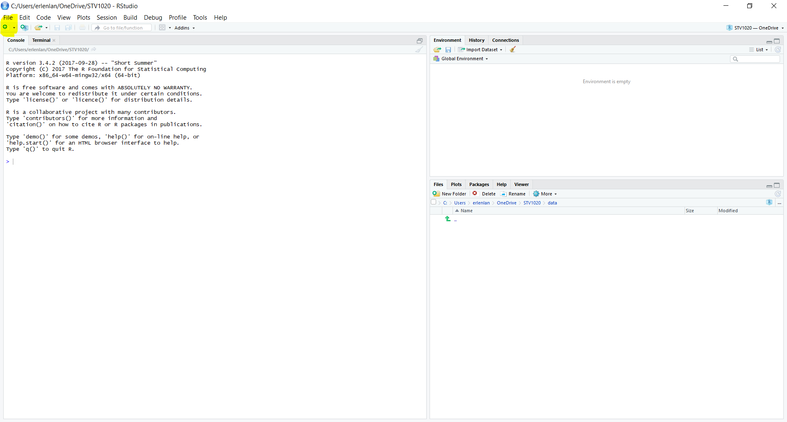
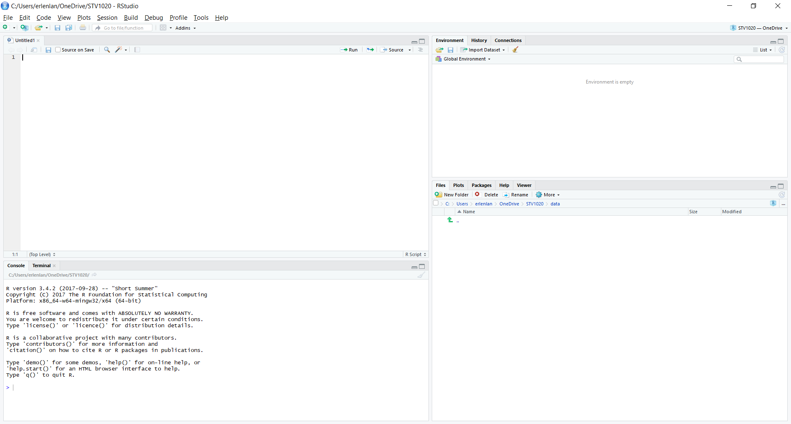
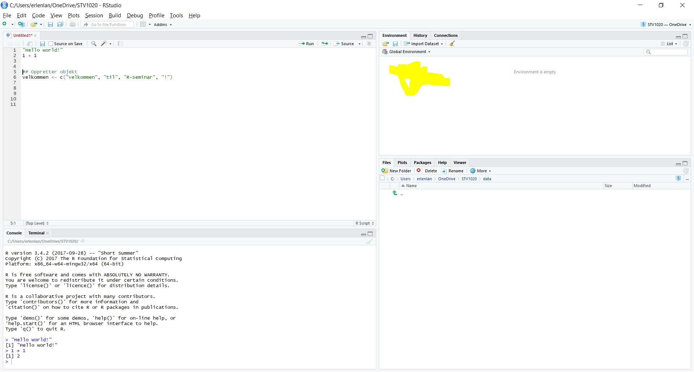
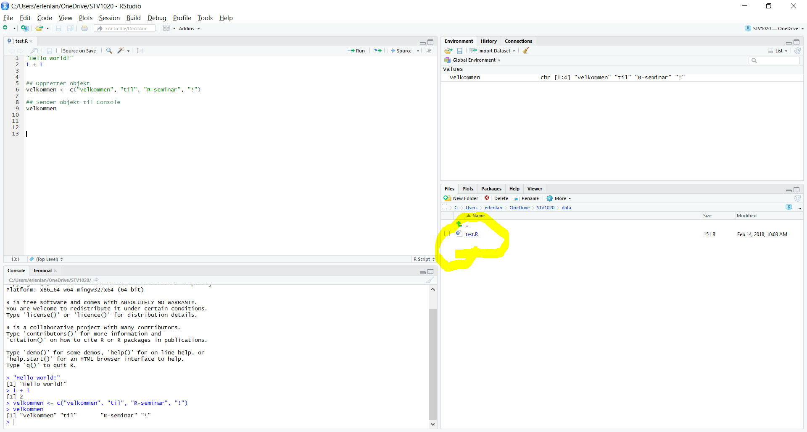

```{r setup, include=FALSE}
knitr::opts_chunk$set(echo = TRUE)
```

## Hva er R og Rstudio?

R er et gratisprogram som er spesielt egnet for statistikk og dataanalyse. Rstudio er en IDE (integrated development environment), et gratisprogram  som gjør det lettere å bruke R. Derfor skal vi lære R med Rstudio i seminarene i STV 4020A.

Første gang du åpner Rstudio er alt fremmed, du blir du møtt av en rekke vinduer, menyer og knapper. Dette dokumentet er ment gir deg en kort forklaring av det aller mest grunnleggende i R og Rstudio gjennom 10 bilder. Dersom du tar deg 5 minutter til å lese dokumentet, og forsøke koden, kommer det første seminar til å gå som en lek. Dersom første seminar ikke gikk som en lek, og du er usikker på hva som foregår i Rstudio, kan det også være nyttig å lese dette dokumentet.

## Installere R og Rstudio

Før du går videre, ber jeg om at du installerer [R](https://cloud.r-project.org/) og [Rstudio](https://www.rstudio.com/products/rstudio/download/) (velg gratisversjonen for desktop). Følg lenkene, og kjør standardinstallasjonen for ditt operativsystem. Ta kontakt med meg på erlend.langorgen@stv.uio.no dersom installasjonen ikke virker. 

Dersom du ikke vil installere R og Rstudio på pcen din, kan du finne en UiO-pc med Rstudio, eller kjøre Rstudio gjennom [kiosk](https://kiosk.uio.no/RDWeb/Pages/en-US/login.aspx?ReturnUrl=/RDWeb/Pages/en-US/Default.aspx/kontor). 
Det vil være tilgang på pcer med Rstudio i seminarene, men ikke i introduksjonsforelesningen. 

##  Åpne Rstudio

Nå er du klar til å åpne Rstudio (du trenger ikke åpne R!). Når du åpner Rstudio, vil denne skjermen dukke opp: 


På bildet ser du tre paneler. Til venstre er **Console**, øverst til høyre er **Environment**, og nederst til høyre er **Files**. Fra hvert av disse panelene er det mulig å trykke seg til andre paneler som **Terminal**, **Plots**, **History** og **Help**. I denne gjennomgangen forklarer jeg imidlertid bare de fire panelene du trenger for å skrive, kjøre, og lagre kode. Disse panelene er: 

1. **Script** Her skrives koden din 
2. **Console** - Her produseres output fra koden din
3. **Environment** - Her er en oversikt over data du kan kjøre kode på.
4. **Files** - Her vises filer i mappen du jobber fra, som for eksempel data og kode. Dersom du lagrer **scriptet** ditt i mappen du jobber fra, dukker det opp her.

## Script

La oss starte med **Script**. Første gang du åpner Rstudio må du åpne dette panelet selv. Det gjør du ved å trykke på arket med grønn sirkel og hvitt plusstegn øverst i høyre hjørne. Jeg har merket dette arket på bildet under. Trykk deretter på "R Script". Alternativt kan du bruke hurtigtasten `ctrl/cmd + shift + N`. 



Når du har åpnet et nytt R-script vil denne skjermen med fire paneler dukker opp:



I R-scriptet, det øverste panelet til venstre, kan du nå skrive R-koder. La oss prøve å skrive to gyldige R-koder, `"Hello world!"` og `1+1`. R-scriptet ditt skal se slik ut:


Du har nå skrevet to linjer med R-kode!


## Console

I forrige bilde merket jeg den nederste linjen i **Console**, som begynner med `>`. Den er tom, men når vi kjører koden vi har skrevet, vil Rstudio evaluere/kjøre koden i **Console**. Dersom koden produserer output, vil denne også printes i **Console**. Vi kjører koden ved å merke koden i scriptet, og trykke på `ctrl/cmd + enter` (`ctrl` på pc, `cmd` på mac). La oss se på resultatet av å kjøre koden vi har skrevet i scriptet:


På linjen med `>` vises kode som R har kjørt. På linjen under kode som er kjørt, vises output fra koden. Koden `"Hello world!"`ble lest og evaluert som tekst - resultatet er tekst-outputen **"Hello world!"**. Koden `1+1` ble lest som et mattestykke, og Rstudio produserte outputen **2**, løsningen på mattestykket vi ba Rstudio om å kjøre/evaluere for oss. Rstudio kan tydeligvis både lese og regne. 

## Environment

Det er ikke all kode som gir output i **Console**. Noen ganger skriver vi kode som gir input til Rstudio i form av informasjon/data som vi ber Rstudio huske på for oss. Rstudio kan huske på informasjon, uten av vi trenger å lagre den på datamaskinen. Data som Rstudio husker, vises i **Environment**. Vi kaller slike data for **objekter**. Jeg har merket **Environment**-panelet, øverst til høyre. Vi bruker som regel objekter, gjerne datasett i kodingen vi gjør.  

La oss skrive en kode som gir Rstudio informasjon å huske på. Til dette bruker vi funksjonen (mer presist: assignment operatoren) `<-`, som brukes til å oprette objekter. Objekter inneholder ulike samlinger av informasjon/data som Rstudio husker på for oss. Vi kan selv velge navnet på objektene våre. Navnet kommer før `<-`, jeg velger å kalle objektet mitt velkommen. Etter pilen forteller vi hva objektet skal inneholde. Under har jeg brukt funksjonen `c()` for å fortelle Rstudio at jeg ønsker å opprette en vektor (en ordnet liste av verdier) bestående av fire elementer, `"Velkommen"` , `"til"`, `"R-seminar"` og `"!"`. Når jeg bruker hermetegn, `" "`, behandler R disse elementene som tekst.



La oss se hva som skjer når vi kjører koden (med `ctrl + enter` på pc og `cmd + enter` på mac).
 


Vi ser at objektet velkommen har dukket opp i **Environment** panelet øverst til høyre. Vi får også informasjon om hva objektet inneholder. Først kommer navnet på objektet, chr referer til at objektet består av tekst. Deretter referer [1:4] til at objektet består av fire elementer, som vises til slutt. 

Legg for øvrig merke til at når vi kjørte koden, ble den evaluert i **Console**, men vi fikk ikke output på en ny linje i **Console**. Dersom vi evaluerer objektet vi laget, velkommen, får vi imidlertid en egen linje med output, i dette tilfellet innholdet i objektet. Som oftest får vi output i **Console**, men noen typer kode, som opprettelse av objekter med `<-` gir output i andre paneler, som **Environment**


Vi har nå sett på 3 deler av arbeidsflyten i Rstudio:

1. Først skriver vi kode i et **script**.
2. Deretter kjører/evaluerer vi koden i **Console** med `ctrl/cmd + enter`.
3. Resultatet av at koden ble evaluert dukker som regel opp i **Console**. Når koden produserer objekter med informasjon som Rstudio skal huske på, dukker imidlertid objektet opp i **Environment**. 


## Files

Når vi er ferdig med de 3 stegene over, vil vi som regel lagre arbeidet vårt, slik at vi ikke trenger å gjøre arbeidet på nytt senere. Dersom det går fort å kjøre gjennom R-scriptet, er scriptet alt vi trenger å lagre. Det er også mulig å lagre datasett, figurer, tabeller og bilder, men dette skal vi lære senere. For å forstå hvordan vi kan lagre ulike filer i Rstudio, og hvor R leter etter filer (som datasett) som vi ber R finne, må vi kjenne til mappesystemet på datamaskinen vi jobber fra. 

Et eksempel på en mappe som finnes på de fleste pcer er Mine dokumenter eller Documents.  Rstudio velger en mappe av denne typen på datamaskinen som **working directory**. Rstudio forventer at filnavn som refereres til ligger i *working directory*. Rstudio vil også sette som default option at filer lagres i **working directory**.

Panelet **Files** nederst til høyre viser filer i ditt nåværende **working directory**. På bildet under, ser du at mappen jeg har som **working directory**, data, er tom. 


Hva skjer dersom jeg lagrer R-scriptet i denne mappen? La oss lagre og sjekke. Trykk på `file` øverst til venstre i Rstudio, trykk deretter på save as. Du kan eventuelt bruke hurtigtastene `ctrl/cmd + s`. Da vil dette vinduet dukke opp: 


Jeg velger filnavnet test. Vi trenger ikke å skrive hvilken filtype vi lagrer, Rstudio gjør dette for oss. Trykk på lagre uten å skifte mappe du lagrer filen i bor fra default option. Du vil få følgende resultat:



Scriptet vårt, test.R dukket nå opp under **Files**. Dette betyr at Rstudio har registrert at filen er i **working directory**. Filer som slutter med .R er lagret som R-script, vi har dermed lyktes med å lagre R-scriptet riktig.

## P.S. - Om viktigheten av working directory og mapper:

Ofte ligger mapper inne i andre mapper, under en harddisk (for eksempel C:). Mappene vi må klikke oss gjennom for å komme fra harddisken til en bestemt mappe, f.eks. STV4020A, utgjør *filstien* til mappen STV4020A. Ved å spesifisere filstien til en mappe, kan du kan bytte working directory med funksjonen `setwd()`. Dersom vi skriver navnet på en fil som ligger i en annen mappe enn **working directory**, vil ikke R klare å finne denne, med mindre vi spesifiserer filstien. Vi kan lese filstien til nåværende **working directory** på toppen av **Files**-panelet. Fra bildet over, ser vi at mitt **working directory** er satt til C:/Users/erlenlan/OneDrive/STV4020A/data (Bruk `/` for å skille mellom mapper når du skriver filstier). Du kan også finne nåværende **working directory** ved å kjøre koden `getwd()`. Den beste og letteste måten å unngå frustrasjon pga. **working directory** er å opprette et prosjekt gjennom menyen i R-studio. Les mer [her](https://r4ds.had.co.nz/workflow-projects.html). 


