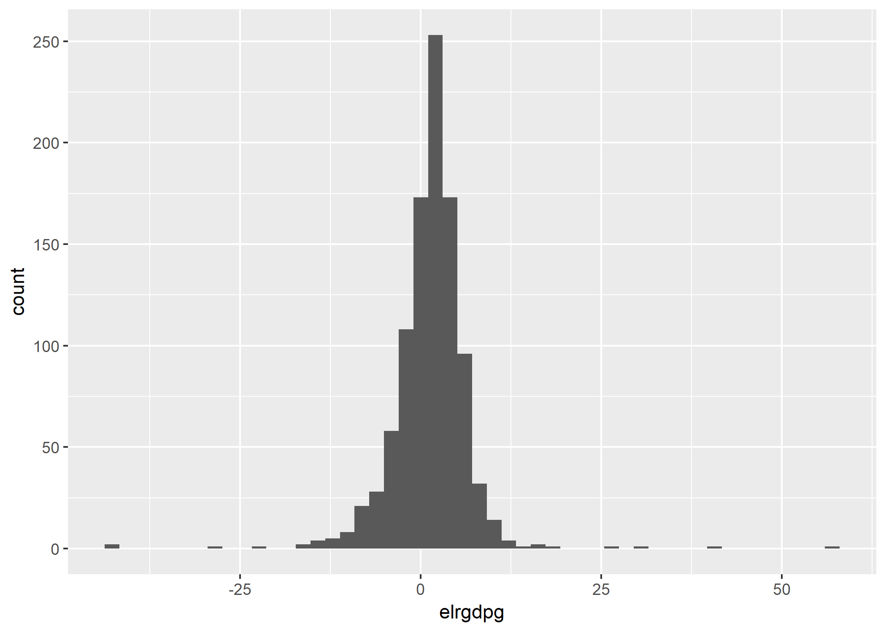
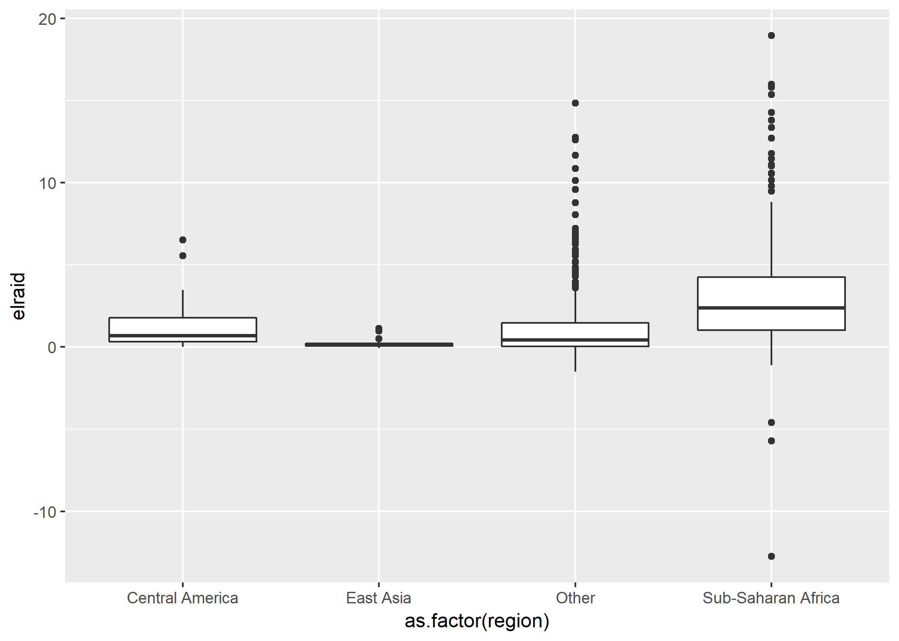
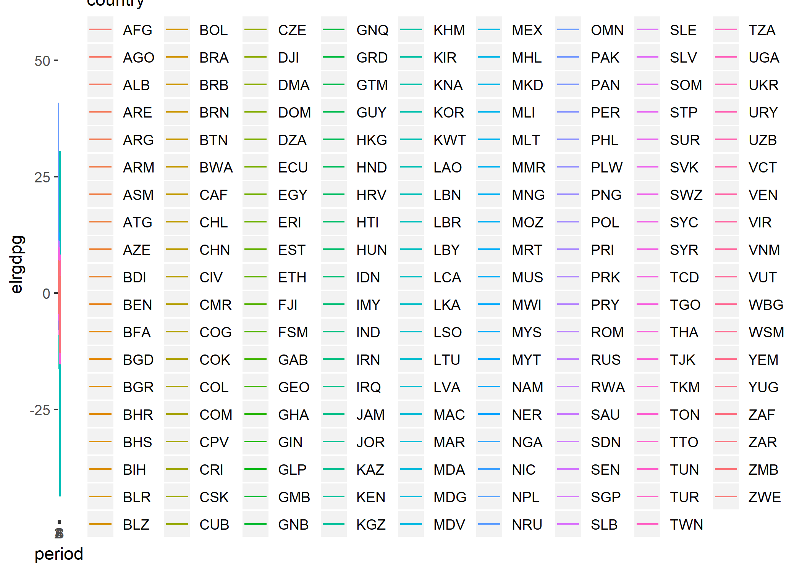
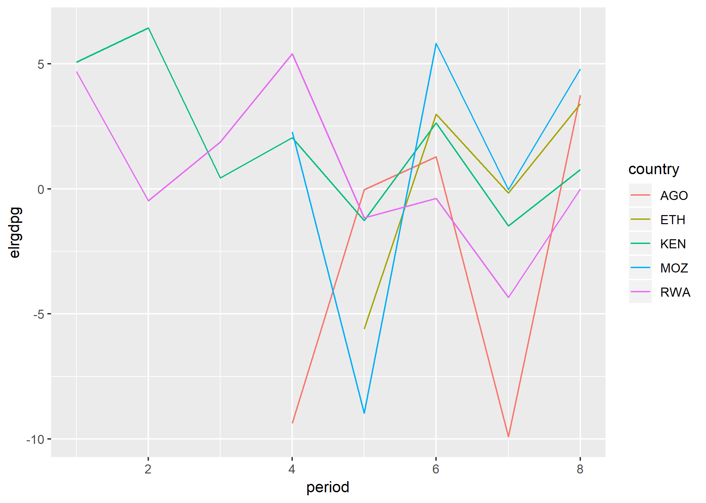
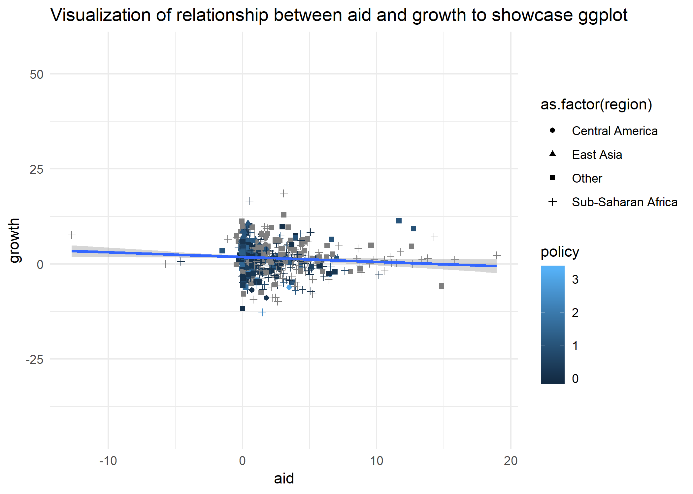

# Velkommen!

<!-- -->


# Seminaropplegg

De fleste seminarene vil bestå av to deler:

1. En introduksjon fra seminarleder til dagens emner
2. Oppgaver som trener deg i å jobbe med dagens emner - trening på anvendelse er nødvendig for å skaffe seg tilstrekkelig god forståelse. Vi har gjort vårt beste for å lage oppgaver som trener deg i ferdigheter som du ikke visste at du trengte, men som du vil få bruk for i hjemmeoppgaven.

Løsningsforslag til oppgavene vil bli lagt ut etter seminarene. Alt seminaropplegg vil bli lenket til under moduler på Canvas - vi forbeholder oss retten til å gjøre endringer i undervisningsmateriale helt frem til seminaret.

Dersom du skal skrive hjemmeoppgave med R, anbefaler vi at du forbereder deg til seminaret ved å se gjennom relevante kapitler fra **R for Data Science** eller tilsvarende ressurs. Det er også en svært stor fordel å være ajour med statistikkpensum før seminarene - dess færre nye momenter du blir introdusert til, dess lettere er det å tilegne seg nye kunnnskaper. Det er kjedelig å falle av i R-seminarene pga. at du ikke aner hva regresjonsanalyse er. Når det er sagt, har vi full forståelse for at dere har et travelt semester - gjør deres beste!

Vi rekker ikke gå gjennom alt som kan være relevant av R-ferdigheter til hjemmeoppgaven, derfor har vi laget [studieguiden](https://github.com/langoergen/stv4020aR/blob/master/docs/Studieguide_R.md) til **R for Data Science**, samt noe ekstra undervisningsmateriale som viser hvordan du gjennomfører faktoranalyse og flernivåanalyse i hjemmeoppgaven. Dersom dere tror at det kan være aktuelt å bruke noen av disse analysemetodene til hjemmeoppgaven - ta en titt på dette undervisningsmaterialet før siste seminar. Da vil du få anledning til å spørre seminarleder om ting du lurer på.


## Om å lære R:

Øvelse gjør mester, jeg håper derfor at alle vil gjøre sitt beste med tiden dere har til rådighet i seminarene. Vi vil også anbefale dere å komme i gang med hjemmeoppgaven før de to siste R-seminarene. Dette vil gjøre det lettere for dere å lære R på en mer målrettet måte og øke utbytte fra seminarene. Dere vil også få betydelig bedre hjelp i skisseseminarene dersom dere allerede har valgt datasett og kjørt noen analyser (det er bedre å finne noen data og bruke dem i skissen enn å ikke bruke noen, selv om du bytter data senere).

Still masse spørsmål, særlig i starten dersom alt er nytt og fremmed(gjørende) - det er slik du lærer. Bruk medstudenter aktivt, samarbeid og hjelp hverandre.

Mot slutten av semesteret vil dere oppleve at dess mer du kan, dess bedre blir spørsmålene dine og hjelpen du får fra oss som underviser. Dersom du kan nok til å forstå problemet ditt, og til å vite at løsningen ikke finnes rett foran nesen din i et seminardokument eller **R for Data Science** vil du få gode svar. Dersom du spør om ting som ble gjennomgått i første seminar, vil du selvfølgelig få hjelp, men det kan hende at en del av hjelpen er at du blir bedt om å kikke på dokumentet til første seminar en gang til.

Jeg vil at dere skal skrive mest mulig selvstendig kode i seminarene. Dette er den beste måten å trene dere til å løse hjemmeoppgaven, og den beste måten å sørge for at det ikke blir ubehagelige overraskelser på prøven. Det gir også meg muligheten til å gå rundt å gi individuell oppfølging til dere. For at dette skal fungere effektivt, må dere gjøre noe forberedelser. Derfor foreslår jeg at alle i det minste bruker en halvtime/et kvarter på å se på relevante kapitler i R for Data Science før seminaret, samt gjør sitt beste for å holde seg oppdatert på statistikkpensum.

Undervisningsmateriell blir lenket til på Canvas. Selve opplegget blir lastet opp på [github](https://github.com/langoergen/stv4020aR). For øyeblikket ligger fjorårets opplegg ute, jeg kommer til å oppdatere alle seminaren i løpet av semester, da jeg har endret seminarstrukturen en god del.


## Læringsressurser og nyttige R-lenker

- [Gratis innføringsbok på nett - R for Data Science](http://r4ds.had.co.nz/)
- **Hjelpefilene i R:** Det krever litt trening å lære seg å forstå hjelpefiler, men det er en av de beste investeringene du kan gjøre - finn all informasjonen du trenger ved hjelp av `?` og `??` i R
- [Quick-R - et bra sted å søke etter ting, lett å forstå for nybegynnere](https://www.statmethods.net/)
- [Interaktiv R-intro fra datacamp](https://www.datacamp.com/courses/free-introduction-to-r)
- [Interaktiv tidyverse-intro fra datacamp](https://www.datacamp.com/courses/introduction-to-the-tidyverse)
- [Stackoverflow - har svar på det R-problemet du sliter med](https://stackoverflow.com/questions/tagged/r)
- [R-bloggers - har gode, kortfattede tutorials](https://www.r-bloggers.com/)
- [Guide til ggplot2](http://docs.ggplot2.org/current/)
- [Facebookgruppe for R for statsvitere på UiO - bruk!](https://www.facebook.com/groups/427792970608618/)
- [Stilguide for R](https://google.github.io/styleguide/Rguide.xml)
- [Bruke prosjekter i R](https://support.rstudio.com/hc/en-us/articles/200526207-Using-Projects)

Du kan også finne videoer, flere gratis bøker m.m. hvis du googler/søker på stackoverflow/søker på youtube. Noe av det aller vikti Det viktigste er nok imidlertid å lære seg å lese og forstå hjelpefiler i R og stackoverflow. For å bli god i R er det lurt å huske noen grunnbegreper (dvs. en god del av det som du lærer i seminarene og **R for Data Science**), men ut over det bruker man hjelpefiler i R/stackoverflow som ordbøker hele tiden.


## Dagens seminar: En første dataanalyse med R.

I dagens seminar skal vi øve på å forberede og utforske data. Dette er som regel første del av enhver dataanalyse - også hjemmeoppgaven.
Vi skal også øve på å forstå hjelpefiler til funksjoner.


1. [Kort om funksjoner og hjelpefiler](#funksjoner)
2. [Forberede og Manipulere data](#manipulere)
3. [Utforsking av data og deskriptiv statistikk.](#deskriptiv)
4. [Plotte-funksjonen `ggplot`.](#ggplot)


Som i introduksjonsforelesningen, kommer det til å være noe kode dere kjører der vi ikke forklarer alt som skjer - vi kommer til å dekke mesteparten av dette i neste seminar, men det er også fint å prøve å forstå dette på egenhånd ved hjelp av hjelpfiler og **R for Data Science**

Dere vil få oppgaver som trener dere i disse ferdighetene, samt i grunnleggende forståelse av R som språk. Dersom dere sliter med å forstå indeksering, funksjoner, objekter e.l., kan dere kikke på introduksjonsforelesningen, eller lese i **R for Data Science**, boken til Silje (**Lær deg R**) eller en tilsvarende ressurs. Vi kommer til å fortsette med å trene litt på basisferdigheter også i neste seminar.


## Kort om  funksjoner og hjelpefiler <a name="funksjoner"></a>

En grunnleggende byggestein i R er funksjoner. En funksjon tar i mot verdi(er), gjerne lagret i form av et R-objekt, utfører operasjoner basert på input, og produserer nye verdier. En typisk R-funksjon har følgende *syntaks*:


```r
aFunction(x = "R-objekt", arg = "alternativ for funksjonens oppførsel")d
## Merk: dette er ikke en faktisk funksjon i R. Funksjoner kan også ha andre syntakser.
```
Funksjoner som `c()`, `log()`, `summary()`, `str()` og `read_csv()` er eksempler på funksjoner.
Dersom vi vil lære mer om en funksjon, kan vi spørre R om hjelp med `?`. Kjør `?c()` og `?log()`

Dersom vi er på jakt etter en funksjon til et spesielt formål, kan vi bruke `??` (eller google).
Si at vi har lyst til å lage en sekvens av tall, som med `:` (som teller på heltall), men bare inkludere partall. La oss se om vi kan finne en funksjon til å gjøre dette med følgende kode: `??sequence`

Søket med `??` tyder på at funksjonen `seq()` kan gjøre jobben.
La oss åpne hjelpefilen til `seq()` ved hjelp av `?seq()`

**Oppgave:** Bruk to minutter på å lese hjelpefilen, og skriv ned hva du tror de to linjene med kode kommer til å gjøre:


```r
seq(from = 2, to = 20, by =2)
```

```
##  [1]  2  4  6  8 10 12 14 16 18 20
```

```r
seq(from = 20, to = 2, by = -2)
```

```
##  [1] 20 18 16 14 12 10  8  6  4  2
```
Dersom en funksjon produserer output av en type som fungerer som input i en annen funksjon, kan vi plassere funksjoner inne i andre funksjoner:

```r
c(seq(20 ,2 , -2), rep(1, 2), seq(2, 20, 2))
```

```
##  [1] 20 18 16 14 12 10  8  6  4  2  1  1  2  4  6  8 10 12 14 16 18 20
```
Som dere ser trenger vi ikke skrive argumentene, kjør `?rep` for å finne ut hva funksjonen i midten gjør. Fortsett å bruke `?` til å lære om nye funksjoner som introduseres resten av seminaret. Øv på å lese syntaks fra hjelpefilene, sammen med googling vil evnen til å lese syntaks sette dere i stand til å finne løsninger på alle slags problemer, med litt trening går dette stort sett ganske raskt.

Mange funksjoner er i eksterne pakker (det finnes over 10 000!) som må lastes ned fra nettet med `install.packages("pakkenavn")` og gjøres tilgjengelig i R-sesjonen din før du kan bruke dem med `library(pakkenavn)`. Dersom du Lukker og åpner Rstudio på nytt trenger du altså ikke å kjøre `install.packages("pakkenavn")` på nytt, men du må kjøre `library(pakkenavn)` for å få tilgang på funksjoner fra pakkene i tidyverse.

I dagens seminar skal dere innom `tidyverse`- pakkene `ggplot2`, `haven`, og `dplyr`, samt pakken `moments`.
Under viser jeg koden for å installere `moments`. Skriv koden for å installere og laste inn de andre pakkene selv i scriptet ditt!

```r
#install.packages("moments") # dersom pakken allerede er installert trenger du ikke kjøre denne, klikk på packages i viduet nede til høyre for å sjekke, eller se om neste linje med kode kjører uten problemer.
library(moments)
```

### Laste inn data - read_funksjoner()

Vi skal starte med å laste inn data som et objekt i R. Funksjoner for å laste inn ulike datatyper har stort sett ganske lik syntaks (det kan være små variasjoner og ulike tilleggalternativ - dette finner du raskt ut av i hjelpefilen!)


```r
library(tidyverse) # read_funksjoner fra readr i tidyvsere
datasett <- read_filtype("filnavn.filtype")
read_csv("filnavn.csv") # for .csv, sjekk også read.table
load("") # For filer i R-format.

aid <-  read_csv("https://raw.githubusercontent.com/langoergen/stv4020aR/master/data/aid.csv")

library(haven)
# Fra haven-pakken - dette skal vi se på i senere seminar
read_spss("filnavn.sav")  # for .sav-filer fra spss
read_dta("filnavn.dta") # for .dta-filer fra stata
```

Vi skal bruke samme kode for å laste inn datasettet `aid` som på introduksjonsforelesningen. Ta en kjapp titt på hjelpefilen, hva heter argumentet vi har spesifisert?


```r
# install.packages(tidyverse)
library(tidyverse)
```

```
## Warning: package 'tidyverse' was built under R version 3.5.3
```

```
## -- Attaching packages -------------------------------------------------------- tidyverse 1.2.1 --
```

```
## v ggplot2 3.1.0       v purrr   0.3.0  
## v tibble  2.0.1       v dplyr   0.8.0.1
## v tidyr   0.8.2       v stringr 1.4.0  
## v readr   1.3.1       v forcats 0.4.0
```

```
## Warning: package 'stringr' was built under R version 3.5.3
```

```
## Warning: package 'forcats' was built under R version 3.5.3
```

```
## -- Conflicts ----------------------------------------------------------- tidyverse_conflicts() --
## x dplyr::filter() masks stats::filter()
## x dplyr::lag()    masks stats::lag()
```

```r
aid <-  read_csv("https://raw.githubusercontent.com/langoergen/stv4020aR/master/data/aid.csv")
```

```
## Parsed with column specification:
## cols(
##   .default = col_double(),
##   country = col_character(),
##   code = col_character()
## )
```

```
## See spec(...) for full column specifications.
```

**Legg merke til:** eksterne filer, som uinstallerte pakker og datasett som ikke er lastet inn som objekter, må alltid skrives i `" "` når vi refererer til dem. Informasjon som er lagret internt, som nedlastede pakker og opprettede objekter, refererer vi ikke til med `" "`

Vi kommer til å snakke mer om import og kombinering av ulike typer data i senere seminarer.

# Forberede og manipulere data <a name="manipulere"></a>

Vi lærer R for å kunne gjøre statistiske analyser. Noen ganger er man så heldig å få et analyserklart datasett som har alle variablene man ønsker, men dette hører trolig til sjeldenhetene. Veldig ofte må man jobbe litt med å forberede og manipulere data, f.eks. ved å omkode variabler, eller hente inn variabler fra andre datakilder. Forberedelse av data er ikke rutinearbeid - det innbefatter svært ofte viktige metodologiske beslutninger, som f.eks. hvordan du ønsker å operasjonalisere når en konflikt ble avsluttet. Forsøk derfor alltid å tenke på metodologiske implikasjoner når du forbereder data. Dersom du lager en klar slagplan for hvordan du ønsker at dataene dine skal se ut på forhånd, blir det lettere å forberede data. Datamanipulasjon og dataforberedelser handler derfor om å stille seg selv følgende spørsmål:

1. Hva slags data ønsker jeg?
2. Hva slags data har jeg?
3. Hva må jeg gjøre for å omarbeide de dataene jeg har til dataene jeg ønsker meg?

Når du har svart på disse spørsmålene, har du laget en plan med et sett av oppgaver, datamanipuleringer du vet at du må gjøre - disse skal vi lære å løse i R. Dersom du ikke har en slik plan, blir datamanipulering vanskeligere. Tenk gjennom disse spørsmålene (særlig spm. 1 og 2) allerede før du åpner R, med utgangspunkt i teori, og det du vet om dataene dine fra kodebok eller artikklene du repliserer. Vi skal imidlertid lære hvordan R også kan være til stor hjelp for å lage arbeidsplanen din - også for å svare på spm. 1 og 2. Dersom du blir flink på koder for å manipulere data, blir denne planleggingsprosessen både lettere og mer kreativ fordi du ser flere muligheter.


I dagens seminar, skal vi jobbe med utgangspunkt i følgende hypotese:  bistand fører til økonomisk vekst, men bare dersom de fører en god makroøkonomisk politikk. Datasettet `aid` som vi brukte i introduksjonsforelesningen, og som vi lastet inn i sted, ble brukt i en forskningsartikkel - *Aid, policies and growth* (**Burnside og Dollar, 2000**) - for å teste denne hypotesen. Disse dataene har observasjoner av en rekke land over flere tidsperioder. Dersom dere hadde lest denne artikkelen og kodeboken på nett - slik vi har gjort for dere - ville dere også visst at vi har data som blant annet inneholder:

* Økonomisk vekst i prosent av BNP - variabelen `elrgdpg`
* Økonomisk bistand som prosentandel av landets BNP - variabelen `elraid`
* Tre variabler som ble brukt til å opprette en indeks for makroøkonomisk politikk - `elrsacw` (øk. åpenhet), `elrbb` (budsjettbalanse) og `elrinfl` (inflasjon).
* En rekke potensielle kontrollvariabler

Dersom vi har lyst til å kjøre den samme testen av hypotesen som det **Burnside og Dollar** gjorde - dette bør man alltid gjøre som første del av en replikasjon - er vi nødt til å opprette en indeks-variabel, som kombinerer de tre variablene som omhandler makroøkonomisk politikk. Dermed inneholder i hvert fall planen vår denne arbeidsoppgaven.


### Sjekke strukturen til data

Nå som vi har laget en tentativ plan for hva som må gjøre, og lastet inn et datasett, er det tid for å skaffe seg en enda bedre forståelse av hva slags data vi har ved hjelp av R. Husk at du i tillegg til å bruke R, **alltid** bør se på kodeboken/beskrivelsen av data i artikkelen du repliserer i denne fasen av analysen din. R og kodebok komplementerer hverandre.

For å skaffe deg en forståelse av datasettet ditt i R, vil du som regel stille spørsmål av følgende type:

1. Hva er observasjonene i datasettet? Ønsker jeg å omarbeide informasjonen slik at jeg får andre typer enheter?
2. Hva heter variablene mine?
3. Hva slags klasse har variablene mine? Hva slags informasjon inneholder variablene mine?
4. Er det mange observasjoner som har manglende informasjon på noen av variablene jeg er interessert i?

Spørsmål 1-3. bør du kunne svare på delvis ut fra kodeboken. Spørsmål 4. kan ofte bare besvares ved hjelp av et statistikkprogram som R. Uansett er det nyttig å bruke følgende koder i R for å svare på disse spørsmålene. Under viser jeg hvordan:

1. Hva er enhetene i datasettet? Ønsker jeg å omarbeide informasjonen slik at jeg får andre enheter?

**Klikk** på datasettet i Environment - da åpnes det i et nytt vindu. Legg merke til at koden `View(aid)` blir evaluert i Console. Les informasjonen langs en rad, og forsøk å tenke gjennom hvilke sentrale karakteristikker som skiller en enhet fra en annen - Nordmenn kan f.eks. skilles med utgangspunkt i fødselsnummer, eller med utgangspunkt i navn. Du kan også kjøre følgende koder:


2. Hva heter variablene mine?

```r
names(aid)
```

```
##  [1] "country"                 "period"                 
##  [3] "periodstart"             "periodend"              
##  [5] "code"                    "bdgdpg"                 
##  [7] "elrgdpg"                 "bdgdp"                  
##  [9] "elrgdp"                  "bdbb"                   
## [11] "elrbb"                   "bdinfl"                 
## [13] "elrinfl"                 "bdsacw"                 
## [15] "elrsacw"                 "bdethnf"                
## [17] "elrethnf"                "bdassas"                
## [19] "elrassas"                "bdicrge"                
## [21] "elricrge"                "bdm21"                  
## [23] "elrm21"                  "bdssa"                  
## [25] "elrssa"                  "bddn1900"               
## [27] "elrdn1900"               "bdaid"                  
## [29] "elraid"                  "bdlpop"                 
## [31] "elrlpop"                 "bdeasia"                
## [33] "elreasia"                "bdegypt"                
## [35] "elregypt"                "bdcentam"               
## [37] "elrcentam"               "bdfrz"                  
## [39] "elrfrz"                  "bdarms1"                
## [41] "elrarms1"                "originalcountries"      
## [43] "bddatap"                 "bddatao"                
## [45] "elrdatabdcos7093bdvarsp" "elrdatabdcos7093bdvarso"
## [47] "elrdatabdcos7097bdvarsp" "elrdatabdcos7097bdvarso"
## [49] "elrdata7093bdvarsp"      "elrdata7093bdvarso"     
## [51] "elrdata7097bdvarsp"      "elrdata7097bdvarso"
```
3. Hva slags klasse har variablene mine? Hva slags informasjon inneholder variablene mine?

Disse funksjonene er fine for å få en rask oversikt over data


Disse funksjonene for univariat statistikke er fine for å få en forståelse av fordelingen til kontinuerlige variabler vi er særlig interessert i.


```r
min(aid$elrgdpg, na.rm = TRUE)  # minimumsverdi, na.rm = T spesifiserer at missing skal droppes i beregning.
```

```
## [1] -43.64145
```

```r
max(aid$elrgdpg, na.rm = TRUE)  # maksimumsverdi
```

```
## [1] 56.08551
```

```r
mean(aid$elrgdpg, na.rm = TRUE) # gjennomsnitt
```

```
## [1] 1.330477
```

```r
median(aid$elrgdpg, na.rm =T )  # median
```

```
## [1] 1.662594
```

```r
sd(aid$elrgdpg, na.rm = T)      # standardavvik
```

```
## [1] 5.397031
```

```r
var(aid$elrgdpg, na.rm = T)     # varians
```

```
## [1] 29.12795
```

```r
quantile(aid$elrgdpg, na.rm = T)
```

```
##          0%         25%         50%         75%        100% 
## -43.6414490  -0.8738849   1.6625940   3.8163580  56.0855103
```

```r
#install.packages("moments")
library(moments)
skewness(aid$elrgdpg, na.rm = T) # skjevhet - fra moments
```

```
## [1] 0.08339805
```

```r
kurtosis(aid$elrgdpg, na.rm = T) # kurtose - fra moments
```

```
## [1] 27.35215
```

```r
summary(aid$elrgdpg) # forskjellig deskriptiv statistikk for en variabel
```

```
##     Min.  1st Qu.   Median     Mean  3rd Qu.     Max.     NA's 
## -43.6414  -0.8739   1.6626   1.3305   3.8164  56.0855      369
```

```r
summary(aid)            # deskriptiv statistikk for alle variabler i datasettet
```

```
##    country              period      periodstart     periodend   
##  Length:1360        Min.   :1.00   Min.   :1966   Min.   :1969  
##  Class :character   1st Qu.:2.75   1st Qu.:1973   1st Qu.:1976  
##  Mode  :character   Median :4.50   Median :1980   Median :1983  
##                     Mean   :4.50   Mean   :1980   Mean   :1983  
##                     3rd Qu.:6.25   3rd Qu.:1987   3rd Qu.:1990  
##                     Max.   :8.00   Max.   :1994   Max.   :1997  
##                                                                 
##      code               bdgdpg            elrgdpg             bdgdp      
##  Length:1360        Min.   :-56.4871   Min.   :-43.6414   Min.   :  294  
##  Class :character   1st Qu.: -0.9493   1st Qu.: -0.8739   1st Qu.:  885  
##  Mode  :character   Median :  1.6893   Median :  1.6626   Median : 1712  
##                     Mean   :  1.1635   Mean   :  1.3305   Mean   : 2500  
##                     3rd Qu.:  4.0273   3rd Qu.:  3.8164   3rd Qu.: 3320  
##                     Max.   : 62.8700   Max.   : 56.0855   Max.   :24322  
##                     NA's   :471        NA's   :369        NA's   :633    
##      elrgdp           bdbb             elrbb             bdinfl       
##  Min.   :  270   Min.   :-0.5775   Min.   :-0.4503   Min.   :-0.1667  
##  1st Qu.:  899   1st Qu.:-0.0603   1st Qu.:-0.0556   1st Qu.: 0.0454  
##  Median : 1780   Median :-0.0284   Median :-0.0284   Median : 0.0938  
##  Mean   : 2622   Mean   :-0.0385   Mean   :-0.0361   Mean   : 0.1770  
##  3rd Qu.: 3431   3rd Qu.:-0.0073   3rd Qu.:-0.0083   3rd Qu.: 0.1566  
##  Max.   :24322   Max.   : 0.3951   Max.   : 0.4776   Max.   : 3.8784  
##  NA's   :471     NA's   :764       NA's   :655       NA's   :660      
##     elrinfl            bdsacw          elrsacw         bdethnf      
##  Min.   :-0.0633   Min.   :0.0000   Min.   :0.000   Min.   :0.0000  
##  1st Qu.: 0.0489   1st Qu.:0.0000   1st Qu.:0.000   1st Qu.:0.1600  
##  Median : 0.0959   Median :0.0000   Median :0.000   Median :0.5500  
##  Mean   : 0.2055   Mean   :0.2105   Mean   :0.267   Mean   :0.4725  
##  3rd Qu.: 0.1723   3rd Qu.:0.0000   3rd Qu.:0.750   3rd Qu.:0.7225  
##  Max.   : 3.8784   Max.   :1.0000   Max.   :1.000   Max.   :0.9300  
##  NA's   :569       NA's   :758      NA's   :611     NA's   :952     
##     elrethnf         bdassas           elrassas          bdicrge     
##  Min.   :0.0000   Min.   : 0.0000   Min.   : 0.0000   Min.   :2.271  
##  1st Qu.:0.1675   1st Qu.: 0.0000   1st Qu.: 0.0000   1st Qu.:3.603  
##  Median :0.5350   Median : 0.0000   Median : 0.0000   Median :4.553  
##  Mean   :0.4694   Mean   : 0.3172   Mean   : 0.2157   Mean   :4.706  
##  3rd Qu.:0.7225   3rd Qu.: 0.2500   3rd Qu.: 0.0000   3rd Qu.:5.578  
##  Max.   :0.9300   Max.   :11.5000   Max.   :11.5000   Max.   :8.560  
##  NA's   :656      NA's   :936       NA's   :297       NA's   :976    
##     elricrge         bdm21             elrm21            bdssa       
##  Min.   :1.580   Min.   :  6.855   Min.   :  2.716   Min.   :0.0000  
##  1st Qu.:3.082   1st Qu.: 19.848   1st Qu.: 17.091   1st Qu.:0.0000  
##  Median :4.700   Median : 26.035   Median : 24.025   Median :0.0000  
##  Mean   :4.687   Mean   : 30.834   Mean   : 30.714   Mean   :0.1867  
##  3rd Qu.:5.900   3rd Qu.: 36.555   3rd Qu.: 36.800   3rd Qu.:0.0000  
##  Max.   :9.600   Max.   :159.364   Max.   :167.482   Max.   :1.0000  
##  NA's   :528     NA's   :950       NA's   :587       NA's   :310     
##      elrssa          bddn1900        elrdn1900           bdaid        
##  Min.   :0.0000   Min.   :0.0000   Min.   :-1.0000   Min.   :-0.0080  
##  1st Qu.:0.0000   1st Qu.:0.0000   1st Qu.:-1.0000   1st Qu.: 0.2733  
##  Median :0.0000   Median :0.0000   Median : 0.0000   Median : 1.3247  
##  Mean   :0.2824   Mean   :0.2467   Mean   :-0.3455   Mean   : 2.5963  
##  3rd Qu.:1.0000   3rd Qu.:0.0000   3rd Qu.: 0.0000   3rd Qu.: 3.6661  
##  Max.   :1.0000   Max.   :1.0000   Max.   : 0.0000   Max.   :24.8543  
##                   NA's   :310      NA's   :480       NA's   :748      
##      elraid             bdlpop         elrlpop         bdeasia       
##  Min.   :-12.7330   Min.   :12.08   Min.   :10.17   Min.   :0.00000  
##  1st Qu.:  0.1785   1st Qu.:14.95   1st Qu.:14.03   1st Qu.:0.00000  
##  Median :  0.9166   Median :15.85   Median :15.31   Median :0.00000  
##  Mean   :  1.9607   Mean   :15.91   Mean   :15.13   Mean   :0.04667  
##  3rd Qu.:  2.8420   3rd Qu.:16.95   3rd Qu.:16.40   3rd Qu.:0.00000  
##  Max.   : 18.9440   Max.   :20.59   Max.   :20.91   Max.   :1.00000  
##  NA's   :629        NA's   :928     NA's   :92      NA's   :310      
##     elreasia          bdegypt          elregypt           bdcentam     
##  Min.   :0.00000   Min.   :0.0000   Min.   :0.000000   Min.   :0.0000  
##  1st Qu.:0.00000   1st Qu.:0.0000   1st Qu.:0.000000   1st Qu.:0.0000  
##  Median :0.00000   Median :0.0000   Median :0.000000   Median :0.0000  
##  Mean   :0.04706   Mean   :0.0116   Mean   :0.005882   Mean   :0.0833  
##  3rd Qu.:0.00000   3rd Qu.:0.0000   3rd Qu.:0.000000   3rd Qu.:0.0000  
##  Max.   :1.00000   Max.   :1.0000   Max.   :1.000000   Max.   :1.0000  
##                    NA's   :928                         NA's   :928     
##    elrcentam           bdfrz           elrfrz           bdarms1       
##  Min.   :0.00000   Min.   :0.000   Min.   :0.00000   Min.   :  0.000  
##  1st Qu.:0.00000   1st Qu.:0.000   1st Qu.:0.00000   1st Qu.:  0.325  
##  Median :0.00000   Median :0.000   Median :0.00000   Median :  1.350  
##  Mean   :0.04118   Mean   :0.125   Mean   :0.07647   Mean   :  4.921  
##  3rd Qu.:0.00000   3rd Qu.:0.000   3rd Qu.:0.00000   3rd Qu.:  4.250  
##  Max.   :1.00000   Max.   :1.000   Max.   :1.00000   Max.   :116.350  
##                    NA's   :928                       NA's   :935      
##     elrarms1       originalcountries    bddatap           bddatao        
##  Min.   :-0.2984   Min.   :0.0000    Min.   :-4.5035   Min.   :0.000000  
##  1st Qu.: 0.0032   1st Qu.:0.0000    1st Qu.: 0.6747   1st Qu.:0.000000  
##  Median : 0.0160   Median :0.0000    Median : 0.9944   Median :0.000000  
##  Mean   : 0.0668   Mean   :0.3294    Mean   : 1.2596   Mean   :0.003677  
##  3rd Qu.: 0.0513   3rd Qu.:1.0000    3rd Qu.: 1.6105   3rd Qu.:0.000000  
##  Max.   : 2.4612   Max.   :1.0000    Max.   : 4.5245   Max.   :1.000000  
##  NA's   :526                         NA's   :944                         
##  elrdatabdcos7093bdvarsp elrdatabdcos7093bdvarso elrdatabdcos7097bdvarsp
##  Min.   :-5.074          Min.   :0.0000          Min.   :-5.136         
##  1st Qu.: 0.904          1st Qu.:0.0000          1st Qu.: 1.012         
##  Median : 1.084          Median :0.0000          Median : 1.241         
##  Mean   : 1.570          Mean   :0.0219          Mean   : 1.491         
##  3rd Qu.: 3.221          3rd Qu.:0.0000          3rd Qu.: 2.648         
##  Max.   : 3.841          Max.   :1.0000          Max.   : 3.594         
##  NA's   :873             NA's   :1086            NA's   :873            
##  elrdatabdcos7097bdvarso elrdata7093bdvarsp elrdata7093bdvarso
##  Min.   :0.0000          Min.   :-5.048     Min.   :0.00      
##  1st Qu.:0.0000          1st Qu.: 0.852     1st Qu.:0.00      
##  Median :0.0000          Median : 1.135     Median :0.00      
##  Mean   :0.0373          Mean   : 1.494     Mean   :0.03      
##  3rd Qu.:0.0000          3rd Qu.: 2.867     3rd Qu.:0.00      
##  Max.   :1.0000          Max.   : 4.072     Max.   :1.00      
##  NA's   :1038            NA's   :873        NA's   :1060      
##  elrdata7097bdvarsp elrdata7097bdvarso
##  Min.   :-5.3453    Min.   :0.0000    
##  1st Qu.: 0.9723    1st Qu.:0.0000    
##  Median : 1.2896    Median :0.0000    
##  Mean   : 1.4182    Mean   :0.0309    
##  3rd Qu.: 2.3485    3rd Qu.:0.0000    
##  Max.   : 3.7832    Max.   :1.0000    
##  NA's   :873        NA's   :1004
```

4. Er det mange observasjoner som har manglende informasjon på noen av variablene jeg er interessert i?

```r
table(complete.cases(aid)) # tester hvor mange rader som ikke har missing
```

```
## 
## FALSE  TRUE 
##  1104   256
```

```r
table(is.na(aid$elrgdpg)) # tester hvor mange observasjoner som har missing på variabelen aid$elrgdpg
```

```
## 
## FALSE  TRUE 
##   991   369
```

```r
aid %>%
complete(country, period) # Tester alle mulige teoretiske kombinasjoner av verdier for variablene vi setter inn - ta utgangspunkt i variabler som definerer forskjellen på observasjonene. Dersom vi for eksempel har spurt et panel av førstegangsvelgere hva de har tenkt å stemme i mange runder, skiller vi med utgangspunkt i individ og spørsmålsrunde.
```

```
## # A tibble: 1,360 x 52
##    country period periodstart periodend code  bdgdpg elrgdpg bdgdp elrgdp
##    <chr>    <dbl>       <dbl>     <dbl> <chr>  <dbl>   <dbl> <dbl>  <dbl>
##  1 AFG          1        1966      1969 AFG1      NA -0.0131    NA     NA
##  2 AFG          2        1970      1973 AFG2      NA -0.550     NA     NA
##  3 AFG          3        1974      1977 AFG3      NA  2.24      NA     NA
##  4 AFG          4        1978      1981 AFG4      NA -1.09      NA     NA
##  5 AFG          5        1982      1985 AFG5      NA  0.804     NA     NA
##  6 AFG          6        1986      1989 AFG6      NA NA         NA     NA
##  7 AFG          7        1990      1993 AFG7      NA NA         NA     NA
##  8 AFG          8        1994      1997 AFG8      NA NA         NA     NA
##  9 AGO          1        1966      1969 AGO1      NA NA       1066   1066
## 10 AGO          2        1970      1973 AGO2      NA NA       1165   1165
## # ... with 1,350 more rows, and 43 more variables: bdbb <dbl>,
## #   elrbb <dbl>, bdinfl <dbl>, elrinfl <dbl>, bdsacw <dbl>, elrsacw <dbl>,
## #   bdethnf <dbl>, elrethnf <dbl>, bdassas <dbl>, elrassas <dbl>,
## #   bdicrge <dbl>, elricrge <dbl>, bdm21 <dbl>, elrm21 <dbl>, bdssa <dbl>,
## #   elrssa <dbl>, bddn1900 <dbl>, elrdn1900 <dbl>, bdaid <dbl>,
## #   elraid <dbl>, bdlpop <dbl>, elrlpop <dbl>, bdeasia <dbl>,
## #   elreasia <dbl>, bdegypt <dbl>, elregypt <dbl>, bdcentam <dbl>,
## #   elrcentam <dbl>, bdfrz <dbl>, elrfrz <dbl>, bdarms1 <dbl>,
## #   elrarms1 <dbl>, originalcountries <dbl>, bddatap <dbl>, bddatao <dbl>,
## #   elrdatabdcos7093bdvarsp <dbl>, elrdatabdcos7093bdvarso <dbl>,
## #   elrdatabdcos7097bdvarsp <dbl>, elrdatabdcos7097bdvarso <dbl>,
## #   elrdata7093bdvarsp <dbl>, elrdata7093bdvarso <dbl>,
## #   elrdata7097bdvarsp <dbl>, elrdata7097bdvarso <dbl>
```

Manglende informasjon/missing data kan ha store implikasjoner, og kan håndteres på forskjellige måter - mer om dette senere. I første runde konsentrerer vi oss om å avdekke missing. Legg merke til at disse funksjonene er logiske tester - de tester om noe er sant eller galt.


### Noen omkodingsfunksjoner:


Etter at vi har kartlagt datastrukturen og hvilke variabler vi har, er det på tide å svare på følgende spørsmål en gang til: Hvilke endringer i data er det nødvendig å gjøre?

Ofte vil en del av svaret være at det er nødvendig å omkode en eller flere variabler. Omkoding av variabler betyr at vi tar informasjon som finnes i en eller flere variabler og omarbeider denne informasjonen, slik at vi får en ny variabel. Dersom du synes dette høres ut som om noe du kan bruke en funksjon til, tenker du rett. Før vi gjennomgår noen funksjoner som er nyttig til å omkode variabker, skal dere få et godt råd. Ikke gjør en omkoding som overskriver variabler som allerede finnes, **opprett alltid nye variabler**, ellers kan det bli veldig kjedelig å gjøre feil (særlig dersom du har den eneste kopien av rådata-filen til masteroppgaven din).


Den generelle syntaksen vi skal bruke for å omkode variabler er som følger:


```r
data$ny_var <- funksjon(data$gammel_var)
# Vi anvender en funksjon som omarbeider informasjonen i en gammel variabel i datasettet vårt, og legger den til datasettet vårt med et nytt navn
```
For å kjøre samme analyse som Burnside og Dollar (2000) må vi som nevnt opprette en ny variabel - en makroøkonimisk politkk-indeks - med utgangspunkt i variablene for inflasjon (`aid$elrinfl`), budsjettbalanse (`aid$elrbb`) og økonomisk åpenhet (`aid$elrsacw`)


```r
# oppretter policy-indeks variabel
aid$policy <- aid$elrinfl + aid$elrbb + aid$elrsacw
```

I `tidyverse` og `dplyr` pakken bruker man som regel `mutate()` funksjonen sammen med andre funksjoner for å opprette nye variabler. Ved hjelp av `mutate()` kan du gjøre mange omkodinger i slengen - dette gir mer ryddig kode.


```r
aid %>% # Spesifiserer at vi skal jobbe med datasettet aid - R vil da lete etter variabler vi referer til her, slik at vi slipper aid$var
  mutate(policy = elrsacw + elrinfl + elrbb) # lager variabelen policy ved å summere budsjettbalanse, inflasjon og en indeks for øk. åpenhet
```

```
## # A tibble: 1,360 x 53
##    country period periodstart periodend code  bdgdpg elrgdpg bdgdp elrgdp
##    <chr>    <dbl>       <dbl>     <dbl> <chr>  <dbl>   <dbl> <dbl>  <dbl>
##  1 AFG          1        1966      1969 AFG1      NA -0.0131    NA     NA
##  2 AFG          2        1970      1973 AFG2      NA -0.550     NA     NA
##  3 AFG          3        1974      1977 AFG3      NA  2.24      NA     NA
##  4 AFG          4        1978      1981 AFG4      NA -1.09      NA     NA
##  5 AFG          5        1982      1985 AFG5      NA  0.804     NA     NA
##  6 AFG          6        1986      1989 AFG6      NA NA         NA     NA
##  7 AFG          7        1990      1993 AFG7      NA NA         NA     NA
##  8 AFG          8        1994      1997 AFG8      NA NA         NA     NA
##  9 AGO          1        1966      1969 AGO1      NA NA       1066   1066
## 10 AGO          2        1970      1973 AGO2      NA NA       1165   1165
## # ... with 1,350 more rows, and 44 more variables: bdbb <dbl>,
## #   elrbb <dbl>, bdinfl <dbl>, elrinfl <dbl>, bdsacw <dbl>, elrsacw <dbl>,
## #   bdethnf <dbl>, elrethnf <dbl>, bdassas <dbl>, elrassas <dbl>,
## #   bdicrge <dbl>, elricrge <dbl>, bdm21 <dbl>, elrm21 <dbl>, bdssa <dbl>,
## #   elrssa <dbl>, bddn1900 <dbl>, elrdn1900 <dbl>, bdaid <dbl>,
## #   elraid <dbl>, bdlpop <dbl>, elrlpop <dbl>, bdeasia <dbl>,
## #   elreasia <dbl>, bdegypt <dbl>, elregypt <dbl>, bdcentam <dbl>,
## #   elrcentam <dbl>, bdfrz <dbl>, elrfrz <dbl>, bdarms1 <dbl>,
## #   elrarms1 <dbl>, originalcountries <dbl>, bddatap <dbl>, bddatao <dbl>,
## #   elrdatabdcos7093bdvarsp <dbl>, elrdatabdcos7093bdvarso <dbl>,
## #   elrdatabdcos7097bdvarsp <dbl>, elrdatabdcos7097bdvarso <dbl>,
## #   elrdata7093bdvarsp <dbl>, elrdata7093bdvarso <dbl>,
## #   elrdata7097bdvarsp <dbl>, elrdata7097bdvarso <dbl>, policy <dbl>
```

```r
aid <- aid %>% # samme kode som over, men nå overskriver jeg data slik at variabelen legges til - gjør dette etter at du har testet at koden fungerte
  mutate(policy = elrsacw + elrinfl + elrbb,
         policy2 = elrsacw*elrinfl*elrbb)
# Her lager jeg to versjoner av policyindeksen - en additiv og en multiplikativ indeks. Hva er den teoretiske forskjellen?
# Dette er en ryddig måte å samle alle omkodinger på!
```


Her brukte vi enkle matematiske operasjoner, `+` og `*` for å opprette nye variabler. Andre nyttige matematiske funksjoner til omkoding er funksjoner som `log()`, `exp()` og `sqrt()`. Mot slutten av dokumentet til introduksjonsforelesningen viste jeg sentrering - dvs. å sørge for at gjennomsnittet til en variabel blir 0. Så lenge vi jobber med variabler av klassene `integer` eller `numeric` kan vi utføre omkodinger ved hjelp av alle slags matematiske operasjoner - bare teoretiske og metodologiske hensyn setter begrensninger. For variabler som ikke inneholder tall, vil naturlig nok denne typen omkoding ikke fungere. Vi kommer til å se såvidt på noen funksjoner for omkoding med utgangspunkt i tekstvariabler i et senere seminar.

**Oppgave:** Sentrer de to nye variablene `policy` og `policy2`. Det er lov å bruke alle hjelpemidler!


En annen type enkel omkoding består i å endre klassen til en variabel. Dette kan gjøres med utgangspunkt i to begrunnelser:

1. Endre målenivå til en variabel - variabler av klassene `numeric` og `integer` vil stort sett behandles som kontinuerlige variabler. Variabler av klassene `factor` vil derimot stort sett håndteres som nominal-nivå variabler i statistiske funksjoner (her er det noen ganger forskjell mellom funksjoner - se på hjelpefil dersom du er i tvil).
2. Endre klassen til en variabel for at en R-funksjon skal fungere på variabelen. Tenk gjennom konsekvensene for målenivå når du gjør dette.

For å endre klassen til en variabel, bruk en funksjon av typen `as.klassenavn(data$variabel)` - her er noen eksempler på hvordan disse funksjonene brukes:


**Oppgave:** Opprett tre nye variabler i datasettet ditt ved å omkode klassen til tre valgfrier variabler, velg også navn selv. Bruk `mutate()`.

### Omkoding med ifelse()

Den funksjonen jeg bruker mest til omkoding, er `ifelse()`. Syntaksen til denne funksjonen kan forklares som følger:


```r
data$nyvar <- ifelse(test = my_data$my.variabel=="some logical condition",
       yes  = "what to return if 'some condition' is TRUE",
       no   = "what to return if 'some condition' is FALSE")
```

**Oppgave:** Opprett en ny variabel som får verdien 1 dersom de har positiv verdi på variabelen policy, og negativ verdi på variabelen policy2 - hvor mange slike observasjoner finnes? Hint: Her kan du bruke `&` for å binde sammen to logiske tester. Du kan også bruke `ifelse()` inne i `mutate()` - jeg viser et eksempel under.


### Endre datatstruktur ved hjelp av aggregering:

Tenk deg at vi ønsket å opprette en ny variabel, `relative_neighborhood_growth`, som viser differansen mellom et lands vekst i en periode, og gjennomsnittsveksten til alle land i samme region over hele tidsperioden. Dette høres kanskje fryktelig komplisert ut, og mangler en god teoretisk begrunnelse. Vi kan imidlertid finne informasjonen vi er på jakt etter ganske enkelt ved hjelp av funksjonene `group_by()` og `summarise()`. Først må vi imidlertid opprette en region-variabel - fordi informasjon om hvilken region et land tilhører er spredt ut over tre variabler - `elrssa`, `elrcentam` og `elreasia`. La oss bruke `ifelse()` og `mutate()` til dette:


```r
aid <- aid %>% # Forteller at vi skal jobbe med aid-datasettet
       mutate(region = ifelse(elrssa == 1, "Sub-Saharan Africa",
                               ifelse(elrcentam == 1, "Central America",
                               ifelse(elreasia == 1, "East Asia", "Other"))))
# Her nøster jeg ifelse-funksjoner inne i hverandre, ved å skrive en ifelse() funksjon som det som skal gjøres med observasjoner som får FALSE på at de ligger i Afrika sør for Sahara, osv. La oss sjekke omkodingen med en tabell
table(aid$region)
```

```
## 
##    Central America          East Asia              Other 
##                 56                 64                856 
## Sub-Saharan Africa 
##                384
```

```r
table(aid$elrssa) # ser at det er like mange land - kunne gjort det samme for resten av kategoriene
```

```
## 
##   0   1 
## 976 384
```
La oss se hvordan `group_by()` og `summarise()` fungerer:


```r
aid %>%
   group_by(region) %>% # grupperer observasjoner basert på verdi på region-variabelen. Alle observasjoner med lik verdi (uavh. av tidsperiode) blir gruppert sammen.
   summarise(neigh_growth = mean(elrgdpg, na.rm = T)) # regner gjennomsnitt for økonomisk vekst innad i hver gruppe - for hele tidsperioden data dekker sett under ett
```

```
## # A tibble: 4 x 2
##   region             neigh_growth
##   <chr>                     <dbl>
## 1 Central America           1.08 
## 2 East Asia                 5.10 
## 3 Other                     1.33 
## 4 Sub-Saharan Africa        0.717
```

```r
# Samme kode, men lagrer som et objekt - vi får et nytt datasett der vi har endret observasjonene - nå er det regioner som er observasjoner
agg_aid <- aid %>%
group_by(region) %>%
summarise(neigh_growth = mean(elrgdpg, na.rm = T))

# Litt annen kode - aggregerer til datasett der observasjonene er regions-perioder
agg_aid <- aid %>%
group_by(region, period) %>%
summarise(region_growth = mean(elrgdpg, na.rm = T))

# Endelig versjon - legger til en variabel som teller hvor mange land som finnes i hver gruppe:

agg_aid <- aid %>%
group_by(region) %>%
summarise(region_growth = mean(elrgdpg, na.rm = T),
          n_region = n()) # teller antall observasjoner i gruppene med n()
```

Nå har vi informasjonen vi trenger - men vi har ikke lagt den til det opprinnelige datasettet som en variabel. Dette kan vi gjøre ved hjelp av en `join` funksjon som slår sammen informasjon fra to datasett. Mer om `join` i senere seminar, og [her](https://r4ds.had.co.nz/relational-data.html).


```r
aid <- aid %>% left_join(agg_aid)
```

```
## Joining, by = "region"
```

```r
# left_join er en av flere join funksjoner. Siden begge datasett har en variabel som heter region, brukes denne til å matche de to datasettene. All informasjon i agg_aid legges til aid

# Ser på resultatet:
table(aid$region_growth, aid$region)
```

```
##                   
##                    Central America East Asia Other Sub-Saharan Africa
##   0.71703294443541               0         0     0                384
##   1.07525226560288              56         0     0                  0
##   1.33109037684893               0         0   856                  0
##   5.09593167688165               0        64     0                  0
```

```r
table(aid$n_region, aid$region)
```

```
##      
##       Central America East Asia Other Sub-Saharan Africa
##   56               56         0     0                  0
##   64                0        64     0                  0
##   384               0         0     0                384
##   856               0         0   856                  0
```

Disse formene for omkoding og opprettelse av nye variabler kan fort være aktuelle for hjemmeoppgaven.

## Utforsking av data og deskriptiv statistikk <a name="deskriptiv"></a>

Disse funksjonene fungerer gir unviariat statistikk for kontinuerlige variabler:


```r
min(aid$elrgdpg, na.rm = TRUE)  # minimumsverdi, na.rm = T spesifiserer at missing skal droppes i beregning.
```

```
## [1] -43.64145
```

```r
max(aid$elrgdpg, na.rm = TRUE)  # maksimumsverdi
```

```
## [1] 56.08551
```

```r
mean(aid$elrgdpg, na.rm = TRUE) # gjennomsnitt
```

```
## [1] 1.330477
```

```r
median(aid$elrgdpg, na.rm =T )  # median
```

```
## [1] 1.662594
```

```r
sd(aid$elrgdpg, na.rm = T)      # standardavvik
```

```
## [1] 5.397031
```

```r
var(aid$elrgdpg, na.rm = T)     # varians
```

```
## [1] 29.12795
```

```r
#install.packages("moments")
library(moments)
skewness(aid$elrgdpg, na.rm = T) # skjevhet - fra moments
```

```
## [1] 0.08339805
```

```r
kurtosis(aid$elrgdpg, na.rm = T) # kurtose - fra moments
```

```
## [1] 27.35215
```

```r
summary(aid$elrgdpg) # forskjellig deskriptiv staatistikk for en variabel
```

```
##     Min.  1st Qu.   Median     Mean  3rd Qu.     Max.     NA's 
## -43.6414  -0.8739   1.6626   1.3305   3.8164  56.0855      369
```

```r
summary(aid)            # deskriptiv statistikk for alle variabler i datasettet
```

```
##    country              period      periodstart     periodend   
##  Length:1360        Min.   :1.00   Min.   :1966   Min.   :1969  
##  Class :character   1st Qu.:2.75   1st Qu.:1973   1st Qu.:1976  
##  Mode  :character   Median :4.50   Median :1980   Median :1983  
##                     Mean   :4.50   Mean   :1980   Mean   :1983  
##                     3rd Qu.:6.25   3rd Qu.:1987   3rd Qu.:1990  
##                     Max.   :8.00   Max.   :1994   Max.   :1997  
##                                                                 
##      code               bdgdpg            elrgdpg             bdgdp      
##  Length:1360        Min.   :-56.4871   Min.   :-43.6414   Min.   :  294  
##  Class :character   1st Qu.: -0.9493   1st Qu.: -0.8739   1st Qu.:  885  
##  Mode  :character   Median :  1.6893   Median :  1.6626   Median : 1712  
##                     Mean   :  1.1635   Mean   :  1.3305   Mean   : 2500  
##                     3rd Qu.:  4.0273   3rd Qu.:  3.8164   3rd Qu.: 3320  
##                     Max.   : 62.8700   Max.   : 56.0855   Max.   :24322  
##                     NA's   :471        NA's   :369        NA's   :633    
##      elrgdp           bdbb             elrbb             bdinfl       
##  Min.   :  270   Min.   :-0.5775   Min.   :-0.4503   Min.   :-0.1667  
##  1st Qu.:  899   1st Qu.:-0.0603   1st Qu.:-0.0556   1st Qu.: 0.0454  
##  Median : 1780   Median :-0.0284   Median :-0.0284   Median : 0.0938  
##  Mean   : 2622   Mean   :-0.0385   Mean   :-0.0361   Mean   : 0.1770  
##  3rd Qu.: 3431   3rd Qu.:-0.0073   3rd Qu.:-0.0083   3rd Qu.: 0.1566  
##  Max.   :24322   Max.   : 0.3951   Max.   : 0.4776   Max.   : 3.8784  
##  NA's   :471     NA's   :764       NA's   :655       NA's   :660      
##     elrinfl            bdsacw          elrsacw         bdethnf      
##  Min.   :-0.0633   Min.   :0.0000   Min.   :0.000   Min.   :0.0000  
##  1st Qu.: 0.0489   1st Qu.:0.0000   1st Qu.:0.000   1st Qu.:0.1600  
##  Median : 0.0959   Median :0.0000   Median :0.000   Median :0.5500  
##  Mean   : 0.2055   Mean   :0.2105   Mean   :0.267   Mean   :0.4725  
##  3rd Qu.: 0.1723   3rd Qu.:0.0000   3rd Qu.:0.750   3rd Qu.:0.7225  
##  Max.   : 3.8784   Max.   :1.0000   Max.   :1.000   Max.   :0.9300  
##  NA's   :569       NA's   :758      NA's   :611     NA's   :952     
##     elrethnf         bdassas           elrassas          bdicrge     
##  Min.   :0.0000   Min.   : 0.0000   Min.   : 0.0000   Min.   :2.271  
##  1st Qu.:0.1675   1st Qu.: 0.0000   1st Qu.: 0.0000   1st Qu.:3.603  
##  Median :0.5350   Median : 0.0000   Median : 0.0000   Median :4.553  
##  Mean   :0.4694   Mean   : 0.3172   Mean   : 0.2157   Mean   :4.706  
##  3rd Qu.:0.7225   3rd Qu.: 0.2500   3rd Qu.: 0.0000   3rd Qu.:5.578  
##  Max.   :0.9300   Max.   :11.5000   Max.   :11.5000   Max.   :8.560  
##  NA's   :656      NA's   :936       NA's   :297       NA's   :976    
##     elricrge         bdm21             elrm21            bdssa       
##  Min.   :1.580   Min.   :  6.855   Min.   :  2.716   Min.   :0.0000  
##  1st Qu.:3.082   1st Qu.: 19.848   1st Qu.: 17.091   1st Qu.:0.0000  
##  Median :4.700   Median : 26.035   Median : 24.025   Median :0.0000  
##  Mean   :4.687   Mean   : 30.834   Mean   : 30.714   Mean   :0.1867  
##  3rd Qu.:5.900   3rd Qu.: 36.555   3rd Qu.: 36.800   3rd Qu.:0.0000  
##  Max.   :9.600   Max.   :159.364   Max.   :167.482   Max.   :1.0000  
##  NA's   :528     NA's   :950       NA's   :587       NA's   :310     
##      elrssa          bddn1900        elrdn1900           bdaid        
##  Min.   :0.0000   Min.   :0.0000   Min.   :-1.0000   Min.   :-0.0080  
##  1st Qu.:0.0000   1st Qu.:0.0000   1st Qu.:-1.0000   1st Qu.: 0.2733  
##  Median :0.0000   Median :0.0000   Median : 0.0000   Median : 1.3247  
##  Mean   :0.2824   Mean   :0.2467   Mean   :-0.3455   Mean   : 2.5963  
##  3rd Qu.:1.0000   3rd Qu.:0.0000   3rd Qu.: 0.0000   3rd Qu.: 3.6661  
##  Max.   :1.0000   Max.   :1.0000   Max.   : 0.0000   Max.   :24.8543  
##                   NA's   :310      NA's   :480       NA's   :748      
##      elraid             bdlpop         elrlpop         bdeasia       
##  Min.   :-12.7330   Min.   :12.08   Min.   :10.17   Min.   :0.00000  
##  1st Qu.:  0.1785   1st Qu.:14.95   1st Qu.:14.03   1st Qu.:0.00000  
##  Median :  0.9166   Median :15.85   Median :15.31   Median :0.00000  
##  Mean   :  1.9607   Mean   :15.91   Mean   :15.13   Mean   :0.04667  
##  3rd Qu.:  2.8420   3rd Qu.:16.95   3rd Qu.:16.40   3rd Qu.:0.00000  
##  Max.   : 18.9440   Max.   :20.59   Max.   :20.91   Max.   :1.00000  
##  NA's   :629        NA's   :928     NA's   :92      NA's   :310      
##     elreasia          bdegypt          elregypt           bdcentam     
##  Min.   :0.00000   Min.   :0.0000   Min.   :0.000000   Min.   :0.0000  
##  1st Qu.:0.00000   1st Qu.:0.0000   1st Qu.:0.000000   1st Qu.:0.0000  
##  Median :0.00000   Median :0.0000   Median :0.000000   Median :0.0000  
##  Mean   :0.04706   Mean   :0.0116   Mean   :0.005882   Mean   :0.0833  
##  3rd Qu.:0.00000   3rd Qu.:0.0000   3rd Qu.:0.000000   3rd Qu.:0.0000  
##  Max.   :1.00000   Max.   :1.0000   Max.   :1.000000   Max.   :1.0000  
##                    NA's   :928                         NA's   :928     
##    elrcentam           bdfrz           elrfrz           bdarms1       
##  Min.   :0.00000   Min.   :0.000   Min.   :0.00000   Min.   :  0.000  
##  1st Qu.:0.00000   1st Qu.:0.000   1st Qu.:0.00000   1st Qu.:  0.325  
##  Median :0.00000   Median :0.000   Median :0.00000   Median :  1.350  
##  Mean   :0.04118   Mean   :0.125   Mean   :0.07647   Mean   :  4.921  
##  3rd Qu.:0.00000   3rd Qu.:0.000   3rd Qu.:0.00000   3rd Qu.:  4.250  
##  Max.   :1.00000   Max.   :1.000   Max.   :1.00000   Max.   :116.350  
##                    NA's   :928                       NA's   :935      
##     elrarms1       originalcountries    bddatap           bddatao        
##  Min.   :-0.2984   Min.   :0.0000    Min.   :-4.5035   Min.   :0.000000  
##  1st Qu.: 0.0032   1st Qu.:0.0000    1st Qu.: 0.6747   1st Qu.:0.000000  
##  Median : 0.0160   Median :0.0000    Median : 0.9944   Median :0.000000  
##  Mean   : 0.0668   Mean   :0.3294    Mean   : 1.2596   Mean   :0.003677  
##  3rd Qu.: 0.0513   3rd Qu.:1.0000    3rd Qu.: 1.6105   3rd Qu.:0.000000  
##  Max.   : 2.4612   Max.   :1.0000    Max.   : 4.5245   Max.   :1.000000  
##  NA's   :526                         NA's   :944                         
##  elrdatabdcos7093bdvarsp elrdatabdcos7093bdvarso elrdatabdcos7097bdvarsp
##  Min.   :-5.074          Min.   :0.0000          Min.   :-5.136         
##  1st Qu.: 0.904          1st Qu.:0.0000          1st Qu.: 1.012         
##  Median : 1.084          Median :0.0000          Median : 1.241         
##  Mean   : 1.570          Mean   :0.0219          Mean   : 1.491         
##  3rd Qu.: 3.221          3rd Qu.:0.0000          3rd Qu.: 2.648         
##  Max.   : 3.841          Max.   :1.0000          Max.   : 3.594         
##  NA's   :873             NA's   :1086            NA's   :873            
##  elrdatabdcos7097bdvarso elrdata7093bdvarsp elrdata7093bdvarso
##  Min.   :0.0000          Min.   :-5.048     Min.   :0.00      
##  1st Qu.:0.0000          1st Qu.: 0.852     1st Qu.:0.00      
##  Median :0.0000          Median : 1.135     Median :0.00      
##  Mean   :0.0373          Mean   : 1.494     Mean   :0.03      
##  3rd Qu.:0.0000          3rd Qu.: 2.867     3rd Qu.:0.00      
##  Max.   :1.0000          Max.   : 4.072     Max.   :1.00      
##  NA's   :1038            NA's   :873        NA's   :1060      
##  elrdata7097bdvarsp elrdata7097bdvarso     policy           policy2       
##  Min.   :-5.3453    Min.   :0.0000     Min.   :-0.0895   Min.   :-0.0949  
##  1st Qu.: 0.9723    1st Qu.:0.0000     1st Qu.: 0.0552   1st Qu.:-0.0006  
##  Median : 1.2896    Median :0.0000     Median : 0.2116   Median : 0.0000  
##  Mean   : 1.4182    Mean   :0.0309     Mean   : 0.5163   Mean   :-0.0018  
##  3rd Qu.: 2.3485    3rd Qu.:0.0000     3rd Qu.: 1.0320   3rd Qu.: 0.0000  
##  Max.   : 3.7832    Max.   :1.0000     Max.   : 3.3147   Max.   : 0.0139  
##  NA's   :873        NA's   :1004       NA's   :873       NA's   :873      
##     region          region_growth      n_region    
##  Length:1360        Min.   :0.717   Min.   : 56.0  
##  Class :character   1st Qu.:0.717   1st Qu.:384.0  
##  Mode  :character   Median :1.331   Median :856.0  
##                     Mean   :1.324   Mean   :652.5  
##                     3rd Qu.:1.331   3rd Qu.:856.0  
##                     Max.   :5.096   Max.   :856.0  
## 
```

For bivariat eller multivariat deskriptiv statistikk, ser vi gjerne på korrelasjon (pearsons R). Med funksjonen `cor()` kan vi få bivariat korrelasjon mellom to variabler, eller lage bivariate korrelasjoner mellom alle numeriske variabler i datasettet vårt:


```r
cor(aid$elrgdpg, aid$elraid, use = "pairwise.complete.obs") # argumentet use bestemmer missing-håndtering
```

```
## [1] -0.09172658
```

```r
aid         # sjekker hvilke variabler som er numeriske, str(aid hvis du ikke har en tibble)
```

```
## # A tibble: 1,360 x 57
##    country period periodstart periodend code  bdgdpg elrgdpg bdgdp elrgdp
##    <chr>    <dbl>       <dbl>     <dbl> <chr>  <dbl>   <dbl> <dbl>  <dbl>
##  1 AFG          1        1966      1969 AFG1      NA -0.0131    NA     NA
##  2 AFG          2        1970      1973 AFG2      NA -0.550     NA     NA
##  3 AFG          3        1974      1977 AFG3      NA  2.24      NA     NA
##  4 AFG          4        1978      1981 AFG4      NA -1.09      NA     NA
##  5 AFG          5        1982      1985 AFG5      NA  0.804     NA     NA
##  6 AFG          6        1986      1989 AFG6      NA NA         NA     NA
##  7 AFG          7        1990      1993 AFG7      NA NA         NA     NA
##  8 AFG          8        1994      1997 AFG8      NA NA         NA     NA
##  9 AGO          1        1966      1969 AGO1      NA NA       1066   1066
## 10 AGO          2        1970      1973 AGO2      NA NA       1165   1165
## # ... with 1,350 more rows, and 48 more variables: bdbb <dbl>,
## #   elrbb <dbl>, bdinfl <dbl>, elrinfl <dbl>, bdsacw <dbl>, elrsacw <dbl>,
## #   bdethnf <dbl>, elrethnf <dbl>, bdassas <dbl>, elrassas <dbl>,
## #   bdicrge <dbl>, elricrge <dbl>, bdm21 <dbl>, elrm21 <dbl>, bdssa <dbl>,
## #   elrssa <dbl>, bddn1900 <dbl>, elrdn1900 <dbl>, bdaid <dbl>,
## #   elraid <dbl>, bdlpop <dbl>, elrlpop <dbl>, bdeasia <dbl>,
## #   elreasia <dbl>, bdegypt <dbl>, elregypt <dbl>, bdcentam <dbl>,
## #   elrcentam <dbl>, bdfrz <dbl>, elrfrz <dbl>, bdarms1 <dbl>,
## #   elrarms1 <dbl>, originalcountries <dbl>, bddatap <dbl>, bddatao <dbl>,
## #   elrdatabdcos7093bdvarsp <dbl>, elrdatabdcos7093bdvarso <dbl>,
## #   elrdatabdcos7097bdvarsp <dbl>, elrdatabdcos7097bdvarso <dbl>,
## #   elrdata7093bdvarsp <dbl>, elrdata7093bdvarso <dbl>,
## #   elrdata7097bdvarsp <dbl>, elrdata7097bdvarso <dbl>, policy <dbl>,
## #   policy2 <dbl>, region <chr>, region_growth <dbl>, n_region <int>
```

```r
aid %>%
select(1:13) %>%
head() # velger de substansielle numeriske variablene i datasettet
```

```
## # A tibble: 6 x 13
##   country period periodstart periodend code  bdgdpg elrgdpg bdgdp elrgdp
##   <chr>    <dbl>       <dbl>     <dbl> <chr>  <dbl>   <dbl> <dbl>  <dbl>
## 1 AFG          1        1966      1969 AFG1      NA -0.0131    NA     NA
## 2 AFG          2        1970      1973 AFG2      NA -0.550     NA     NA
## 3 AFG          3        1974      1977 AFG3      NA  2.24      NA     NA
## 4 AFG          4        1978      1981 AFG4      NA -1.09      NA     NA
## 5 AFG          5        1982      1985 AFG5      NA  0.804     NA     NA
## 6 AFG          6        1986      1989 AFG6      NA NA         NA     NA
## # ... with 4 more variables: bdbb <dbl>, elrbb <dbl>, bdinfl <dbl>,
## #   elrinfl <dbl>
```

```r
aid %>%
select(6:13) %>%
cor(, use = "pairwise.complete.obs")  # korrelasjonsmatrise basert på numeriske variabler
```

```
##                bdgdpg      elrgdpg        bdgdp        elrgdp        bdbb
## bdgdpg   1.0000000000  0.945978221 -0.044538487  0.0001539001  0.05196675
## elrgdpg  0.9459782214  1.000000000  0.004423129  0.0188800071  0.09323997
## bdgdp   -0.0445384873  0.004423129  1.000000000  1.0000000000  0.20930475
## elrgdp   0.0001539001  0.018880007  1.000000000  1.0000000000  0.19978944
## bdbb     0.0519667519  0.093239975  0.209304751  0.1997894430  1.00000000
## elrbb    0.0451870871  0.084099280  0.195031938  0.1982491736  0.82348412
## bdinfl  -0.3190177401 -0.304478935  0.021410578  0.0255177880 -0.17885826
## elrinfl -0.3597406832 -0.326107615  0.030734035 -0.0095472030 -0.20026225
##               elrbb      bdinfl      elrinfl
## bdgdpg   0.04518709 -0.31901774 -0.359740683
## elrgdpg  0.08409928 -0.30447893 -0.326107615
## bdgdp    0.19503194  0.02141058  0.030734035
## elrgdp   0.19824917  0.02551779 -0.009547203
## bdbb     0.82348412 -0.17885826 -0.200262255
## elrbb    1.00000000 -0.16782050 -0.170226117
## bdinfl  -0.16782050  1.00000000  0.994029552
## elrinfl -0.17022612  0.99402955  1.000000000
```

```r
# Sjekk hva use = argumentet styrer i hjelpefilen
```


To av variablene i datasettet vårt, `aid$country` og `code`, er ikke kontinuerlig. Ved å ta `str(aid)`, ser vi at denne variabelen er kodet som en faktor. Dette innebærer at den vil behandles som en nominalnivå-variabel i statistisk analyse. For kategoriske variabler, er tabeller nyttig:


```r
table(aid$country)      # frekvenstabell
```

```
## 
## AFG AGO ALB ARE ARG ARM ASM ATG AZE BDI BEN BFA BGD BGR BHR BHS BIH BLR 
##   8   8   8   8   8   8   8   8   8   8   8   8   8   8   8   8   8   8 
## BLZ BOL BRA BRB BRN BTN BWA CAF CHL CHN CIV CMR COG COK COL COM CPV CRI 
##   8   8   8   8   8   8   8   8   8   8   8   8   8   8   8   8   8   8 
## CSK CUB CZE DJI DMA DOM DZA ECU EGY ERI EST ETH FJI FSM GAB GEO GHA GIN 
##   8   8   8   8   8   8   8   8   8   8   8   8   8   8   8   8   8   8 
## GLP GMB GNB GNQ GRD GTM GUY HKG HND HRV HTI HUN IDN IMY IND IRN IRQ JAM 
##   8   8   8   8   8   8   8   8   8   8   8   8   8   8   8   8   8   8 
## JOR KAZ KEN KGZ KHM KIR KNA KOR KWT LAO LBN LBR LBY LCA LKA LSO LTU LVA 
##   8   8   8   8   8   8   8   8   8   8   8   8   8   8   8   8   8   8 
## MAC MAR MDA MDG MDV MEX MHL MKD MLI MLT MMR MNG MOZ MRT MUS MWI MYS MYT 
##   8   8   8   8   8   8   8   8   8   8   8   8   8   8   8   8   8   8 
## NAM NER NGA NIC NPL NRU OMN PAK PAN PER PHL PLW PNG POL PRI PRK PRY ROM 
##   8   8   8   8   8   8   8   8   8   8   8   8   8   8   8   8   8   8 
## RUS RWA SAU SDN SEN SGP SLB SLE SLV SOM STP SUR SVK SWZ SYC SYR TCD TGO 
##   8   8   8   8   8   8   8   8   8   8   8   8   8   8   8   8   8   8 
## THA TJK TKM TON TTO TUN TUR TWN TZA UGA UKR URY UZB VCT VEN VIR VNM VUT 
##   8   8   8   8   8   8   8   8   8   8   8   8   8   8   8   8   8   8 
## WBG WSM YEM YUG ZAF ZAR ZMB ZWE 
##   8   8   8   8   8   8   8   8
```

```r
prop.table(table(aid$country)) # prosentfordeling basert på frekvenstabell
```

```
## 
##         AFG         AGO         ALB         ARE         ARG         ARM 
## 0.005882353 0.005882353 0.005882353 0.005882353 0.005882353 0.005882353 
##         ASM         ATG         AZE         BDI         BEN         BFA 
## 0.005882353 0.005882353 0.005882353 0.005882353 0.005882353 0.005882353 
##         BGD         BGR         BHR         BHS         BIH         BLR 
## 0.005882353 0.005882353 0.005882353 0.005882353 0.005882353 0.005882353 
##         BLZ         BOL         BRA         BRB         BRN         BTN 
## 0.005882353 0.005882353 0.005882353 0.005882353 0.005882353 0.005882353 
##         BWA         CAF         CHL         CHN         CIV         CMR 
## 0.005882353 0.005882353 0.005882353 0.005882353 0.005882353 0.005882353 
##         COG         COK         COL         COM         CPV         CRI 
## 0.005882353 0.005882353 0.005882353 0.005882353 0.005882353 0.005882353 
##         CSK         CUB         CZE         DJI         DMA         DOM 
## 0.005882353 0.005882353 0.005882353 0.005882353 0.005882353 0.005882353 
##         DZA         ECU         EGY         ERI         EST         ETH 
## 0.005882353 0.005882353 0.005882353 0.005882353 0.005882353 0.005882353 
##         FJI         FSM         GAB         GEO         GHA         GIN 
## 0.005882353 0.005882353 0.005882353 0.005882353 0.005882353 0.005882353 
##         GLP         GMB         GNB         GNQ         GRD         GTM 
## 0.005882353 0.005882353 0.005882353 0.005882353 0.005882353 0.005882353 
##         GUY         HKG         HND         HRV         HTI         HUN 
## 0.005882353 0.005882353 0.005882353 0.005882353 0.005882353 0.005882353 
##         IDN         IMY         IND         IRN         IRQ         JAM 
## 0.005882353 0.005882353 0.005882353 0.005882353 0.005882353 0.005882353 
##         JOR         KAZ         KEN         KGZ         KHM         KIR 
## 0.005882353 0.005882353 0.005882353 0.005882353 0.005882353 0.005882353 
##         KNA         KOR         KWT         LAO         LBN         LBR 
## 0.005882353 0.005882353 0.005882353 0.005882353 0.005882353 0.005882353 
##         LBY         LCA         LKA         LSO         LTU         LVA 
## 0.005882353 0.005882353 0.005882353 0.005882353 0.005882353 0.005882353 
##         MAC         MAR         MDA         MDG         MDV         MEX 
## 0.005882353 0.005882353 0.005882353 0.005882353 0.005882353 0.005882353 
##         MHL         MKD         MLI         MLT         MMR         MNG 
## 0.005882353 0.005882353 0.005882353 0.005882353 0.005882353 0.005882353 
##         MOZ         MRT         MUS         MWI         MYS         MYT 
## 0.005882353 0.005882353 0.005882353 0.005882353 0.005882353 0.005882353 
##         NAM         NER         NGA         NIC         NPL         NRU 
## 0.005882353 0.005882353 0.005882353 0.005882353 0.005882353 0.005882353 
##         OMN         PAK         PAN         PER         PHL         PLW 
## 0.005882353 0.005882353 0.005882353 0.005882353 0.005882353 0.005882353 
##         PNG         POL         PRI         PRK         PRY         ROM 
## 0.005882353 0.005882353 0.005882353 0.005882353 0.005882353 0.005882353 
##         RUS         RWA         SAU         SDN         SEN         SGP 
## 0.005882353 0.005882353 0.005882353 0.005882353 0.005882353 0.005882353 
##         SLB         SLE         SLV         SOM         STP         SUR 
## 0.005882353 0.005882353 0.005882353 0.005882353 0.005882353 0.005882353 
##         SVK         SWZ         SYC         SYR         TCD         TGO 
## 0.005882353 0.005882353 0.005882353 0.005882353 0.005882353 0.005882353 
##         THA         TJK         TKM         TON         TTO         TUN 
## 0.005882353 0.005882353 0.005882353 0.005882353 0.005882353 0.005882353 
##         TUR         TWN         TZA         UGA         UKR         URY 
## 0.005882353 0.005882353 0.005882353 0.005882353 0.005882353 0.005882353 
##         UZB         VCT         VEN         VIR         VNM         VUT 
## 0.005882353 0.005882353 0.005882353 0.005882353 0.005882353 0.005882353 
##         WBG         WSM         YEM         YUG         ZAF         ZAR 
## 0.005882353 0.005882353 0.005882353 0.005882353 0.005882353 0.005882353 
##         ZMB         ZWE 
## 0.005882353 0.005882353
```

Vi kan også lage tabeller med flere variabler. Under viser jeg hvordan du lager en tabell fordelingen av observasjoner som har høyere vekst enn medianveksten i utvalget, ved hjelp av en logisk test:

```r
table(aid$elrgdpg>median(aid$elrgdpg,na.rm=T))
```

```
## 
## FALSE  TRUE 
##   496   495
```

```r
table(aid$elrgdpg>median(aid$elrgdpg,na.rm=T), aid$country)
```

```
##        
##         AFG AGO ALB ARE ARG ARM ASM ATG AZE BDI BEN BFA BGD BGR BHR BHS
##   FALSE   4   4   3   6   5   1   0   0   3   5   6   6   4   2   4   5
##   TRUE    1   1   2   0   3   1   0   5   0   3   2   2   4   3   1   3
##        
##         BIH BLR BLZ BOL BRA BRB BRN BTN BWA CAF CHL CHN CIV CMR COG COK
##   FALSE   0   2   2   5   3   3   5   0   0   7   3   1   4   5   4   0
##   TRUE    1   1   6   3   5   5   1   5   8   1   5   7   4   3   4   0
##        
##         COL COM CPV CRI CSK CUB CZE DJI DMA DOM DZA ECU EGY ERI EST ETH
##   FALSE   1   4   1   3   0   0   1   3   0   2   3   5   4   1   2   2
##   TRUE    7   1   3   5   0   1   1   0   0   6   5   3   4   1   3   2
##        
##         FJI FSM GAB GEO GHA GIN GLP GMB GNB GNQ GRD GTM GUY HKG HND HRV
##   FALSE   4   2   4   3   7   2   0   7   6   1   1   5   4   0   5   1
##   TRUE    4   1   4   5   1   1   0   1   1   2   4   3   4   8   3   1
##        
##         HTI HUN IDN IMY IND IRN IRQ JAM JOR KAZ KEN KGZ KHM KIR KNA KOR
##   FALSE   7   1   0   0   2   3   5   4   4   2   4   2   0   5   0   0
##   TRUE    1   7   8   0   6   3   2   4   2   0   4   1   3   2   5   8
##        
##         KWT LAO LBN LBR LBY LCA LKA LSO LTU LVA MAC MAR MDA MDG MDV MEX
##   FALSE   6   1   1   5   4   2   2   2   2   1   1   3   3   7   0   3
##   TRUE    2   3   2   1   2   3   6   6   1   7   3   5   2   1   4   5
##        
##         MHL MKD MLI MLT MMR MNG MOZ MRT MUS MWI MYS MYT NAM NER NGA NIC
##   FALSE   0   2   6   0   3   1   2   8   2   3   0   0   4   8   5   7
##   TRUE    0   0   2   8   5   3   3   0   6   5   8   0   1   0   3   1
##        
##         NPL NRU OMN PAK PAN PER PHL PLW PNG POL PRI PRK PRY ROM RUS RWA
##   FALSE   3   0   5   2   4   6   2   0   5   1   2   0   4   2   2   5
##   TRUE    5   0   3   6   4   2   6   0   3   1   6   0   4   4   6   3
##        
##         SAU SDN SEN SGP SLB SLE SLV SOM STP SUR SVK SWZ SYC SYR TCD TGO
##   FALSE   4   6   7   0   5   7   5   4   3   5   1   5   2   2   6   5
##   TRUE    4   2   1   8   3   1   3   3   0   2   3   2   6   6   2   3
##        
##         THA TJK TKM TON TTO TUN TUR TWN TZA UGA UKR URY UZB VCT VEN VIR
##   FALSE   0   3   3   1   3   2   2   0   3   1   2   3   2   0   7   2
##   TRUE    8   0   0   3   5   6   6   0   0   3   1   5   1   5   1   3
##        
##         VNM VUT WBG WSM YEM YUG ZAF ZAR ZMB ZWE
##   FALSE   0   3   1   4   1   0   5   7   8   4
##   TRUE    4   2   0   1   1   1   3   1   0   4
```

De fleste land har vekst både over og under medianen. Dersom det hadde vært svært lite variasjon i veksten til land, ville kontrollvariabler for land kunne ha fjernet effekten av de fleste variabler - vi ville ikke hatt veldig godt datagrunnlag for å si så mye om effekten av bistand i samspill med policy (jeg sier ikke dermed nødvendigvis at dataene er gode generelt).


**Oppgave:** Lag et nytt datasett ved hjelp av `group_by` og `summarise()`, der du oppretter variabler som viser korrelasjon (Pearsons r) mellom `elraid`, og `elrgdpg`, `elraid` og `policy` og `elrgdpg` separat for hver region. Er det store forskjeller i korrelasjonene mellom regionene? Lag deretter to nye variabler, `good_policy` og `good_policy2`, slik at observasjoner som har positive verdier på henholdsvis variablene `policy` og `policy2` får verdien 1, mens andre observasjoner får verdien 0. Bruk disse nye variablene som grupperingsvariabler, og lag et nytt datasett der du inkluderer en variabel som beregner korrelasjon mellom `elraid` og `elrpolicy` for hver gruppe.


## Plotte-funksjonen `ggplot` <a name="ggplot"></a>


Hadley Wickham fra R studio skriver mange veldig gode tilleggspakker til R (i tillegg til gratis innføringsbøker på nett), blant annet pakken `ggplot2` (det kan være forvirrende at pakken heter `ggplot2`, mens funksjonen heter `ggplot()`). Jeg foretrekker å lage plot med `ggplot()` funksjonen fra ggplot2 over `plot()` fra *base* R. Grunnen til dette er først og fremst fordi jeg liker syntaksen bedre, og at jeg har brukt `ggplot()` mest, det er ingenting galt med `plot()`. Dersom jeg  bare vil ha et svært enkelt scatterplot bruker jeg ofte `plot()`. Med det sagt, her er de nødvendige elementene man må spesifisere i syntaksen til `ggplot()`:


```r
ggplot(data = my_data) +
  geom_point(aes(x = x-axis_var_name, y = y-axis_var_name, col=my.var3)))
```

Vi starter med å fortelle ggplot hvilket datasett vi bruker. Deretter bruker vi en `geom_...()`-funksjon, her `geom_point()` (det er en lang rekke alternativer), for å fortelle hvordan vi vil plotte data. Her har vi valgt å plotte data som punkter, dvs. lage et scatterplot. Vi må også spesifisere hvilke variabler fra datasettet vi vil plotte, etter `aes()` for aesthetics. Vi må minst velge å plotte en akse, som regel vil vi plotte minst to akser. Vi kan også velge å legge til argumentet `col` for å visualisere enda en variabel. Dette argumentet gir ulike farger til observasjonen avhengig av verdien de har på variabelen vi spesifiserte. Det finnes også alternative måter å visualisere mer enn to variabler, som f.eks. `size = my.var3`, eller `shape = my.var3`.

Vi legger til nye argumer til plottet vårt med `+`. Etter at vi har spesifisert datasett, geom og aesthetics må vi ikke legge til flere argumenter, men det er mulig å legge til flere elementer (som en regresjonslinje) eller finjustere plottet i det uendelige (f.eks. angi fargekoder for alle farger i plottet manuelt). Man får imidlertid som regel et godt resultat med et par linjer kode. Vi skal se raskt på 4 `geom()`

1. `geom_histogram` - histogram (et godt alternativ kan være å bruke `geom_bar()`)
2. `geom_boxplot()` - box-whiskers plot
3. `geom_line()`    - linje, fin for tidsserier
4. `geom_point()`   - scatterplot


```r
library(ggplot2)
ggplot(aid) + geom_histogram(aes(x = elrgdpg), bins = 50) # lager histogram
```


<!-- -->

Med et boxplot får du raskt oversikt over fordelingen til variabler innenfor ulike grupper.


```r
ggplot(aid) + geom_boxplot(aes(x = as.factor(region), y = elraid))
```

<!-- -->
**Oppgave:** Lag boxplot som viser fordelingen til variablene `policy` og `elrgpdg` innenfor hver region.


Med `geom_line()` kan vi plotte tidsserier:


```r
ggplot(aid) + geom_line(aes(x = period, y = elrgdpg, col = country))
```

```
## Warning: Removed 369 rows containing missing values (geom_path).
```

<!-- -->

<!-- -->

Et problem med dette plottet, er at det blir vanskelig å se veksten til forskjellige land klart, det er for mye informasjon. Dersom vi har lyst til å sammenligne et par land om gangen, kan vi bruke `%in%` til å indeksere. Denne operatorene lar deg velge alt innholdet i en vektor - f.eks. variabelnavn eller ulike verdier på en variabel. Her viser jeg hvordan du kan kombinere `dplyr`, `%in%` og `ggplot()` for å sammenligne et par land om gangen:


```r
# Hvilke land finnes i Sub-Saharan Africa? Velger land kun herfra:
aid %>% filter(region == "Sub-Saharan Africa") %>%
ggplot() + geom_line(aes(x = period, y = elrgdpg, col = country))

# Fortsatt litt mye informasjon til å være enkelt å lese - La oss sammenligne 5 land med %in%
```

<!-- -->


```r
# Velger land med %in%, fint for mindre sammenligninger
aid %>% filter(country %in% c("KEN", "ETH", "MOZ", "AGO", "RWA")) %>%
ggplot() + geom_line(aes(x = period, y = elrgdpg, col = country))
```


<!-- -->

I tillegg til indekseringsmetodene for datasett fra introduksjonsforelesningen, er det nyttig å lære seg `%in%`.


Her viser jeg fordelingen til vekst (`elrgdpg`) opp mot bistand (`elraid`) og makroøkonomisk politikk (`policy`) ved hjelp av et spredningsplot (scatterplot). Sammenlign gjerne med korrelasjonsmatrisen du lagde mellom disse tre variablene.


```r
ggplot(aid) + geom_point(aes(x = elraid, y = elrgdpg, col = policy))
```

```
## Warning: Removed 669 rows containing missing values (geom_point).
```

<!-- -->


Her er et overlesset eksempel på et scatterplot (poenget er å illustrere muligheter, ikke å lage et pent plot):


```r
library(ggplot2)
ggplot(aid) +
  geom_point(aes(x=elraid, y=elrgdpg, col=policy, shape=as.factor(region))) +
  geom_smooth(aes(x=elraid, y=elrgdpg), method="lm") +  # merk: geom_smooth gir bivariat regresjon
  ggtitle("Visualization of relationship between aid and growth to showcase ggplot") +
  xlab("aid") +
  ylab("growth") +
  theme_minimal()
```


<!-- -->


**Oppgave:** Forsøk å legge til `facet_wrap(~region)`, hva gjør dette argumentet? Hvordan kan det være nyttig for å plotte samspill? Forsøk å fjerne ett og ett argument i plottet over for å se hva argumentene gjør.

Dersom du lager et plot du er fornøyd med, kan du lagre det med `ggsave()`, som lagrer ditt siste ggplot.

```r
ggsave("testplot.png", width = 8, height = 5) # lagrer ditt siste ggplot i det formatet du vil på working directory
```
Mulighetene er endeløse, jeg har bare vist dere noen få muligheter her. Ved hjelp av [cheatsheet til ggplot2](https://www.rstudio.com/wp-content/uploads/2015/03/ggplot2-cheatsheet.pdf) og [annen dokumentasjon](http://zevross.com/blog/2014/08/04/beautiful-plotting-in-r-a-ggplot2-cheatsheet-3/) som dere kan google dere frem til, burde dere finne metoder for å lage akkurat det plottet dere ønsker.


## Takk for i dag!
