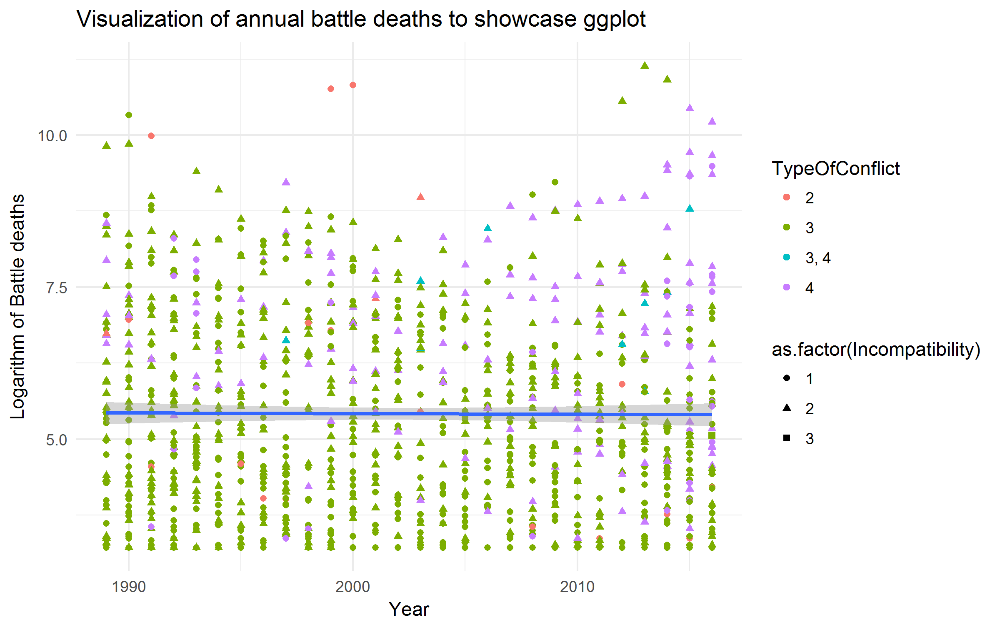

# Andre R-seminar
Erlend Langørgen  
29 august 2017  
# Velkommen!
<!-- -->

## Dagens seminar: Hvordan lykkes med R.

I forrige seminar fikk dere en innføring i R. Vi snakket litt om hvordan R fungerer, og dere fikk en smakebit av hva man kan gjøre med R. 

I første time i dagens R seminar skal vi snakke om hvordan dere kan gjøre R til et nyttig redskap (i stedet for å gjøre R til en evig frustrasjonskilde). Hemmeligheten er god organisering av R-script og arbeid i R. Vi skal også snakke mer om databehandling i R, en annen potensiell kilde til frustrasjon. R-script vi lager i dag kan være særlig relevant for dem som skal bruke R til oppgaveskriving, men prinsipper for organisering av script gjelder mer generelt. Som i forrige seminar vil vi ha **code-along**, både jeg og dere skal skrive all koden vi går gjennom.

I andre time skal vi se på noen regresjonsoppgaver. Dere får oppgavene i timen, jeg vil at dere skal samarbeide med hverandre for å løse dem. Jeg er dessverre ganske sikker på at vi ikke rekker å gå gjennom alt i løpet av dagens seminar, men jeg vil heller at dere avbryter meg med spørsmål enn at vi pløyer gjennom all koden uten at dere henger med.


Plan for i dag:

1. [Oppsett R-script](#Rscript)
2. [Importere data](#datasett)
3. [Forberede data 1: Omkoding](#data1) 
4. [Forberede data 2: Merge, subset, aggregate](#data2)
5. [Mer om funksjoner*](#funksjoner)
6. [OLS med samspill, andregradsledd og diagnostikk](#ols)
7. [Fine plot med ggplot2](#ggplot2)
8. [Eksportere tabeller fra R*](#tabeller)

Avsnitt merket med `*` i overskriften er mer avanserte og vil ikke bli prioritert dersom det blir dårlig tid i dagens seminar. De kan imidlertid være svært nyttig ved en senere anledning.

## Oppsett R-script <a name="Rscript"></a>

### Kommentering
Som dere kanskje har lagt merke til, kan vi bruke `#` til å kommentere kode i R.
Bruk kommentarer flittig, det hjelper fremtids-deg og andre å lese og forstå koden din. 

I R-studio kan vi også lage seksjoner av kode, som man kan folde sammen. For å prøve dette, skriv `#### tekst ####` (flere `#` går også). På venstre side av tekstlinjen vil dere se en pil, skriv en setning kode under pilen og trykk på den.
Sammen med meningsfulle overskrifter, et innebygget søkesystem og godt kommentert kode, hjelper dette folde-systemet deg til å finne rask frem i R-scriptet ditt.

Jeg anbefaler at dere starter R script med en overskrift, samt en kort beskrivelse av R scriptet etter headingen deres ved hjelp av `#`. 

### Navngivning
Man kan spare mye tid og krefter på å gi lure navn til objekter. Her er noen regler, for flere tips, se [Stilguide for R](https://google.github.io/styleguide/Rguide.xml):

* R er sensitivt til store og små bokstaver (Forsøk å kjøre Y). Min anbefaling er derfor: bruk små bokstaver så langt det er mulig.
* Ikke gi objekter det samme navnet som en funksjon. Hvordan kan du teste om et navn ikke er brukt på en funksjon? 
* Bruk meningsfulle, men ganske korte navn. 
* Følg et system for navngivning *slavisk*. Eksempel:
     + Skill mellom ord i et objektnavn med `_`
     + Skill mellom ord i et variabelnavn med `.` 

### Renske R.
Dersom vi skal kjøre et nytt script, er det ofte ønskelig å fjerne objekter/arbeid fra andre script vi jobber med. Dette kan vi gjøre med `rm()`. Jeg pleier å benytte `rm(list=ls())`, som fjerner alle objekter vi har lagret i R.
R-scriptet deres bør fungere etter denne kommandoen, dere bør ikke skrive i flere script, på en slik måte at scriptene må kjøres i en spesiell rekkefølge for å fungere (unntaket er dersom dere kjører andre R-script med kode).

### Working directory
Working directory er den mappen R forventer å hente og lagre filer i. Dere må spesifisere en sti gjennom mappene deres dersom dere vil hente filer fra andre steder på pcen. Jeg anbefaler derfor at dere lager en ny mappe for hvert nye prosjekt med R, og at dere lagrer alle filer knyttet til prosjektet (data, bilder, script, figurer) her. For å finne ut hvilken mappe dere jobber fra for øyeblikket, kan vi bruke `getwd()`. For å bestemme at en mappe skal være vår working directory bruker vi `setwd()`. I script dere skal dele med andre, fjern innholdet fra `setwd()`. Her er en demonstrasjon av `setwd()`, som fungerer litt ulikt på windows og mac/linux:

```r
setwd("C:/Users/Navn/R/der/du/vil/jobbe/fra") # For windows
setwd("~/R/der/du/vil/jobbe/fra")             # For mac/linux
```

**Oppgave:** Lag en mappe som heter *R-seminar*, og lag en mappe som heter *seminar 2* i denne mappen. Sett working directory til mappen *seminar 2*. Opprett et dokument fra notepad som heter test i mappen seminar 2.

Når vi har bestemt working directory, kan vi navigere til andre mapper med utgangspunkt i denne mappen. Vi kan for eksempel sjekke hvilke filer som finnes i mappen som er working directory, og i mappen på nivået under med:

```r
list.files()      # Filer i mappen vi er i
list.files("../") # Filer i mappen under
```
Jeg har gjemt output fra koden, men dere bør få "test.txt" og "seminar 2" som output.


### Pakker 
R er *open-source* software, som gjør det mulig for brukere å lage sine egne tilleggspakker til R. Det finnes over **10 000** slike pakker, mange av dem inneholder mange funksjoner som løser spesifikke oppgaver mer effektivt enn grunninstallasjonen av R. Vi installerer nye pakker med `install.packages("pakkenavn")`. For å bruke installerte pakker, må vi laste inn pakkene med `library(pakkenavn)`. Dersom dere skal dele kode, sett `#` foran `install.packages()`, slik at koden ikke kjøres, det er kjedelig å sette i gang et script som installerer 10 pakker man allerede har på nytt. Inkluder imidlertid `library`. Et godt tips er å skrive hvilken versjon av en pakke du bruker i en kommentar etter `library()`, da pakker noen ganger endres slik at koden din ikke fungerer. Det er mulig å laste inn historiske versjoner av pakker, dermed bidrar dette også til å sikre reproduserbarhet. Her er et eksempel på installasjon og innlasting av pakker: 

```r
#### Kjør denne koden dersom du ikke har installert pakkene:
# install.packages(dplyr)
# install.packages(ggplot2)
# install.packages(moments)
# install.packages(stargazer)
# install.packages(xtable)
# install.packages(texreg)

#### Laster inn pakker:
library(dplyr)
library(ggplot2)
library(moments)
library(stargazer)
library(xtable)
library(texreg)
```


Vi installerer og laster inn alle pakker vi trenger etter `setwd()`. Etter at vi har lastet inn pakkene vi trenger, er vi ferdig med å skrive preamble til scriptet, resten av scriptet deler vi inn i seksjoner ved hjelp av `#### overskrift ####`. Dere bør nå ha en preamble som ser omtrent slik ut:

```r
#################################
#### R seminar 2           ######
#################################

## I dette seminaret skal vi gå gjennom:
## 1. organisering av R-script
## 2. Import av data
## 3. Omkoding 
## 4. Merge, subset, aggregate
## 5. Mer om funksjoner
## 6. Mer regresjonsanalyse
## 7. Output fra R

## Disse temaene kan være særlig nyttig til arbeid med hjemmeoppgave med R

## Fjerner objekter fra R:
rm(list=ls())

## Setter working directory
setwd("C:/Users/Navn/R/der/du/vil/jobbe/fra")

## Installerer pakker (fjerne '#' og kjør dersom en pakke ikke er installert)
# install.packages(ggplot2)
# install.packages(dplyr)
# install.packages(moments)

## Laster inn pakker:
library(ggplot2)
library(dplyr)
library(moments)
#### Overskrift 1 #####
## Kort om hva jeg skal gjøre/produsere i seksjonen
2+2 # her starter jeg å kode
```

Denne organiseringen hjelper deg og andre med å finne frem i scriptet ditt, samt å oppdage feil. 


### Flere tips: 
1. Start en ny seksjon med en kommentar der du skriver hva du skal produsere i seksjonen, forsøk å bryte oppgaven ned i så mange små steg som du klarer. Dette gjør det ofte lettere å finne en fremgangsmåte som fungerer.
2. Test at ny kode fungerer hele tiden, fjern den koden som ikke trengs til å løse oppgavene du vil løse med scriptet ditt (skriv gjerne i et eget R-script du bruker som kladdeark dersom du famler i blinde). Forsøk å kjøre gjennom større segmenter av koden en gang i blant.

 

## Importere data <a name="datasett"></a>

Dersom dere skal gjøre statistisk analyse, er som regel den første seksjonen import og forberedelse av data. En styrke ved R, er at det er mulig å importere alskens mulige filer, både fra en mappe på pcen din og fra en url fra internett. Jeg går gjennom import av filer fra excel, stata, spss, R, men vit at det finnes mange andre muligheter. Vi skal bruke ekte statsvitenskapelige konfliktdatasett, fra Uppsala Conflict Data Program.

### Import fra fil lagret på pc:
**Oppgave** Last ned "UCDP Battle-Related Deaths Dataset" i `.csv`fra <http://ucdp.uu.se/downloads/> til ditt working directory, og kjør `list.files()` for å sjekke om du har lyktes. Kjør deretter `?read.csv()`. Kan noen forklare syntaksen? Eventuelt finner dere datasettet på [github](https://github.com/martigso/stv4020aR/tree/master/Gruppe%201/data)

La oss laste inn datasettet vi lagret i working directory som et objekt i R:

```r
bat_death <- read.csv("ucdp-brd-conf-171.csv")
```
Dere bør nå få opp objektet `bat_death` i RStudio.

### Import av fil fra url:
Vi kan også laste inn csv filen direkte fra internett, ved å spesifisere urlen til filen:

```r
bat_death <- read.csv("http://ucdp.uu.se/downloads/brd/ucdp-brd-conf-171.csv")
str(bat_death)
```

```
## 'data.frame':	1113 obs. of  24 variables:
##  $ ConflictID     : int  13349 13349 13349 13721 13692 13641 13641 11342 11342 11344 ...
##  $ DyadID         : Factor w/ 375 levels "10006","10509, 11377",..: 54 54 54 49 10 66 66 16 16 19 ...
##  $ Year           : int  2013 2014 2015 2015 2001 2016 2015 2012 2014 2011 ...
##  $ LocationInc    : Factor w/ 93 levels "Afghanistan",..: 58 58 58 3 2 62 62 35 35 81 ...
##  $ SideA          : Factor w/ 84 levels "Government of Afghanistan",..: 51 51 51 2 1 55 55 30 30 72 ...
##  $ SideA2nd       : Factor w/ 82 levels "",", Government of Albania, Government of Australia, Government of Austria, Government of Azerbaijan, Government of Belgium, Gover"| __truncated__,..: 1 1 1 1 1 50 50 1 1 1 ...
##  $ SideB          : Factor w/ 355 levels "ABSDF","ABSU",..: 289 289 289 197 161 179 179 150 150 305 ...
##  $ SideBID        : Factor w/ 356 levels "1051","1053",..: 318 318 318 315 98 72 72 27 27 15 ...
##  $ SideB2nd       : Factor w/ 18 levels "",", Government of Angola, Government of Chad",..: 1 1 1 1 1 1 1 1 1 1 ...
##  $ Incompatibility: int  1 1 1 1 2 1 1 1 1 1 ...
##  $ TerritoryName  : Factor w/ 79 levels "","Abkhazia",..: 64 64 64 38 1 38 38 36 36 3 ...
##  $ BdBest         : int  29 37 106 26 1490 2213 1919 27 26 145 ...
##  $ BdLow          : int  29 37 106 26 1482 2210 1916 23 23 145 ...
##  $ BdHigh         : int  30 203 181 26 2259 2311 2953 27 32 145 ...
##  $ TypeOfConflict : Factor w/ 4 levels "2","3","3, 4",..: 2 2 2 2 1 4 4 2 2 2 ...
##  $ BattleLocation : Factor w/ 181 levels "Afghanistan",..: 135 135 135 13 1 141 141 92 92 167 ...
##  $ GWNoA          : Factor w/ 84 levels "100","101","130",..: 70 70 70 49 63 30 30 67 67 51 ...
##  $ GWNoA2nd       : Factor w/ 82 levels "",", 2",", 339, 900, 305, 373, 211, 355, 20, 344, 316, 390, 366, 375, 220, 260, 350, 310, 395, 205, 325, 367, 368, 212, 343, 210, 920, 3"| __truncated__,..: 1 1 1 1 1 35 35 1 1 1 ...
##  $ GwNoB          : Factor w/ 12 levels "","135","2","200, 2",..: 1 1 1 1 4 1 1 1 1 1 ...
##  $ GWNoB2nd       : Factor w/ 18 levels "",", 438, 475",..: 1 1 1 1 1 1 1 1 1 1 ...
##  $ GWNoLoc        : Factor w/ 93 levels "100","101","130, 135",..: 79 79 79 55 8 34 34 75 75 57 ...
##  $ GWNoBattle     : Factor w/ 181 levels "100","100, 100, 130",..: 163 163 163 101 140 53 53 157 157 105 ...
##  $ Region         : Factor w/ 7 levels "1","1, 2, 3, 5",..: 5 5 5 6 3 6 6 5 5 6 ...
##  $ Version        : int  17 17 17 17 17 17 17 17 17 17 ...
```


Merk: for egne prosjekter anbefaler jeg at dere lagrer datasett på et åpent område på internett, som github eller en åpen dropbox mappe, urler kan slutte å fungere.

### Importere og eksportere datasett fra andre filtyper:
 - Filer i `.Rdata`, R sitt eget filformat, lastes inn med `load()`. Lagre et objekt som en `.Rdata` fil med `save()`
 - Filer i `.sav` format fra SPSS kan leses med `read.spss()` fra pakken `foreign`. Bruk `write.foreign()` fra samme pakke for å eksportere til `sav`.
 - Filer i `.dta` format fra stata kan lastes inn med `read.dta13` fra pakken `readstata13`. Bruk `save.dta13()` fra samme pakke for å eksportere til `.dta` 


## Forberede data 1: Omkoding <a name="data1"></a>

Det neste steget på veien mot statistisk analyse, er ofte omokding av variablene, kanskje vi for eksempel er mer interessert i å tolke logaritmene til to variabler enn de opprinnelige verdiene, eller kanskje dere vil slå sammen ulike verdier på en variabel. 

Dere skal få et godt råd: ikke gjør en omkoding som overskriver variabler som allerede finnes, opprett alltid nye variabler, ellers kan det bli veldig kjedelig å gjøre feil.

### `ifelse()`
Den funksjonen jeg bruker mest til omkoding, er `ifelse()`. Syntaksen til denne funksjonen kan forklares som følger:

```r
ifelse(test = my_data$my.variabel=="some logical condition",    
       yes  = "what to return if 'some condition' is TRUE",
       no   = "what to return if 'some condition' is FALSE")
```
Eksempel: Vi har et datasett med variabelen gender (character) med verdiene "male" og "female". Vi har lyst til å omkode denne variabelen slik at `"female"==1` og `"male"==0`:

```r
my_data <- data.frame(gender = c("female","male"), 
                      v2 = rnorm(200),
                      v3 =1:200)
str(my_data)
```

```
## 'data.frame':	200 obs. of  3 variables:
##  $ gender: Factor w/ 2 levels "female","male": 1 2 1 2 1 2 1 2 1 2 ...
##  $ v2    : num  -1.444 -0.58 -0.388 -0.391 -1.1 ...
##  $ v3    : int  1 2 3 4 5 6 7 8 9 10 ...
```

```r
my_data$gender.num <- ifelse(my_data$gender=="female", 1, NA)
my_data$gender.num <- ifelse(my_data$gender=="male", 0, my_data$gender.num)
table(my_data$gender, my_data$gender.num)
```

```
##         
##            0   1
##   female   0 100
##   male   100   0
```

`ifelse()` er en svært fleksibel kommando til omkoding. Man kan bruke logiske operatorer som `&` og `|` til å legge inn mer komplekse betingelser, eller plassere ifelse inne i en annen ifelse. Vi kan også bytte `==` med andre logiske operatorer, som f.eks. `!=`.

### Transformasjoner:
Noen ganger vil vi transformere variabler med matematiske funksjoner. Under ser dere eksempler på vanlige transformasjoner:

```r
summary(bat_death$BdBest)
```

```
##    Min. 1st Qu.  Median    Mean 3rd Qu.    Max. 
##      25      55     179    1157     751   68500
```

```r
summary(bat_death$BdBest.log  <- log(bat_death$BdBest))  # logtransformasjon
```

```
##    Min. 1st Qu.  Median    Mean 3rd Qu.    Max. 
##   3.219   4.007   5.187   5.415   6.621  11.130
```

```r
summary(bat_death$BdBest.two  <- bat_death$BdBest^2)     # andregradsledd
```

```
##      Min.   1st Qu.    Median      Mean   3rd Qu.      Max. 
## 6.250e+02 3.025e+03 3.204e+04 1.964e+07 5.640e+05 4.693e+09
```

```r
summary(bat_death$BdBest.three   <- bat_death$BdBest^3)  # tredjegradsledd
```

```
##      Min.   1st Qu.    Median      Mean   3rd Qu.      Max. 
## 1.562e+04 1.664e+05 5.735e+06 8.235e+11 4.236e+08 3.215e+14
```

```r
summary(bat_death$BdBest.sqrt <- sqrt(bat_death$BdBest)) # kvadratrot
```

```
##    Min. 1st Qu.  Median    Mean 3rd Qu.    Max. 
##   5.000   7.416  13.380  22.190  27.400 261.700
```
Dette er som regel ganske lettvint, det handler stort sett bare om å finne den riktige matematiske funksjonen.

### Håndtere missing:
I R kan missing være kodet på flere måter. Dersom missing er eksplisitt definert i R, vil vi se missing som `NA` når vi ser på datasettet. Vi vil også kunne sjekke om vi har missing på en variabel med `table(is.na(data$myvar))`. La oss teste:

```r
table(is.na(bat_death$SideA2nd))
```

```
## 
## FALSE 
##  1113
```
Vi ser at ingen observasjoner er kodet som eksplisitt missing på denne variabelen. La oss se nærmere på denne variabelen med `levels()`, som gir oss verdiene til en faktor:

```r
levels(bat_death$SideA2nd)
```
Gir det mening å omkode alle observasjoner med verdien `""` til missing? Når vi ser på kodeboken, ser vi at her er " " faktisk en meningsfull verdi, det betyr at ingen stater støtter part A i konflikten. I slike tilfeller er det derfor alltid viktig å sjekke kodeboken. 

Noen ganger, særlig ved import av data fra andre statistikkprogramm som spss, kan imidlertid missing være eksplisitt definert på en annen måte enn i R (negative verdier som -99 er vanlig). Derfor må man i bunn og grunn **alltid sjekke kodeboken**, og se på verdiene til data. 

For å illustrere hvordan `table(is.na())` virker gjør jeg likefullt omkodingen jeg nettopp sa vi ikke burde gjøre (men jeg lager ingen ny variabel!):

```r
table(is.na(
  ifelse(bat_death$SideA2nd=="", NA, bat_death$SideA2nd)))
```

```
## 
## FALSE  TRUE 
##   144   969
```
I de fleste tilfeller er `ifelse()` en fin funksjon til å definere missing. Statistiske R-funksjoner har stort sett et eller flere argumenter der du kan velge hvordan missing skal håndteres (se for eksempel `?cor`, og argumentene `use` og `na.rm`). Husk på det dere har lært på forelesning, og ta aktive valg om hvordan missing bør håndteres. 


En annen måte data kan være missing på, er at en hel observasjon simpelthen er utelatt fra datasettet. Vi kan for eksempel ha et datasett med boligprisene for en gjennomsnittlig treromsleilighet fra 2013 til i dag i 2 bydeler som ser slik ut:

```r
boligpris <- data.frame(year = c(2013, 2015:2017), bydel = c(rep("Sagene", 4), rep("Manglerud", 4)), pris = c(2.8, 3.6, 4.2, 4, 2.6, 3.1, 3.4, 3.3))
table(is.na(boligpris))
```

```
## 
## FALSE 
##    24
```

```r
boligpris
```

```
##   year     bydel pris
## 1 2013    Sagene  2.8
## 2 2015    Sagene  3.6
## 3 2016    Sagene  4.2
## 4 2017    Sagene  4.0
## 5 2013 Manglerud  2.6
## 6 2015 Manglerud  3.1
## 7 2016 Manglerud  3.4
## 8 2017 Manglerud  3.3
```
Her er det ingen eksplisitte missing, men all informasjon for 2014 er implisitt missing. Pass opp for denne typen missing, særlig i panel data.
En lettvint måte å kikke etter slike metoder er å vise den grunnleggende datastrukturen med `table()`, der du legger inn variablene som danner grunnlaget for datastrukturen. Heldigvis er det sjeldent dette forekommer når vi bruker ferdiglagde datasett,


### Min første `for()`-loop*
En annen funksjon som kan være nyttig til omkoding er en `for()`-loop.
En slik loop starter på første (eller siste) observasjon i et datasett, og går deretter forlengs (eller) baklengs gjennom datasettet, observasjon for observasjon. Siden en `for`-loop går gjennom observasjonene i en bestemt rekkefølge, er det svært viktig å sørge for at observasjonene er i den rekkefølgen vi ønsker før vi setter i gang loopen. Derfor bruker jeg alltid `arrange()` fra dplyr til å ordne datasettet slik jeg vil som den siste linjen med kode før en slik loop. Under er et eksempel på en enkel loop som lager en ny variabel ved å telle antall år en konflikt har vart.


```r
bat_death <- arrange(bat_death, ConflictID, Year) # Ordner data etter konflikt og deretter etter år.

bat_death$conflict.year <- 1    # Lager en variabel å loope over, alle konflikter varer minst ett år.

for(i in 2:nrow(bat_death)){    # nrow teller antall observasjoner i datasett
bat_death$conflict.year[i]<- ifelse(bat_death$ConflictID[i-1]==bat_death$ConflictID[i],
bat_death$conflict.year[i-1] + 1,
bat_death$conflict.year[i])
}
table(bat_death$conflict.year)
```

```
## 
##   1   2   3   4   5   6   7   8   9  10  11  12  13  14  15  16  17  18 
## 171 124  93  73  65  62  54  49  45  42  38  34  31  29  26  23  22  21 
##  19  20  21  22  23  24  25  26  27  28 
##  19  15  15  13  11  11  10   9   5   3
```

```r
# table(bat_death$ConflictID) # kjør for kjapp sjekk av om resultatet virker rimelig.
```

Forklaring: den første linjen av koden bestemmer hvor loopen skal starte (andre 2) og hvor den skal slutte (siste rad), dere er kjent med `:`. Vi starter med andre rad fordi vi referer til observasjonen før inneværende observasjon, 1. observasjon har ingen observasjon før seg, og den må nødvendigvis være det første året i en konflikt (se bort fra konflikter som har pågått siden før datainnsamling startet). Koden på de neste linjene burde se ganske kjent ut, med unntak av `[i]` og `[i-1]`. Vi bruker `[i]` til å refere til den observasjonen loopen er kommet til, mens `[i-1]` referer til forrige observasjon (`[i+1]` referer til neste observasjon). Dermed sier loopen at så lenge vi teller år i en og samme konflikt, skal vi legge til en, `[i-1]+ 1`, til forrige års opptelling av år konflikten har pågått i *conflict.year* variabelen vår. 

## Forberede data 2:  Merge, subset og aggregate <a name="data2"></a>

### Subset:

> Når vi subsetter velger vi ut noen av observasjonene i datasettet vårt, og lager et datasett bestående av disse observasjonene.

Det er som regel mange forskjellige måter å løse oppgaver i R. Under ser dere 3 ulike linjer med kode, som alle velger observasjoner fra et datasett, og lager et nytt datasett som bare inneholder disse observasjonene. Vi bruker `table(test==test2, test==test3)` for å sjekke at vi får samme resultat.

```r
test <- subset(bat_death, bat_death$conflict.year>1)

test2 <- bat_death[bat_death$conflict.year>1,]


test3 <- bat_death %>%                     
  filter(conflict.year>1) # Denne fremgangsmåten kommer fra pakken dplyr 
```

```
## Warning: package 'bindrcpp' was built under R version 3.3.3
```

```r
table(test==test2, test==test3)
```

```
##       
##         TRUE
##   TRUE 27318
```


### Merge:

> Når vi merger legges det flere variabler til datasettet vårt.

Noen ganger er vi interessert i å kombinere informasjon fra ulike datasett. Dette kan gjøres med `merge()`, eller med `right_join()` (og beslektede funksjoner) fra dplyr. La oss laste inn et annet datasett fra uppsala for å prøve:


```r
nonstate <- read.csv("http://ucdp.uu.se/downloads/nsos/ucdp-nonstate-171.csv")
str(nonstate)
```

```
## 'data.frame':	1000 obs. of  24 variables:
##  $ conflictid     : int  4564 4565 4566 4567 4567 4568 4569 4569 4570 4571 ...
##  $ dyadid         : int  5174 5175 5176 5177 5177 5178 5179 5179 5180 5181 ...
##  $ org            : int  1 3 3 2 2 2 3 3 3 3 ...
##  $ sideaname      : Factor w/ 454 levels "1920 Revolution Brigades",..: 1 6 8 422 422 423 10 10 10 7 ...
##  $ sideaid        : int  783 1028 570 893 893 571 572 572 572 569 ...
##  $ sideacomponents: Factor w/ 47 levels "","1051, 1161, 539",..: 1 1 1 1 1 1 1 1 1 1 ...
##  $ sidebname      : Factor w/ 438 levels "Afi subclan of Galje'el clan (Hawiye)",..: 105 429 9 359 359 359 145 145 116 1 ...
##  $ sidebid        : int  234 891 892 668 668 668 635 635 624 573 ...
##  $ sidebcomponents: Factor w/ 33 levels "","1029, 693",..: 1 1 1 1 1 1 1 1 1 1 ...
##  $ startdate      : Factor w/ 582 levels "1989-01-01","1989-01-04",..: 351 367 272 368 368 290 277 277 218 254 ...
##  $ startprec      : int  1 1 2 1 1 2 3 3 1 2 ...
##  $ startdate2     : Factor w/ 711 levels "1989-01-08","1989-02-15",..: 417 440 282 425 517 318 307 307 286 338 ...
##  $ startprec2     : int  1 2 2 1 1 2 3 3 1 1 ...
##  $ epend          : int  1 1 1 1 1 1 0 1 1 1 ...
##  $ ependdate      : Factor w/ 637 levels "","1989-03-31",..: 404 432 270 413 496 303 1 294 288 324 ...
##  $ ependprec      : int  1 2 2 1 1 1 NA 3 3 1 ...
##  $ year           : int  2007 2008 2002 2008 2011 2003 2002 2003 2002 2004 ...
##  $ fatbest        : int  25 31 36 33 26 29 29 40 75 26 ...
##  $ fatlow         : int  25 31 25 33 26 29 29 40 75 26 ...
##  $ fathigh        : int  25 55 40 33 46 36 29 40 248 30 ...
##  $ location       : Factor w/ 85 levels "Afghanistan",..: 30 67 22 57 57 57 19 19 19 67 ...
##  $ gwnoloc        : Factor w/ 85 levels "100","101","130",..: 56 40 24 27 27 27 42 42 42 40 ...
##  $ region         : int  2 4 4 4 4 4 4 4 4 4 ...
##  $ version        : num  17.1 17.1 17.1 17.1 17.1 17.1 17.1 17.1 17.1 17.1 ...
```
Vi kan merge disse dataene på flere måter. Vi kan for eksempel være interessert i informasjon om ikke-statlig vold i områder som er utgangspunktet for en territoriell konflikt (Angitt av `GWNoLoc`) i battle deaths datasettet. Vi ser at det er en variabel som heter "gwnoloc" også i datasettet med ikke-statlig vold. Det er også en variabel som heter year. Vi kan bruke disse til å merge. Kikk alltid på kodeboken for å dobbeltsjekke at du har kompatible data og får det du vil med merge. Mergingen her er ment for å demonstrere kode, ikke for senere seriøs statistisk analyse.

```r
conflict_merge <- merge(bat_death, nonstate, by.x=c("GWNoLoc", "Year"), by.y=c("gwnoloc", "year"), all.x=T)
str(conflict_merge)
```

```
## 'data.frame':	1702 obs. of  51 variables:
##  $ GWNoLoc        : Factor w/ 93 levels "100","101","130, 135",..: 1 1 1 1 1 1 1 1 1 1 ...
##  $ Year           : int  1989 1990 1991 1992 1993 1994 1995 1996 1997 1998 ...
##  $ ConflictID     : int  289 289 289 289 289 289 289 289 289 289 ...
##  $ DyadID         : Factor w/ 375 levels "10006","10509, 11377",..: 159 159 158 158 158 158 158 158 158 158 ...
##  $ LocationInc    : Factor w/ 93 levels "Afghanistan",..: 17 17 17 17 17 17 17 17 17 17 ...
##  $ SideA          : Factor w/ 84 levels "Government of Afghanistan",..: 14 14 14 14 14 14 14 14 14 14 ...
##  $ SideA2nd       : Factor w/ 82 levels "",", Government of Albania, Government of Australia, Government of Austria, Government of Azerbaijan, Government of Belgium, Gover"| __truncated__,..: 1 1 1 1 1 1 1 1 1 1 ...
##  $ SideB          : Factor w/ 355 levels "ABSDF","ABSU",..: 96 96 97 97 97 97 97 97 97 97 ...
##  $ SideBID        : Factor w/ 356 levels "1051","1053",..: 335 335 334 334 334 334 334 334 334 334 ...
##  $ SideB2nd       : Factor w/ 18 levels "",", Government of Angola, Government of Chad",..: 1 1 1 1 1 1 1 1 1 1 ...
##  $ Incompatibility: int  2 2 2 2 2 2 2 2 2 2 ...
##  $ TerritoryName  : Factor w/ 79 levels "","Abkhazia",..: 1 1 1 1 1 1 1 1 1 1 ...
##  $ BdBest         : int  238 501 725 1479 182 1123 823 1192 560 939 ...
##  $ BdLow          : int  237 501 725 1479 182 1123 823 1185 560 938 ...
##  $ BdHigh         : int  944 568 754 1503 192 1334 828 1229 676 1384 ...
##  $ TypeOfConflict : Factor w/ 4 levels "2","3","3, 4",..: 2 2 2 2 2 2 2 2 2 2 ...
##  $ BattleLocation : Factor w/ 181 levels "Afghanistan",..: 50 50 50 50 50 50 50 50 50 50 ...
##  $ GWNoA          : Factor w/ 84 levels "100","101","130",..: 1 1 1 1 1 1 1 1 1 1 ...
##  $ GWNoA2nd       : Factor w/ 82 levels "",", 2",", 339, 900, 305, 373, 211, 355, 20, 344, 316, 390, 366, 375, 220, 260, 350, 310, 395, 205, 325, 367, 368, 212, 343, 210, 920, 3"| __truncated__,..: 1 1 1 1 1 1 1 1 1 1 ...
##  $ GwNoB          : Factor w/ 12 levels "","135","2","200, 2",..: 1 1 1 1 1 1 1 1 1 1 ...
##  $ GWNoB2nd       : Factor w/ 18 levels "",", 438, 475",..: 1 1 1 1 1 1 1 1 1 1 ...
##  $ GWNoBattle     : Factor w/ 181 levels "100","100, 100, 130",..: 1 1 1 1 1 1 1 1 1 1 ...
##  $ Region         : Factor w/ 7 levels "1","1, 2, 3, 5",..: 7 7 7 7 7 7 7 7 7 7 ...
##  $ Version        : int  17 17 17 17 17 17 17 17 17 17 ...
##  $ BdBest.log     : num  5.47 6.22 6.59 7.3 5.2 ...
##  $ BdBest.two     : num  56644 251001 525625 2187441 33124 ...
##  $ BdBest.three   : num  1.35e+07 1.26e+08 3.81e+08 3.24e+09 6.03e+06 ...
##  $ BdBest.sqrt    : num  15.4 22.4 26.9 38.5 13.5 ...
##  $ conflict.year  : num  1 2 3 4 5 6 7 8 9 10 ...
##  $ conflictid     : int  NA 4729 NA NA 4730 NA NA NA 4586 4728 ...
##  $ dyadid         : int  NA 5339 NA NA 5340 NA NA NA 5196 5338 ...
##  $ org            : int  NA 1 NA NA 1 NA NA NA 1 1 ...
##  $ sideaname      : Factor w/ 454 levels "1920 Revolution Brigades",..: NA 122 NA NA 344 NA NA NA 73 73 ...
##  $ sideaid        : int  NA 810 NA NA 774 NA NA NA 771 771 ...
##  $ sideacomponents: Factor w/ 47 levels "","1051, 1161, 539",..: NA 1 NA NA 1 NA NA NA 1 1 ...
##  $ sidebname      : Factor w/ 438 levels "Afi subclan of Galje'el clan (Hawiye)",..: NA 204 NA NA 270 NA NA NA 46 42 ...
##  $ sidebid        : int  NA 774 NA NA 811 NA NA NA 743 744 ...
##  $ sidebcomponents: Factor w/ 33 levels "","1029, 693",..: NA 1 NA NA 1 NA NA NA 1 1 ...
##  $ startdate      : Factor w/ 582 levels "1989-01-01","1989-01-04",..: NA 29 NA NA 90 NA NA NA 155 156 ...
##  $ startprec      : int  NA 1 NA NA 2 NA NA NA 1 1 ...
##  $ startdate2     : Factor w/ 711 levels "1989-01-08","1989-02-15",..: NA 26 NA NA 73 NA NA NA 152 169 ...
##  $ startprec2     : int  NA 1 NA NA 2 NA NA NA 3 3 ...
##  $ epend          : int  NA 1 NA NA 1 NA NA NA 0 1 ...
##  $ ependdate      : Factor w/ 637 levels "","1989-03-31",..: NA 21 NA NA 66 NA NA NA 1 167 ...
##  $ ependprec      : int  NA 1 NA NA 1 NA NA NA NA 1 ...
##  $ fatbest        : int  NA 41 NA NA 45 NA NA NA 46 53 ...
##  $ fatlow         : int  NA 41 NA NA 45 NA NA NA 46 53 ...
##  $ fathigh        : int  NA 46 NA NA 45 NA NA NA 72 53 ...
##  $ location       : Factor w/ 85 levels "Afghanistan",..: NA 13 NA NA 13 NA NA NA 13 13 ...
##  $ region         : int  NA 5 NA NA 5 NA NA NA 5 5 ...
##  $ version        : num  NA 17.1 NA NA 17.1 NA NA NA 17.1 17.1 ...
```
Vi ser at vi fikk flere observasjoner enn vi hadde tidligere, hva kan dette skyldes? sjekk følgende kode selv:

```r
table(nonstate$year, nonstate$gwnoloc)
table(bat_death$Year, bat_death$GWNoLoc)
table(conflict_merge$GWNoLoc, conflict_merge$Year)
```
Vi ser at det i noen tilfeller er flere konflikter som pågår samme sted/om samme område i samme år. Dermed brukte vi ikke en unik identifikator av hver enkelt observasjon når vi merget. Dette illustrerer viktigheten av å undersøke oppbygging av data/datastruktur før man merger godt, samtidig som det leder oss over til neste tema, som er aggregering av data. 


### Aggregate:

> Når vi aggregerer grupperer vi data med utgangspunkt i en eller flere variabler, og oppsummerer informasjon om hver gruppe. Dette fører til færre observasjoner

Noen ganger ønsker vi å lage ett nytt datasett ved å aggregere data fra et datasett vi allerede har. Et eksempel på en slik situasjon kan være en studie der vi ser på territorielle konflikter, og ønsker å inkludere data om ikke-statlig vold i disse områdene (se eksempelet over). Vi kan for eksempel aggregere data med utgangspunkt i en variabel for området der volden foregikk, og år. Dette kan gjøres som følger:

```r
nonstate <- nonstate %>%
  group_by(gwnoloc, year) %>%                
  summarise(n.state.viol.b = sum(fatbest),
            n.state.viol.l = sum(fatlow),
            n.state.viol.h = sum(fathigh))    
str(nonstate)
```

```
## Classes 'grouped_df', 'tbl_df', 'tbl' and 'data.frame':	438 obs. of  5 variables:
##  $ gwnoloc       : Factor w/ 85 levels "100","101","130",..: 1 1 1 1 1 1 1 1 1 1 ...
##  $ year          : int  1990 1993 1997 1998 1999 2000 2001 2002 2003 2004 ...
##  $ n.state.viol.b: int  41 45 46 189 143 300 41 581 108 255 ...
##  $ n.state.viol.l: int  41 45 46 189 143 300 41 337 108 255 ...
##  $ n.state.viol.h: int  46 45 72 395 224 448 41 652 108 272 ...
##  - attr(*, "vars")= chr "gwnoloc"
##  - attr(*, "drop")= logi TRUE
```
Vi bruker først `group_by` til å bestemme hvilke variabler vi skal gruppere data etter, deretter bruker vi summarise til å fortelle hvordan vi skal kombinere de grupperte dataene. Her velger vi å opprette 3 variabler basert på dødsestimat-variablene ved å summere de grupperted dataene med `sum()`. Andre operasjoner som `median()` er også mulig.


**Oppgave** Prøv selv å merge det nye datasettet med `bat_death` datasettet.

Forberede data oppsummert: Sjekk først strukturen til data og variabler. Tenk deretter nøye gjennom hva slags data du trenger, og hvilken struktur du trenger data i. Finn til slutt en fremgangsmåte for å lage det datasettet du trenger, men ikke skriv over variabler/datasett mens du forsøker å finne en løsning.

## Mer om funksjoner* <a name="funksjoner"></a>

I forrige seminar snakket vi om at funksjoner er grunnleggende byggeklosser i R sammen med objekter. Dere har nå lært at det finnes et hav av ferdiglagde funksjoner i R og i tilleggspakker til R, og vi har sett nærmere på noen nyttige funksjoner for omkoding av data. Siden R er et programmeringsspråk, lar det oss imidlertid også skrive våre egne funksjoner. Dette er som regel mye lettere enn man skulle tro. Syntaksen for å skrive en egen funksjon er:

```r
a_function <- function(arg1, arg2) {
  #operasjoner her
}
```
arg1 og arg2 kan være hva som helst. Når jeg koder skriver jeg funksjoner ofte, særlig når jeg jobber med å forberede data. Dersom jeg skal utføre en repetetiv oppgave, går det som regel raskere å skrive en funksjon til oppgaven enn å copy-paste. Dessuten er sjansen for å gjøre feil mye mindre enn når man copy-paster, for da må man gjerne bytte ut en haug med navn. Her er et eksempel på en typisk situasjon der det er nyttig å skrive en funksjon:

Vi har importert et datasett i spss format der missing på alle variabler er kodet som -999, - 998 og -997. En fremgangsmåte er å skrive:

```r
data <- data.frame(v1 = c(1:90, rep(-999,10)), v2 =c(-998,2), v3=c(200, 2))
data$v1 <- ifelse(data$v1==-999, NA, data$v1)
data$v1 <- ifelse(data$v1==-998, NA, data$v1)
data$v1 <- ifelse(data$v1==-997, NA, data$v1)
```
Deretter kan man copy-paste ørten gannger, og bytte ut var1 med en annen variabel hver gang. Her er det imidlertid lett å glemme å bytte ut var1, noe som kan føre til feil. Alternativt kan vi skrive en funksjon:

```r
fix_na <- function(x) {
x <- ifelse(x==-999, NA, x)
x <- ifelse(x==-998, NA, x)
x <- ifelse(x==-997, NA, x)
x
}
```

Her utnytter vi at vi skal gjennom føre en repetitiv oppgave, der variabelnavn er det eneste som endres. I stedet for å måtte skrive hvert variabelnavn 9 ganger, må vi nå bare skrive det en gang. Dersom man ser slike mønstre i repetetive oppgaver kan man som regel lett skrive en funksjon.

I dette tilfellet kan vi faktisk gjøre enda bedre. Et annet mønster er at vi vil gjøre denne operasjonen på alle variablene i datasettet, vi gjennomfører på sett og vis en repetetiv oppgave når vi skriver alle variabelnavnene i datasettet. Funksjonen `apply()` passer perfekt til å gjøre jobben enda enklere, da den lar oss kjøre funksjoner enten på alle rader (bytt 2 med 1 under) eller alle kolonner:

```r
data <-  apply(data, 2 , fix_na)
tail(data)
```

```
##        v1 v2  v3
##  [95,] NA NA 200
##  [96,] NA  2   2
##  [97,] NA NA 200
##  [98,] NA  2   2
##  [99,] NA NA 200
## [100,] NA  2   2
```
Vi ser at koden fungerer. Selv om det kan virke litt skummelt og vanskelig, oppfordrer jeg dere til å lære dere å skrive funksjoner så raskt som mulig, da dette kan gjøre arbeidet deres i R utrolig effektivt. Bare kreativiteten setter grenser for hva dere kan bruker funksjoner til, under har jeg skrevet en funksjon som forteller dere hva som er det beste statistikkprogrammet (om noen lurer, er dette en spøk):

```r
beste_statitistikkprogram <- function(input){
  svar <-c("R", "er", "best", "og", "mye", "bedre", "enn", "SPSS")
  ifelse(duplicated(rbind(input, svar[1]))[2]==T, 
        "#### Obviously! ####", 
        "######### Game over. ( Try to type 'R' next time) #######")
}

beste_statitistikkprogram("SPSS")
```

```
## [1] "######### Game over. ( Try to type 'R' next time) #######"
```

```r
beste_statitistikkprogram("R")
```

```
## [1] "#### Obviously! ####"
```

## OLS med samspill, andregradsledd og diagnostikk <a name="ols"></a>
I forrige seminar kjørte vi lineær regresjonsanalyse, og så på output. Her følger en rask gjennomgang av hvordan du legger inn samspill og andregradsledd, samt den emkleste formen for diagnostikk (mer om diagnostikk senere). 


```r
model_data <- bat_death %>%
  filter(Region!="1, 2, 3, 5" & Region!="1, 3, 5" & Incompatibility!=3)

summary(m1 <- lm(log(BdBest) ~ as.factor(Incompatibility), data=model_data)) # Base-model, logtransformert avh.var., Behandler Incompability som på nominalnivå med as.factor (her blir det en dummy).  
```

```
## 
## Call:
## lm(formula = log(BdBest) ~ as.factor(Incompatibility), data = model_data)
## 
## Residuals:
##     Min      1Q  Median      3Q     Max 
## -2.6755 -1.3139 -0.2605  1.0766  5.8950 
## 
## Coefficients:
##                             Estimate Std. Error t value Pr(>|t|)    
## (Intercept)                  4.92478    0.06753   72.92   <2e-16 ***
## as.factor(Incompatibility)2  0.96964    0.09542   10.16   <2e-16 ***
## ---
## Signif. codes:  0 '***' 0.001 '**' 0.01 '*' 0.05 '.' 0.1 ' ' 1
## 
## Residual standard error: 1.59 on 1108 degrees of freedom
## Multiple R-squared:  0.08525,	Adjusted R-squared:  0.08442 
## F-statistic: 103.3 on 1 and 1108 DF,  p-value: < 2.2e-16
```

```r
summary(m2 <- lm(log(BdBest) ~ Year +  as.factor(Incompatibility) + Region, data=model_data)) # Multivariat model, Region behandles også på nominalnivå 
```

```
## 
## Call:
## lm(formula = log(BdBest) ~ Year + as.factor(Incompatibility) + 
##     Region, data = model_data)
## 
## Residuals:
##     Min      1Q  Median      3Q     Max 
## -3.1903 -1.2567 -0.2336  1.1037  6.1402 
## 
## Coefficients:
##                               Estimate Std. Error t value Pr(>|t|)    
## (Intercept)                  5.235e+00  1.125e+01   0.465 0.641819    
## Year                         8.687e-05  5.624e-03   0.015 0.987680    
## as.factor(Incompatibility)2  1.175e+00  1.073e-01  10.946  < 2e-16 ***
## Region2                     -1.738e-01  2.207e-01  -0.788 0.431029    
## Region3                     -6.054e-01  1.923e-01  -3.148 0.001689 ** 
## Region4                     -7.293e-01  2.036e-01  -3.582 0.000356 ***
## Region5                     -1.152e+00  2.636e-01  -4.370 1.36e-05 ***
## ---
## Signif. codes:  0 '***' 0.001 '**' 0.01 '*' 0.05 '.' 0.1 ' ' 1
## 
## Residual standard error: 1.572 on 1103 degrees of freedom
## Multiple R-squared:  0.1098,	Adjusted R-squared:  0.1049 
## F-statistic: 22.67 on 6 and 1103 DF,  p-value: < 2.2e-16
```

```r
summary(m3 <- lm(log(BdBest) ~ Year +  as.factor(Incompatibility)*Region, data=model_data))   # Legger inn samspill med syntaks var1*var2
```

```
## 
## Call:
## lm(formula = log(BdBest) ~ Year + as.factor(Incompatibility) * 
##     Region, data = model_data)
## 
## Residuals:
##     Min      1Q  Median      3Q     Max 
## -2.9259 -1.2112 -0.2139  1.0599  6.3898 
## 
## Coefficients:
##                                       Estimate Std. Error t value Pr(>|t|)
## (Intercept)                          5.4498035 11.1974651   0.487  0.62657
## Year                                 0.0001103  0.0055959   0.020  0.98427
## as.factor(Incompatibility)2         -1.1796022  0.5510867  -2.141  0.03253
## Region2                             -0.2562964  0.2480884  -1.033  0.30179
## Region3                             -0.8935085  0.2054695  -4.349 1.50e-05
## Region4                             -1.2405111  0.2370934  -5.232 2.01e-07
## Region5                             -1.0747775  1.5677335  -0.686  0.49313
## as.factor(Incompatibility)2:Region2  1.9108975  0.6113631   3.126  0.00182
## as.factor(Incompatibility)2:Region3  2.4355813  0.5740973   4.242 2.40e-05
## as.factor(Incompatibility)2:Region4  2.7050249  0.5783362   4.677 3.27e-06
## as.factor(Incompatibility)2:Region5  2.0116798  1.6610259   1.211  0.22611
##                                        
## (Intercept)                            
## Year                                   
## as.factor(Incompatibility)2         *  
## Region2                                
## Region3                             ***
## Region4                             ***
## Region5                                
## as.factor(Incompatibility)2:Region2 ** 
## as.factor(Incompatibility)2:Region3 ***
## as.factor(Incompatibility)2:Region4 ***
## as.factor(Incompatibility)2:Region5    
## ---
## Signif. codes:  0 '***' 0.001 '**' 0.01 '*' 0.05 '.' 0.1 ' ' 1
## 
## Residual standard error: 1.557 on 1099 degrees of freedom
## Multiple R-squared:  0.1299,	Adjusted R-squared:  0.122 
## F-statistic: 16.41 on 10 and 1099 DF,  p-value: < 2.2e-16
```

```r
summary(m4 <- lm(log(BdBest) ~ Year + I(Year^2) + as.factor(Incompatibility)*Region, data=model_data)) #Legger inn andregradsledd med syntaks I(var^2)
```

```
## 
## Call:
## lm(formula = log(BdBest) ~ Year + I(Year^2) + as.factor(Incompatibility) * 
##     Region, data = model_data)
## 
## Residuals:
##     Min      1Q  Median      3Q     Max 
## -2.9187 -1.1647 -0.2023  1.0576  6.4653 
## 
## Coefficients:
##                                       Estimate Std. Error t value Pr(>|t|)
## (Intercept)                          4.428e+03  3.173e+03   1.396  0.16315
## Year                                -4.417e+00  3.169e+00  -1.394  0.16367
## I(Year^2)                            1.103e-03  7.912e-04   1.394  0.16366
## as.factor(Incompatibility)2         -1.197e+00  5.510e-01  -2.173  0.02999
## Region2                             -2.573e-01  2.480e-01  -1.038  0.29969
## Region3                             -8.719e-01  2.060e-01  -4.233 2.49e-05
## Region4                             -1.231e+00  2.371e-01  -5.194 2.45e-07
## Region5                             -1.046e+00  1.567e+00  -0.667  0.50461
## as.factor(Incompatibility)2:Region2  1.933e+00  6.113e-01   3.163  0.00161
## as.factor(Incompatibility)2:Region3  2.450e+00  5.739e-01   4.269 2.14e-05
## as.factor(Incompatibility)2:Region4  2.731e+00  5.784e-01   4.721 2.64e-06
## as.factor(Incompatibility)2:Region5  2.002e+00  1.660e+00   1.206  0.22825
##                                        
## (Intercept)                            
## Year                                   
## I(Year^2)                              
## as.factor(Incompatibility)2         *  
## Region2                                
## Region3                             ***
## Region4                             ***
## Region5                                
## as.factor(Incompatibility)2:Region2 ** 
## as.factor(Incompatibility)2:Region3 ***
## as.factor(Incompatibility)2:Region4 ***
## as.factor(Incompatibility)2:Region5    
## ---
## Signif. codes:  0 '***' 0.001 '**' 0.01 '*' 0.05 '.' 0.1 ' ' 1
## 
## Residual standard error: 1.556 on 1098 degrees of freedom
## Multiple R-squared:  0.1314,	Adjusted R-squared:  0.1227 
## F-statistic:  15.1 on 11 and 1098 DF,  p-value: < 2.2e-16
```
For å få et sett med enkle visuelle tester av regresjonsmodellene, `plot(model)`. Dersom vi ser på `class(model)`, ser vi at modellen vår er et `lm` objekt, `plot()` er i likhet med `summary()` en generisk funksjon, som fungerer på ulike måter for ulike objekt-typer (bruk `?` for å sjekke dette). Forsøk følgende kode:  

```r
plot(m3)
```


## Fine plot med ggplot2 <a name="ggplot2"></a>

Hadley Wickham fra R studio skriver mange veldig gode tilleggspakker til R (i tillegg til gratis innføringsbøker på nett), blant annet ggplot2. Jeg foretrekker å lage plot med `ggplot()` funksjonen fra ggplot2 over `plot()` fra *base* R. Grunnen til dette er først og fremst fordi jeg liker syntaksen bedre, og at jeg har brukt `ggplot()` mest, det er ingenting galt med `plot()`. Dersom jeg  bare vil ha et svært enkelt scatterplot bruker jeg ofte `plot()`. Med det sagt,  her er de nødvendige elementene man må spesifisere i syntaksen til `ggplot()`:

```r
ggplot(data = my_data) +  
  geom_point(aes(x = x-axis_var_name, y = y-axis_var_name, col=my.var3)))  
```
Vi starter med å fortelle ggplot hvilket datasett vi bruker. Deretter bruker vi en `geom_...()`-funksjon, her `geom_point()` (det er en lang rekke alternativer), for å fortelle hvordan vi vil plotte data. Her har vi valgt å plotte data som punkter, dvs. lage et scatterplot. Vi må også spesifisere hvilke variabler fra datasettet vi vil plotte, etter `aes()` for aesthetics. Vi må minst velge å plotte en akse, som regel vil vi plotte minst to akser. Vi kan også velge å legge til argumentet `col` for å visualisere enda en variabel. Dette argumentet gir ulike farger til observasjonen avhengig av verdien de har på variabelen vi spesifiserte. Det finnes også alternative måter å visualisere mer enn to variabler, som f.eks. `size = my.var3`, eller `shape = my.var3`.   

Vi legger til nye argumer til plottet vårt med `+`. Etter at vi har spesifisert datasett, geom og aesthetics må vi ikke legge til flere argumenter, men det er mulig å legge til flere elementer (som en regresjonslinje) eller finjustere plottet i det uendelige (f.eks. angi fargekoder for alle farger i plottet manuelt). Man får imidlertid som regel et godt resultat med et par linjer kode. Her er et overlesset eksempel (poenget er å illustrere muligheter, ikke å lage et pent plot):


<!-- -->


**Oppgave:** Forsøk å legge til `facet_wrap(~Region)`, hva gjør dette argumentet? Hvordan kan det være nyttig for å plotte samspill? Forsøk å fjerne ett og ett argument for å se hva argumentene gjør.

Dersom du lager et plot du er fornøyd med, kan du lagre det med `ggsave()`, som lagrer ditt siste ggplot.

```r
ggsave("testplot.png", width = 8, height = 5) # lagrer ditt siste ggplot i det formatet du vil på working directory
```
Mulighetene er endeløse, jeg har bare vist dere noen få muligheter her. Ved hjelp av [cheatsheet til ggplot2](https://www.rstudio.com/wp-content/uploads/2015/03/ggplot2-cheatsheet.pdf) og [annen dokumentasjon](http://zevross.com/blog/2014/08/04/beautiful-plotting-in-r-a-ggplot2-cheatsheet-3/) som dere kan google dere frem til, burde dere finne metoder for å lage akkurat det plottet dere ønsker.

## Eksportere tabeller fra R* <a name="tabeller"></a>
R kan lage tabellene dine for deg, om du skriver i word eller i [Latex](https://www.latex-project.org/about/). Det finnes flere pakker som kan brukes til å lage og eksportere fine tabeller fra R til begge program. 

### Eksportere til Latex
Latex fungerer fint sammen med R, fordi du kan få pdfen du produserer i Latex til å automatisk oppdatere figurer og tabeller når du endrer dem i R-scriptet ditt. Dette kan gjøres ved å få Latex til å laste inn nyeste versjon av tabeller og figurer hver gang du oppretter en pdf, eller ved å bruke `knitr` pakken (det er også mulig å bruke `sweave`, men `knitr` er bedre), som lar deg skrive kode og Latex om hverandre, enten fra Rstudio (opprett nytt R sweave dokument), eller fra en Latex-editor.  Man kan også sette opp Latex-dokumenter slik at alle referanser til tall du har beregnet i R automatisk oppdateres når du oppdaterer R. Dette kan være nyttig i større prosjekter. Dersom dere tenker å skrive mange statistikkoppgaver, anbefaler jeg at dere kikker nærmere på Latex når dere har god tid. Søk litt på nett, eller snakk med meg om dere har lyst til å vite mer eller komme i gang med Latex. 


### Eksportere til word
Det går også helt fint å bruke word sammen med R. Det eneste du må huske på, er å manuelt oppdatere tabeller og figurer i dokumentet ditt. Vi har allerede sett på hvordan man lagrer et ggplot som et bilde. Det finnes mange forskjellige pakker for å eksportere tabeller. Disse pakkene kan produsere output både til word og til Latex. For å eksportere tabeller til word ber man om output i `html` format, mens til Latex får man koden for Latex tabellen direkte. Pakker som kan være nyttige er [**texreg**](https://cran.r-project.org/web/packages/texreg/vignettes/texreg.pdf), [**stargazer**](https://cran.r-project.org/web/packages/stargazer/stargazer.pdf) og [**xtable**](https://cran.r-project.org/web/packages/xtable/vignettes/xtableGallery.pdf). Den første av disse pakkene, **texreg**, fungerer til alt, og er derfor fin å lære seg, bruk `htmlreg` til word og `texreg` til Latex. Man kan bruke stargazer-pakken til å lage fine regresjonstabeller, mens xtable fungerer fint til å lage tabeller med deskriptiv statistikk. Det finnes flere alternativer, men de har jeg ikke prøvd. 

For å eksportere fine tabeller laget i R til word [finnes det et godt triks](https://www.princeton.edu/~otorres/NiceOutputR.pdf), her eksemplifisert med stargazer. Oppsumert består trikset av 3 trinn:

1. Be om output i `html` format i tabell-funksjonen du bruker (i texreg gjør `htmlreg` dette automatisk).
2. Bruk argumentet i tabell-funksjonen som lar deg lagre tabellen (`file = "filnavn"` i texreg). Lagre filen som `filnavn.htm`, ikke `filnavn.html`.
3. Åpne filen du lagret i word, du bør nå ha en fin tabell.

Både stargazer og texreg (`screenreg()`) kan forøvrig brukes til å sammenlikne regresjonsmodeller i console, dette er ofte nyttig. Her er et eksempel:


```r
screenreg(list(m1,m2,m3,m4))
```

```
## 
## ========================================================================================
##                                      Model 1      Model 2      Model 3      Model 4     
## ----------------------------------------------------------------------------------------
## (Intercept)                             4.92 ***     5.24         5.45       4427.64    
##                                        (0.07)      (11.25)      (11.20)     (3172.79)   
## as.factor(Incompatibility)2             0.97 ***     1.17 ***    -1.18 *       -1.20 *  
##                                        (0.10)       (0.11)       (0.55)        (0.55)   
## Year                                                 0.00         0.00         -4.42    
##                                                     (0.01)       (0.01)        (3.17)   
## Region2                                             -0.17        -0.26         -0.26    
##                                                     (0.22)       (0.25)        (0.25)   
## Region3                                             -0.61 **     -0.89 ***     -0.87 ***
##                                                     (0.19)       (0.21)        (0.21)   
## Region4                                             -0.73 ***    -1.24 ***     -1.23 ***
##                                                     (0.20)       (0.24)        (0.24)   
## Region5                                             -1.15 ***    -1.07         -1.05    
##                                                     (0.26)       (1.57)        (1.57)   
## as.factor(Incompatibility)2:Region2                               1.91 **       1.93 ** 
##                                                                  (0.61)        (0.61)   
## as.factor(Incompatibility)2:Region3                               2.44 ***      2.45 ***
##                                                                  (0.57)        (0.57)   
## as.factor(Incompatibility)2:Region4                               2.71 ***      2.73 ***
##                                                                  (0.58)        (0.58)   
## as.factor(Incompatibility)2:Region5                               2.01          2.00    
##                                                                  (1.66)        (1.66)   
## I(Year^2)                                                                       0.00    
##                                                                                (0.00)   
## ----------------------------------------------------------------------------------------
## R^2                                     0.09         0.11         0.13          0.13    
## Adj. R^2                                0.08         0.10         0.12          0.12    
## Num. obs.                            1110         1110         1110          1110       
## RMSE                                    1.59         1.57         1.56          1.56    
## ========================================================================================
## *** p < 0.001, ** p < 0.01, * p < 0.05
```


## Dagens moral
Dersom dere følger det jeg har lært dere om organisering i dag, kan dere redusere antallet situasjoner av denne typen

<!-- -->


